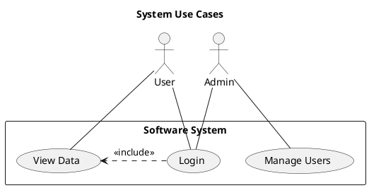
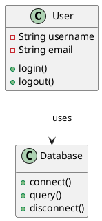
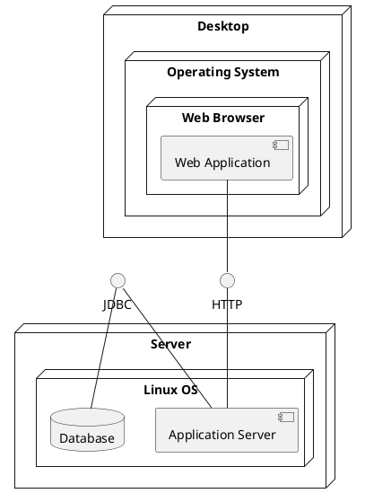

- https://ua.udemy.com/course/security-architecture-and-design-review-with-threat-modeling/?utm_source=adwords&utm_medium=udemyads&utm_campaign=Search_DSA_Beta_Prof_la.EN_cc.ROW-English&campaigntype=Search&portfolio=ROW-English&language=EN&product=Course&test=&audience=DSA&topic=&priority=Beta&utm_content=deal4584&utm_term=_._ag_162511579564_._ad_696197165424_._kw__._de_c_._dm__._pl__._ti_dsa-1677053911888_._li_9061017_._pd__._&matchtype=&gad_source=1&gad_campaignid=21168154305&gbraid=0AAAAADROdO2SLeXZHIIaYxW7u6UU5wWfV&gclid=Cj0KCQjwzOvEBhDVARIsADHfJJR_wjVkaJR38Km9bCXCBgVKiA7x_tbhxDIcpfj2MKP3L94E1_tgNoAaAomZEALw_wcB&couponCode=2021PM25


# Threat Intelligence

- MITRE ATT&CK Framework Essentials, https://ua.udemy.com/course/mitre-attck-framework-essentials/
- Threat Intelligence, https://ua.udemy.com/course/threat-intelligence/
- Fundamentals of Threat Intelligence for Every Cybersecurity Professional, https://medium.com/@Architekt.exe/fundamentals-of-threat-intelligence-for-every-cybersecurity-professional-7a3acb2ef349
- Performing Threat Hunting With A Scientific Approach, https://medium.com/@Architekt.exe/performing-threat-hunting-with-a-scientific-approach-532ff94c793a
- Developing a Successful Intelligence-Driven Hypothesis For Threat Hunting, https://medium.com/@Architekt.exe/developing-a-successful-intelligence-driven-hypothesis-for-threat-hunting-657f241b4460
- 


# Threat-Modeling

- The Art of Threat Modeling - A Step-by-Step Approach, https://ua.udemy.com/course/the-art-of-threat-modeling-a-step-by-step-approach/
- Threat Modeling using STRIDE masterclass - 2025, https://ua.udemy.com/course/threat-modeling-using-stride-masterclass/
- OWASP Top 10: Comprehensive Web Application Security, https://ua.udemy.com/course/the-utlimate-guide-to-web-hacking-owasp-top-techniques/
- OWASP: Threats Fundamentals, https://ua.udemy.com/course/owasp-threats-fundamentals/
- 


#  PENETRATION TESTING -AZURE

- Cloud Penetration Testing with Azure - Master Initial Access, https://ua.udemy.com/course/cloud-penetration-testing-with-azure/
- 


# Threat Modeling as a Basis for Security Requirements
https://www.researchgate.net/publication/228634178_Threat_Modeling_as_a_Basis_for_Security_Requirements
https://people.cs.pitt.edu/~adamlee/pubs/2005/sreis-05.pdf

- Threat Modeling Guide for Software Teams, https://martinfowler.com/articles/agile-threat-modelling.html


# Threat Modeling and Its Tools
https://niteshvs2002.medium.com/threat-modeling-and-its-tools-44d3d764f110

# Що таке моделювання загроз?

Моделювання загроз досліджує проектування системних операцій та те, як дані рухаються через межі підсистем. Потім воно ідентифікує всі точки атаки, які хакери можуть експлуатувати, та як вони можуть це зробити.

Нарешті, воно розробляє рішення для забезпечення безпеки системи та її даних.

За словами провідного експерта Адама Шостака, процес моделювання загроз ставить наступні питання:

**Що ми будуємо?** Оцініть, де дані рухаються в системі, межі, які вони перетинають, та технологію, що використовується для кожної передачі.

**Що може піти не так?** Поставте під сумнів кожен можливий спосіб експлуатації передач.

**Що ми збираємося з цим робити?** Розробіть захист проти кожної експлуатації.

**Чи добре ми зробили свою роботу?** Остаточне та найважливіше питання запрошує нас поміркувати над процесом, переглянути його та нагадує, що робота насправді ніколи не закінчується: завжди є простір для покращення.

Команда потім визначає пріоритети ризиків загроз та включає їх у розробку.

Моделювання загроз є основним елементом Microsoft Security Development Lifecycle (SDL). Це інженерна техніка, яку ви можете використовувати, щоб допомогти ідентифікувати загрози, атаки, вразливості та контрзаходи, які можуть вплинути на ваш додаток. Ви можете використовувати моделювання загроз для формування дизайну вашого додатка, досягнення цілей безпеки вашої компанії та зменшення ризику.

*Натисніть enter або клікніть, щоб переглянути зображення в повному розмірі*

**Рис.1 Кроки моделювання загроз**

Існує п'ять основних кроків моделювання загроз:

1. Визначення вимог безпеки.
2. Створення діаграми додатка.
3. Ідентифікація загроз.
4. Пом'якшення загроз.
5. Валідація того, що загрози були пом'якшені.

Моделювання загроз повинно бути частиною вашого звичайного життєвого циклу розробки, дозволяючи вам поступово уточнювати модель загроз та подальше зменшення ризику.

## Що таке інструмент моделювання загроз?

Інструмент моделювання загроз дозволяє вам проактивно ідентифікувати та вирішувати можливі загрози безпеки для вашого програмного забезпечення, даних або пристрою. Зазвичай він починається на етапі проектування продукту з регулярними ітераціями для підтримки актуальної безпеки.

Моделювання загроз надзвичайно важливе в сьогоднішньому ландшафті. Хакери процвітають на тому факті, що світ стає все більш онлайновим. Дослідження Clark School 2019 року показало, що хакерська атака відбувається кожні 39 секунд. Якщо у вашому додатку є вразливість, експлуатація знаходиться лише за кілька секунд. Значна атака призводить до втрати капіталу, втрати довіри до бренду, або, що гірше, до обох.

## Обов'язкові функції інструментів моделювання загроз

*Натисніть enter або клікніть, щоб переглянути зображення в повному розмірі*

**Рис.2 Функції інструментів моделювання загроз**

**Легкість введення системної інформації:** Будь-який гарний інструмент моделювання загроз вимагає детальної архітектури вашого додатка, інфраструктури, що йде з ним, та регуляторної відповідності, якої потрібно дотримуватися. Якщо додається новий модуль або вимога, інструмент повинен мати можливість безшовно приймати цей вхід також.

**Розвідка загроз:** Розвідка загроз - це інформація, зібрана з різних публічно підтримуваних бібліотек загроз, таких як MITRE's CAPEC, та можливо деякої пропрієтарної інформації, зібраної виробниками інструментів.

**Панель управління загрозами:** Панель управління загрозами - це інтуїтивне відображення даних, зібраних за допомогою розвідки загроз, що робить превентивні заходи легшими. Чим більш складна панель управління загрозами, тим легше приймати рішення щодо боротьби з вразливостями.

**Панель управління пом'якшенням:** Гарна модель загроз не просто перераховує вразливості в системі, вона також дозволяє вам вжити заходів. Це може включати виправлення коду, встановлення додаткових засобів контролю безпеки, додавання до беклогу або просто ігнорування (коли це дуже низька серйозність або витрати на засіб контролю безпеки більше, ніж вартість фактичної атаки). Це найважливіша частина процесу моделювання загроз.

**Механізм правил:** Механізм правил - це система, яка збирає всі регулювання та політики, яких дотримується ваша організація. Він може просто підключатися до існуючих політик, таких як PCI та GDPR, або також працювати з користувацькими правилами. Це та частина інструменту, яка забезпечує відповідність вашого бізнесу регуляторним вимогам.

**Масштабованість:** Складність процесу моделювання загроз зростає зі складністю вашого додатка. Якщо ваш продукт є мамонтом, тоді ваш інструмент моделювання загроз повинен бути готовий зменшити дублювання зусиль. Можливість повторного використання компонентів та використання шаблонів моделей загроз (користувацьких або шаблонів, упакованих з інструментами) при створенні нових модулів є величезною перевагою.

**Інтеграція з існуючим робочим процесом:** Ваш інструмент моделювання загроз не може просто існувати як автономний моноліт. Він повинен бути інтегрований у вашу систему так, щоб обидва працювали разом. Конектори в інструменті, які інтегруються з CI/CD pipeline вашого додатка, роблять процес моделювання загроз ефективним за часом.

**Звітність:** Найкращий результат вправи з моделювання загроз - це надійна документація моделі загроз, яка може бути розповсюджена серед усіх зацікавлених сторін. Інструменти моделювання загроз повинні мати можливість генерувати звіти про зусилля з моделювання загроз у будь-який момент часу.

## Інструменти моделювання загроз

*Натисніть enter або клікніть, щоб переглянути зображення в повному розмірі*

**Cairis** - Cairis є інструментом моделювання загроз з відкритим вихідним кодом, випущеним у 2012 році. Це один з найбільш комплексних інструментів з відкритим вихідним кодом, доступних.

Платформа: Cairns є веб-інструментом.

**IriusRisk** - Заснований у 2015 році, IriusRisk має як спільнотне видання, так і стандартне видання.

Платформа: IriusRisk є веб-інструментом.

**Kenna.VM** - Kenna.VM є пропозицією Kenna Security, яка звітує про позицію ризику додатка з емпіричними метриками.

Платформа: Kenna.VM є хмарною платформою.

**Microsoft Threat Modeling Tool** - Microsoft Threat Modeling Tool є одним з найстаріших та найбільш перевірених інструментів моделювання загроз на ринку. Це інструмент з відкритим вихідним кодом, який слідує методології spoofing, tampering, repudiation, information disclosure, denial of service, and elevation of privilege (STRIDE).

Платформа: MTMT є настільним інструментом, який працює на Windows OS.

**OWASP Threat Dragon** - OWASP Threat Dragon є рішенням з відкритим вихідним кодом, яке було випущено у 2016 році. Воно дуже схоже на MTTM, з меншим фокусом на Microsoft-центрованих сервісах.

Платформа: Threat Dragon є веб-інструментом, хоча старші версії є настільними.

## Захист даних

Захист та безпека даних є однією з найважливіших речей, які ви можете зробити для своєї компанії, якщо ви регулярно обробляєте персональні дані. Якщо це ще не так, захист даних повинен бути невід'ємною частиною вашого процесу для забезпечення відповідності GDPR також.

### Методи захисту даних

**Оцінки ризиків**
Чим ризикованіші дані, тим більший захист їм має бути наданий. Чутливі дані повинні охоронятися пильно, тоді як низькоризикові дані можуть отримати менший захист. Основна причина цих оцінок - співвідношення витрат та вигод, оскільки краща безпека даних дорівнює більшим витратам. Однак це гарний тест для визначення того, які дані потребують більш пильної охорони та робить всю систему обробки даних більш ефективною.

**Резервні копії**
Резервні копії є методом запобігання втраті даних, яка часто може відбутися або через помилку користувача, або через технічну несправність. Резервні копії повинні регулярно створюватися та оновлюватися. Регулярні резервні копії накладуть додаткові витрати на вашу компанію, але потенційні перерви у ваших звичайних бізнес-операціях коштуватимуть навіть більше.

**Шифрування**
Високоризикові дані є основним кандидатом для шифрування на кожному кроці. Це включає під час придбання (онлайн криптографічні протоколи), обробки (повне шифрування пам'яті) та подальшого зберігання (RSA або AES). Добре зашифровані дані за своєю суттю безпечні; навіть у випадках порушення даних, дані будуть марними та невідновлюваними для зловмисників.

**Контроль доступу**
Впровадження контролю доступу до робочого процесу вашої компанії є дуже ефективним методом зменшення ризику. Чим менше людей має доступ до даних, тим менший ризик (ненавмисного) порушення даних або втрати.

Ви повинні переконатися, що надаєте доступ до чутливих даних лише надійним співробітникам, які мають дійсну причину для доступу до них. Ми рекомендуємо проводити регулярні попередні курси навчання з обробки даних та освіжаючі курси, особливо після найму нових співробітників.

## Висновок

Вибір правильного інструменту для моделювання загроз - це половина виграної битви. Тому переконайтеся, що ви розглядаєте ресурси під рукою, ваші цілі моделювання загроз та кількість капіталу та часу, які ви готові інвестувати в процес моделювання загроз.


# How to Perform Threat Modelling?
- https://medium.com/@vijaiyaprathap/how-to-perform-threat-modelling-addf23df65d8


# Як виконувати моделювання загроз?

**Віджайя Пратхап**  
*7 хвилин читання*  
*14 травня 2025 року*

**Актуально для будь-яких IT-фахівців**

## Вступ

Екосистема інформаційних технологій кардинально змінилася за останні кілька десятиліть. Цікаво уявити, як досвідчений IT-керівник кінця 80-х чи 90-х років сприйняв би експоненціальне зростання сучасних IT-інструментів та інфраструктури. Аналогічно, стажер-розробник програмного забезпечення, який починає працювати у 2025 році, може сприймати звичайну HTML-сторінку без CSS як релікт минулих часів.

Перш ніж щось створювати або впроваджувати, критично важливо розглянути потенційні загрози та наслідки рішень, які ми створюємо. Наприклад, ризики, пов'язані з простим статичним односторінковим додатком, кардинально відрізняються від ризиків складного зовнішнього веб-додатку, який обробляє чутливі дані та включає кілька ролей користувачів.

Отже, як ми можемо визначити ризики та загрози, актуальні для конкретного рішення? Ось тут і з'являється моделювання загроз. Існує безліч ресурсів, які допоможуть вам його вивчити — від посібників і фреймворків до інструментів, таких як Microsoft Threat Modeling Tool, і навіть асистентів на основі штучного інтелекту, які спрощують процес. Однак найважливішим фактором залишається технічна кмітливість і мислення з точки зору безпеки рецензента.

## Кроки моделювання загроз

Наступні кроки включені в проведення оцінки моделювання загроз:

### 1. Розуміння реалізації
Почніть з чіткого розуміння системи або рішення, розробленого командою.

### 2. Визначення сутностей і ресурсів
Перелічіть всі ключові компоненти системи, такі як веб-сервери, бази даних, API, сторонні сервіси тощо.

### 3. Мапування взаємодій і потоків даних
Визначте, як сутності взаємодіють один з одним. Зосередьтеся на потоці даних, напрямку комунікації та тому, які компоненти пов'язані.

### 4. Створення діаграми моделі загроз
Після того, як деталі системи та потоки даних зрозумілі, створіть візуальне представлення архітектури (наприклад, діаграму потоку даних або діаграму компонентів).

### 5. Перелік загроз за допомогою фреймворку
Використайте фреймворк моделювання загроз, такий як STRIDE, PASTA або LINDDUN, для визначення та документування відповідних загроз у всій системі.

### 6. Огляд загроз з командою проекту
Представте визначені загрози команді розробки або архітектури для валідації та обговорення.

### 7. Документування статусу загроз і обґрунтувань
Для кожної загрози зафіксуйте:
- **7.1** Поточний статус: Пом'якшено, Не застосовано, Потребує дослідження або Не розпочато
- **7.2** Обґрунтування, надане командою
- **7.3** Будь-які заплановані або поточні дії з пом'якшення

### 8. Перегляд загроз "Не застосовано"
Оцініть обґрунтування команди щодо позначення загрози як не застосовної. Якщо міркування незрозумілі або слабкі, обговоріть далі та досягніть консенсусу.

### 9. Допомога з загрозами "Потребує дослідження"
Для загроз, що потребують глибшого аналізу, співпрацюйте з командою, щоб зрозуміти технічний виклик. Дослідіть варіанти пом'якшення та надайте керівництво, щоб допомогти розблокувати команду.

### 10. Подальші дії щодо загроз "Не розпочато"
Підтвердіть, чи має команда всю необхідну інформацію для початку пом'якшення. Пропонуйте підтримку, приклади або посилання за потреби.

### 11. Перевірка загроз "Пом'якшено"
Перегляньте запропоновані заходи пом'якшення та підтвердіть, що вони відповідні та ефективні. Перехресно перевірте з іншими заходами забезпечення, такими як огляди коду або тестування безпеки.

### 12. Оцінка серйозності загроз
Оцініть серйозність кожної загрози, використовуючи фреймворки, такі як CVSS, DREAD або спеціальну матрицю ризиків. Використайте це для пріоритизації зусиль з усунення.

## Фреймворки моделювання загроз

Існує кілька фреймворків моделювання загроз, таких як STRIDE і PASTA, які можна використовувати для визначення та перелічення загроз у конкретній реалізації.

### PASTA (Process for Attack Simulation and Threat Analysis)
PASTA — це семикрокова методологія, розроблена для моделювання атак шляхом поєднання орієнтованого на зловмисника технічного аналізу з оцінкою бізнес-ризиків. Мета полягає у визначенні загроз при мінімізації потенційних бізнес-впливів. PASTA зосереджується на розумінні та моделюванні реальних сценаріїв атак.

### STRIDE
Іншою широко використовуваною методологією моделювання загроз є STRIDE. У цій статті ми використаємо фреймворк STRIDE для перелічення загроз для простої реалізації веб-додатку.

STRIDE — це абревіатура від:
- **S**poofing (Підміна)
- **T**ampering (Втручання)
- **R**epudiation (Відмова)
- **I**nformation Disclosure (Розкриття інформації)
- **D**enial of Service (Відмова в обслуговуванні)
- **E**levation of Privilege (Підвищення привілеїв)

Основна концепція STRIDE полягає в тому, щоб дослідити кожну взаємодію в системі та оцінити, як загрози можуть виникнути з кожної категорії. Проходячи через ці категорії, ми можемо систематично визначити різні загрози для реалізації.

## Приклад моделювання загроз

Щоб познайомити вас зі світом моделі загроз, розглянемо просту архітектурну діаграму, показану нижче:


**Архітектурна діаграма простого додатку на базі Flask**

Діаграма вище показує просте налаштування веб-додатку/API на базі Flask. Реалізація містить три сервери для веб-додатку, веб-API та бази даних відповідно. Припустимо наступне щодо налаштування:

- Додаток розміщено онлайн. Доступ до командного рядка серверів доступний лише через портал, наданий хостинговою компанією з увімкненою 2FA.
- Кожен користувач хостинг-провайдера має спеціальну віртуальну мережу, щоб інші користувачі не могли достукатися через внутрішню IP-адресу серверів.
- У додатку існує кілька ролей.
- У додатку є різні функціональності, такі як завантаження файлів, читання файлів, залишення коментарів тощо.
- Дані, що стосуються додатку, зберігаються в базі даних.
- Веб-додаток, веб-API та база даних розташовані на різних серверах.

## Визначення та аналіз загроз

Перш ніж переходити до фази аналізу та визначення, давайте розберемо кожну концепцію в STRIDE з таблиці нижче:


### Довідкова таблиця STRIDE

| Категорія | Опис |
|-----------|------|
| **Підміна (Spoofing)** | Претендування на іншу ідентичність |
| **Втручання (Tampering)** | Несанкціоноване змінення даних |
| **Відмова (Repudiation)** | Відмова від виконаних дій |
| **Розкриття інформації (Information Disclosure)** | Розкриття інформації небажаним сторонам |
| **Відмова в обслуговуванні (Denial of Service)** | Відмова або зниження якості обслуговування |
| **Підвищення привілеїв (Elevation of Privilege)** | Отримання більших привілеїв, ніж передбачено |

Після того, як концепції чітко пояснені команді проекту, фахівець з безпеки може поставити відповідні запитання команді щодо того, як кожна з категорій обробляється командою.

Наступна таблиця зіставляє категорії STRIDE з контролями, які можна застосувати:


### Взаємодія: Браузер до веб-додатку
Наступна таблиця показує, як команда проекту може надати обґрунтування для кожної категорії STRIDE для користувачів, що підключаються до веб-додатку:

| Категорія STRIDE | Можливі контролі | Статус |
|------------------|------------------|---------|
| **Підміна** | Автентифікація, сертифікати SSL | Реалізовано |
| **Втручання** | Шифрування даних, цілісність | Реалізовано |
| **Відмова** | Логування, цифрові підписи | Частково |
| **Розкриття інформації** | Авторизація, шифрування | Реалізовано |
| **Відмова в обслуговуванні** | Обмеження швидкості, моніторинг | Потребує покращення |
| **Підвищення привілеїв** | Найменші привілеї, перевірка вводу | Реалізовано |

### Взаємодія: Веб-додаток до бази даних
Наступна таблиця показує, як команда проекту може надати обґрунтування для кожної категорії STRIDE для веб-додатку, що підключається до бази даних:


| Категорія STRIDE | Можливі контролі | Статус |
|------------------|------------------|---------|
| **Підміна** | Автентифікація бази даних, TLS | Реалізовано |
| **Втручання** | Цілісність даних, шифрування | Реалізовано |
| **Відмова** | Логування транзакцій | Реалізовано |
| **Розкриття інформації** | Шифрування, контроль доступу | Реалізовано |
| **Відмова в обслуговуванні** | Пул з'єднань, таймаути | Частково |
| **Підвищення привілеїв** | Найменші привілеї БД | Реалізовано |

Оскільки обґрунтування для веб-додатку до веб-API та веб-API до бази даних буде схожим, я не повторюю ті ж пункти.

## Чи є моделювання загроз панацеєю?

Абсолютно ні! Моделювання загроз — це потужний інструмент для виявлення легко доступних проблем на початку життєвого циклу розробки програмного забезпечення. Воно допомагає виявити потенційні прогалини ще до написання будь-якого коду, дозволяючи командам приймати рішення щодо дизайну, орієнтовані на безпеку, з самого початку.

Однак покладатися виключно на моделювання загроз недостатньо для вирішення всіх питань безпеки. Як і захист в глибину, надійна позиція безпеки вимагає багаторівневого підходу. Це означає поєднання кількох методів і оглядів — таких як оцінка ризиків, моделювання загроз, сканування SAST і DAST, ручне тестування на проникнення та моніторинг SIEM — для покриття повного спектру вразливостей протягом життєвого циклу системи.

Моделювання загроз закладає основу, але воно завжди повинно бути частиною ширшої, безперервної стратегії безпеки.

## Що може піти не так?

Кілька речей можуть піти не так під час вправи з моделювання загроз, підриваючи її ефективність:

### Виконується занадто пізно в SDLC
Якщо моделювання загроз проводиться пізно в життєвому циклі розробки програмного забезпечення (SDLC), пом'якшення визначених загроз стає значно дорожчим і складнішим.

### Огляд, орієнтований на контрольний список
Ставлення до моделювання загроз як до активності "поставити галочку" — особливо при покладанні виключно на інструменти, такі як Microsoft Threat Modeling Tool або OWASP Threat Dragon — може призвести до поверхневих оцінок, які пропускають контекстно-специфічні ризики.

### Відсутність технічного розуміння
Якщо рецензент не має твердого розуміння основних технологій, він може не розпізнати критичні ризики або зробити неточні припущення щодо загроз.

### Залучення неправильних зацікавлених сторін
Ефективність моделювання загроз значною мірою залежить від залучення правильних зацікавлених сторін. Якщо ключові ролі, такі як архітектори, розробники та експерти з безпеки, відсутні, важливі перспективи та інсайти можуть бути упущені.

Щоб уникнути цих пасток, моделювання загроз слід розглядати як співпрацю, ітеративний і контекстно-свідомий процес, який розвивається разом із системою.


----------------------------------------------------------------------------------------------


# Методологія створення безпечних програмних продуктів

*Лекція 1. Вступна лекція з дисципліни*

---

## 1. Вступ до спеціальності

### 1.1 Комп'ютерні науки (Computer Science)
Комп'ютерні науки — одна з небагатьох спеціальностей, у назві якої є слово "Science", що робить її найбільш науковою спеціальністю. Основні напрямки досліджень включають:

- **Теорія алгоритмів** — фундаментальні принципи побудови алгоритмів
- **Мови програмування** — розробка та дослідження засобів програмування
- **Комп'ютерні мережі** — архітектура та протоколи мережевих з'єднань
- **Операційні системи** — управління ресурсами комп'ютерних систем
- **Бази даних та СУБД** — зберігання та обробка структурованих даних
- **Штучний інтелект** — алгоритми та методи інтелектуальної обробки
- **Обчислювальні системи** — архітектура та принципи роботи

### 1.2 Інженерія програмного забезпечення (Software Engineering)
На відміну від Computer Science, Software Engineering орієнтована на:

- **Практичне використання** досягнень комп'ютерних наук
- **Ефективні засоби створення** програмних продуктів
- **Управління процесами** розробки програмного забезпечення
- **Інженерний підхід** до вирішення технічних завдань

> **Порівняння:** Computer Science — більше про комп'ютер, Software Engineering — більше про людину

---

## 2. Поняття системи

### 2.1 Умови існування системи
Будь-що перетворюється у систему за наявності трьох умов:

1. **Кінцева множина елементів** — обмежена кількість компонентів
2. **Зв'язки між елементами** — взаємодія та взаємозалежність
3. **Спільна мета** — об'єднавча ціль існування системи

### 2.2 Типи систем
- **Біологічні системи** — живі організми та їх взаємодія
- **Кібернетичні системи** — системи управління та зв'язку
- **Освітні системи** — учасники освітнього процесу
- **Інформаційні системи** — обробка та передача інформації

---

## 3. Методи наукового пізнання

### 3.1 Метод аналізу
**Призначення:** Розділення складного об'єкта на простіші компоненти

**Переваги:**
- Зменшення складності дослідження
- Можливість детального вивчення кожного елемента
- Прискорення процесу розуміння

**Застосування:** Дослідження атомарних елементів системи

### 3.2 Метод абстрагування
**Призначення:** Видалення зайвих деталей, які не потрібні для досягнення мети

**Принцип роботи:**
- Видалення непотрібних зв'язків між елементами
- Залишення тільки необхідних властивостей
- Спрощення опису об'єкта дослідження

**Приклад:** При дослідженні людини для створення програмного продукту залишаємо тільки соціальні властивості та потреби, видаляючи фізіологічні деталі.

### 3.3 Метод синтезу
**Призначення:** Об'єднання окремих елементів у цілісну систему

**Результат:** Створення абстрактної моделі, яка:
- Відповідає властивостям реального об'єкта
- Значно спрощена у порівнянні з оригіналом
- Придатна для програмної реалізації

---

## 4. Аналіз терміну "Продукт"

### 4.1 Піраміда потреб Маслоу
Рівні потреб споживача:
1. **Фізіологічні потреби** — базові життєві потреби
2. **Безпека** — захист та стабільність
3. **Приналежність** — соціальні зв'язки
4. **Повага** — визнання та самоповага
5. **Пізнання світу** — освітні потреби
6. **Естетика** — мистецтво, культура, спорт
7. **Самоактуалізація** — реалізація потенціалу

### 4.2 Інформаційні потреби
**Виникнення:** Потреба швидко та дешево отримати матеріальну потребу створює штучну інформаційну потребу.

**Інструменти задоволення:**
- Логарифмічні таблиці (історично)
- Механічні калькулятори
- Електронні калькулятори  
- Комп'ютери
- **Програмні продукти** (сучасність)

### 4.3 Умови перетворення даних в інформацію

#### Основні умови:
1. **Доступність** — фінансова та виробнича можливість отримання
2. **Зрозумілість** — представлення зрозумілою мовою
3. **Цінність/корисність** — відповідність реальним потребам

#### Додаткова умова:
4. **Актуальність** — часова достовірність даних

---

## 5. Програма та програмний продукт

### 5.1 Алгоритм
**Визначення:** Кінцевий набір інструкцій для вирішення певного завдання

**Властивості:**
- **Покроковість** — послідовне виконання інструкцій
- **Детермінованість** — однакові дані дають однаковий результат
- **Результативність** — завжди призводить до мети

### 5.2 Комп'ютерна програма
**Визначення:** Алгоритм, представлений у формі, придатній для виконання обчислювальним пристроєм

**Історичний приклад:** Ада Лавлейс — перша програмістка, яка створювала інструкції для механічного комп'ютера Чарльза Беббіджа

### 5.3 Програмне забезпечення (Software)
**Складові частини:**
1. **Сукупність комп'ютерних програм** — виконуваний код
2. **Програмна документація** — інструкції з експлуатації та розвитку

**Важливість документації:**
- Багаторазове використання програми
- Можливість модифікації іншими розробниками
- Передача знань між командами
- Підтримка та розвиток системи

### 5.4 Програмний продукт
**Формула:** Програмний продукт = Програмне забезпечення + Споживач

**Умови існування:**
- Наявність споживача
- Задоволення умов цінності
- Гарантоване перетворення даних в інформацію
- Відповідність реальним потребам

**Ризик:** Досвідчені програмісти можуть створити якісне програмне забезпечення, яке ніколи не стане продуктом через відсутність споживача.

---

## 6. Безпека в контексті програмних продуктів

### 6.1 Безпека людини
**Визначення:** Відсутність неприпустимого ризику, пов'язаного з можливістю нанесення збитків здоров'ю людини та збереженню майна

**Характеристика:** Не бульовий параметр (так/ні), а градація рівнів прийнятності ризику.

### 6.2 Технічна безпека системи
**Визначення:** Властивість системи залишатись у безпечному стані при впливі зовнішніх і внутрішніх факторів

**Умови забезпечення:**
- Система не погіршується під впливом факторів
- Зберігається можливість функціонування
- Підтримується здатність до розвитку
- Відповідність функціональним та нефункціональним вимогам

### 6.3 Інформаційна безпека
**Мета:** Захист інформації від випадкових та навмисних впливів

**Types впливів:**
- **Випадкові впливи** — природного характеру
- **Навмисні впливи** — штучного характеру

**Результат:** Зниження неприйнятного збитку для споживача інформаційних потреб

---

## 7. Загрози інформаційної безпеки

### 7.1 Загроза порушення конфіденційності

#### Приватність vs Конфіденційність
**Privacy (приватність):** Стан особи, коли вона вільна від публічного втручання. Незмінний стан.

**Confidentiality (конфіденційність):** Інформація, яка описує особистий простір особи. Власник може змінювати рівень доступу.

#### Рівні конфіденційності даних:
- **Public Data** — публічні дані з відкритим доступом
- **Private Data** — дані для службового/комерційного використання  
- **Secret Data** — дані державної або військової таємниці

#### Конфіденційність програм:
- Заборона несанкціонованого використання (боротьба з піратством)
- Секретність алгоритмів роботи
- Обмежений доступ до програмного коду

### 7.2 Загроза порушення цілісності

#### Цілісність даних
**Визначення:** Несуперечність та актуальність даних, захищеність від руйнування та несанкціонованих змін

**Ключові аспекти:**
- Захист від руйнування
- Запобігання несанкціонованим змінам
- Відповідність вимогам інформаційних процесів

#### Цілісність програм
**Загрози:**
- Зміна алгоритму роботи програми
- Модифікація даних під час виконання
- Порушення логіки обробки інформації

### 7.3 Загроза порушення доступності

#### Визначення доступності
**Accessibility:** Можливість за визначений час отримати необхідну інформаційну послугу

#### Нефункціональні вимоги продуктивності:
**Часові характеристики (Timers):**
- Максимальна затримка реакції системи
- Час відгуку на дії користувача
- Приклад: кнопка Submit — максимум 2 секунди очікування

**Статистичні показники (Throughput):**
- Кількість одночасних користувачів
- Пропускна здатність системи
- Навантажувальна характеристика

#### Наслідки порушення доступності:
- Перевищення допустимого часу очікування
- Неможливість доступу до системи
- Невідповідність заявленим характеристикам продуктивності

---

## 8. Основні поняття безпеки

### 8.1 Термінологія
**Загроза** — теоретична/потенційна можливість порушення інформаційної безпеки

**Атака** — спроба реалізації загрози зловмисником

**Вразливість** — слабка реалізація програмного продукту, що може стати метою атаки

**Захист** — комплекс організаційних, фізічних, апаратних та програмних заходів для забезпечення інформаційної безпеки

### 8.2 Матриця загроз
Метод аналізу інформаційних загроз через перетин компонентів системи та типів загроз:

#### Компоненти системи:
1. **Апаратне забезпечення**
2. **Програмне забезпечення:**
   - Системне (ОС, утиліти)
   - Прикладне (користувацькі програми)
3. **Дані:**
   - Системні
   - Прикладні (бази даних)
4. **Персонал:**
   - Обслуговуючий (адміністратори)
   - Споживачі (кінцеві користувачі)

#### Типи загроз:
- Порушення конфіденційності
- Порушення цілісності  
- Порушення доступності

---

## 9. Процес створення програмних продуктів

### 9.1 Мета Software Engineering
**Основна ціль:** Скорочення вартості та термінів розробки програмного продукту

**Інженерні завдання:**
- Вирішення технічних питань на всіх етапах
- Управління програмним проектом
- Планування етапів розробки
- Керування колективом
- Фінансування розробки

### 9.2 Життєвий цикл розробки програмного продукту

#### Основні етапи:
1. **Визначення вимог (Requirements)**
   - Бізнес-вимоги
   - Вимоги користувача
   - Функціональні та нефункціональні вимоги

2. **Проектування (Design)**
   - Діаграми послідовності та активності
   - Концептуальні та програмні класи
   - Опис алгоритмів методів та процедур

3. **Реалізація (Implementation)**
   - Створення програмних модулів
   - Заповнення баз даних
   - Unit-тестування модулів

4. **Тестування (Testing)**
   - Acceptance тести
   - Підтвердження відповідності вимогам
   - Перевірка функціональності

5. **Інтеграція (Integration)**
   - Об'єднання модулів у єдину систему
   - Колективна розробка
   - Automated CI/CD

6. **Розгортання (Deployment)**
   - Встановлення у виробничому середовищі
   - Налаштування під потреби замовника

7. **Супровід (Maintenance)**
   - Підтримка та розвиток
   - Додавання нового функціоналу
   - Довгострокова підтримка

#### Наскрізні процеси:
- **Управління проектом** — планування та координація
- **Управління конфігураціями** — версіонування та зміни
- **Управління якістю** — контроль відповідності стандартам

### 9.3 Методології розробки

#### Waterfall (Водоспадна модель)
**Характеристики:**
- Послідовне виконання етапів
- Повне завершення одного етапу перед початком наступного
- Походження з класичної інженерії

**Проблеми для ПЗ:**
- Відсутність етапу виробництва (копіювання безкоштовне)
- Складність змін на пізніх етапах
- Довгий час до отримання результату

#### Agile (Гнучкі методології)
**Основні принципи:**

**Ітеративність:**
- Розбиття вимог на частини за пріоритетом
- Короткі цикли розробки
- Постійний зворотний зв'язок

**Багаторольові команди:**
- Співпраця всередині команди
- Колективна відповідальність
- Кросс-функціональність

**Приклади Agile:**
- Extreme Programming (XP)
- Scrum
- Kanban

#### Extreme Programming (XP)
**Ключові практики:**

**Короткий цикл зворотного зв'язку:**
- Гра в планування
- Постійна присутність замовника
- Швидке реагування на зміни

**Розробка через тестування (TDD):**
- Test-Driven Development
- Behavior-Driven Development (BDD)
- Спочатку тести, потім код

**Парне програмування:**
- Два програмісти на одне завдання
- Постійне code review
- Обмін знаннями

**Безперервна інтеграція (CI/CD):**
- Автоматизоване тестування
- Автоматизоване збирання
- Автоматизоване розгортання

**Рефакторинг:**
- Постійне покращення коду
- Адаптація до нових вимог
- Підтримка якості архітектури

**Часті невеликі релізи:**
- Швидший зворотний зв'язок
- Зменшення ризиків проекту
- Поступове нарощування функціональності

**Організаційні принципи:**
- Колективне володіння кодом
- Стандарти кодування
- 40-годинний робочий тиждень
- Соціальна захищеність розробників

---

## 10. Технологічні процеси

### 10.1 Поняття технології
**Історичне походження:** Ідеї Адама Сміта (кінець 19 ст.) про поділ праці:
- Розбиття завдань між окремими людьми
- Одна операція — один спеціаліст
- Потокове виробництво
- Конвеєрна автоматизація

**Визначення:** Застосування знань та методів у виробничій діяльності

### 10.2 Технологічний процес
**Структура (4 потоки):**
1. **Вхід** — сировина для обробки
2. **Вихід** — результат роботи процесу
3. **Управління** — правила та інструкції
4. **Механізм** — людина з інструментами (ручні/автоматизовані)

### 10.3 Інформаційна технологія
**Визначення:** Технологічний процес, де на вхід подаються дані

**Мета:** Перетворення даних в інформацію для споживача

**Відповідність:** Мета інформаційної технології = Мета інформаційної системи

---

## 11. Поняття методу та методології

### 11.1 Визначення методу
**Етимологія:** Грецьке слово "шлях крізь"

**Варіанти визначень:**

1. **Шлях пізнання** — спирається на раніше отримані знання та принципи

2. **Планомірний спосіб дослідження** — для встановлення істини про явища

3. **Система принципів і прийомів** — для об'єктивного пізнання дійсності

4. **Система розумово-практичних операцій** — націлена на розв'язання певних завдань

### 11.2 Ознаки наукового методу

#### Основні характеристики:
1. **Детермінованість** — визначена послідовність кроків
2. **Результативність** — обов'язкове отримання результату  
3. **Ефективність** — результат більший за трудомісткість операцій
4. **Об'єктивність** — незалежність від суб'єктивності дослідника

### 11.3 Методологія

#### Визначення:
**Методологія** — вчення про методи, наука про методи

#### Варіанти тлумачення:
1. **Сукупність філософських методів пізнання**
2. **Система принципів наукового дослідження** 
3. **Система методів пізнання**

#### Системний підхід:
- **Множина методів** як елементи системи
- **Зв'язки між методами** — послідовність застосування
- **Мета** — ефективне пізнання через комбінацію методів

#### Приклади методів для поєднання:
- Аналіз, абстрагування, синтез
- Дедукція та індукція  
- Метод аналогій та моделювання
- Експериментальні методи

### 11.4 Методологія як технологічний процес
**Схема процесу:**
- **Вхід:** Відомі факти та знання про явища
- **Вихід:** Нові факти та знання про явища
- **Управління:** Методологія (система методів)
- **Механізм:** Вчені з інструментами автоматизації

---

## 12. Зміст дисципліни

### 12.1 Open Web Application Security Project (OWASP)
**Характеристика:** Відкритий проект з безпеки веб-застосунків

**Методологічна основа:**
- Результати досліджень сотень розробників світу
- Наукові основи створення безпечних програмних продуктів
- Практичні рекомендації та стандарти

### 12.2 Проекти OWASP для вивчення:

#### Аналітичні проекти:
- **OWASP Top 10** — головні критичні ризики
- **OWASP SAMM** — модель зрілості та забезпечення програмного продукту

#### Настанови розробки:
- **Web Application Development Guide** — розробка веб-застосунків
- **Web Application Testing Guide** — тестування веб-застосунків

#### Стандарти безпеки:
- **Application Security Verification Standard** — верифікація безпеки
- **Mobile Security Standard** — безпека мобільних застосунків

#### Практичні інструменти:
- **Code Review Guide** — огляд програмного коду
- **Threat Modeling Tools** — моделювання загроз

### 12.3 Структура навчання

#### Теоретична частина:
- Дослідження підходів сучасних практиків
- Аналіз множини методик безпеки
- Вивчення стандартів та рекомендацій

#### Практична частина:
- Лабораторні роботи з базами даних
- Реалізація засобів безпеки у програмному забезпеченні
- Застосування рекомендацій OWASP проектів

---

## Висновки

В рамках вступної лекції було проведено аналіз назви дисципліни "Методологія створення безпечних програмних продуктів" з використанням методів наукового пізнання:

1. **Метод аналізу** дозволив розкласти складний термін на окремі компоненти
2. **Метод абстрагування** допоміг залишити лише релевантні властивості кожного терміну  
3. **Метод синтезу** об'єднав проаналізовані компоненти в цілісне розуміння предмету дисципліни

Дисципліна орієнтована на практичне застосування методологій забезпечення безпеки програмних продуктів на основі досвіду світової спільноти розробників, зокрема проектів OWASP.

-------------------------------------------------------------------------------------------------------

# Методологія створення безпечних програмних продуктів

*Лекція 2. Захист від загроз інформаційної безпеки*

---

## 1. Концепція багаторівневого захисту

### 1.1 Історичні основи багаторівневого захисту
Методологія захисту інформаційних систем базується на концепції **багаторівневого захисту**, яка має глибокі історичні корені. Людство впродовж свого існування створювало системи захисту на різних рівнях для забезпечення безпеки особистості, житла, цінностей та інформації.

### 1.2 Чотири рівні захисту

#### Рівень 1: Морально-етичний рівень
**Характеристика:** Базується на культурних нормах і моральних принципах суспільства.

**Принципи захисту (на прикладі християнських заповідей):**
- **"Не вбивай"** → Не знищуй дані або інформацію
- **"Не кради"** → Не отримуй несанкціонований доступ до даних
- **"Не свідчи неправдиво"** → Не порушуй цілісність інформації
- **"Не пожадай"** → Не претендуй на чужу інтелектуальну власність

**Проблеми у віртуальному світі:**
- Віртуальний світ існує лише ~50 років
- Морально-етичні норми не встигли адаптуватися до цифрової реальності
- Відсутність культурних обмежень у кіберпросторі
- Легкість копіювання даних (на відміну від матеріальних цінностей)

**Висновок:** На жаль, морально-етичний рівень для віртуального світу наразі не працює ефективно.

#### Рівень 2: Законодавчий рівень
**Нормативна база України:** Кримінальний процесуальний кодекс України містить статті, що регулюють кіберзлочинність.

**Стаття 361 КК України: "Несанкціоноване втручання в роботу ЕОМ"**
**Об'єкти захисту:**
- Електронно-обчислювальні машини
- Автоматизовані системи
- Комп'ютерні мережі
- Мережі електрозв'язку

**Наслідки втручання:**
- Витік, втрата, підробка інформації
- Блокування інформації
- Спотворення процесу обробки інформації
- Порушення встановленого порядку маршрутизації

**Кваліфікуючі ознаки (частина 1):**
- Створення шкідливих програмних або технічних засобів
- Розповсюдження або збут таких засобів

**Стаття 362 КК України: "Несанкціоновані дії з інформацією"**
**Суб'єкт:** Особа, яка **має право доступу** до інформації, але перевищує свої повноваження.

**Типи порушень:**
1. **Несанкціонована зміна, знищення або блокування** (порушення цілісності)
2. **Несанкціоноване перехоплення або копіювання** (порушення конфіденційності)

**Стаття 363 КК України: "Порушення правил експлуатації"**
**Суб'єкт:** Обслуговуючий персонал (адміністратори, технічна підтримка)

**Типи порушень:**
- Порушення правил експлуатації об'єктів доступу
- Порушення правил захисту інформації

**Практичні приклади порушень:**
```
Стаття 361: Несанкціонований доступ до сайту департаменту освіти
           з внесенням змін на веб-сторінки

Стаття 362: Використання облікових записів інших користувачів 
           для доступу до інтернету, що призвело до блокування 
           доступу законних користувачів

Стаття 363: Розміщення файлу з обліковими записами у відкритому 
           доступі через помилку адміністратора
```

#### Рівень 3: Адміністративно-організаційний рівень

**3.1 Управління персоналом**

**Первинний інструктаж:**
- Ознайомлення з принципами інформаційної безпеки
- Роз'яснення відповідальності за порушення
- Вивчення внутрішніх регламентів організації

**Періодичні перевірки:**
- Щорічна атестація з питань ІБ
- Оновлення знань про нові загрози
- Контроль дотримання встановлених процедур

**Принцип відповідальності:** "Незнання законів не звільняє від відповідальності"

**3.2 Фізичне обмеження доступу**

**Контроль доступу до приміщень:**
- Замки та ключі на входах
- Системи контролю доступу
- Відеоспостереження критичних зон

**Захист обладнання:**
- Серверні кімнати з обмеженим доступом
- Фізичний захист робочих станцій
- Контроль за зйомними носіями

**Логіка захисту:** Навіть найдосконаліший мережевий захист безрезультатний, якщо зловмисник може фізично отримати доступ до сервера та вийняти жорсткий диск.

**3.3 Процедури реагування на інциденти**

**Планування відновлення:**
- Інструкції реагування на порушення режиму безпеки
- Процедури відновлення після атак
- Резервування критичних компонентів системи

**Забезпечення безперервності:**
- Резервні сервери для критичних сервісів
- Запасні робочі станції для персоналу
- Процедури швидкого відновлення роботи (24/7)

**Обробка ненавмисних дій:**
- Планування відновлення після апаратних збоїв
- Процедури реагування на помилки персоналу
- Захист від стихійних лих (блискавка, відключення електрики)

#### Рівень 4: Програмно-технічний рівень

Найбільш складний та технічно насичений рівень захисту, який включає програмні та апаратні засоби безпеки.

---

## 2. Програмно-технічні засоби захисту

### 2.1 Ідентифікація та аутентифікація

#### Основні поняття
**Ідентифікатор:**
- Унікальна **відкрита** характеристика сутності
- Використовується для розпізнавання користувача в системі
- Не містить персональної інформації (не паспортні дані!)
- Приклади: username, login, ID

**Аутентифікатор:**
- Унікальна **секретна** характеристика сутності
- Підтверджує, що користувач справді той, за кого себе видає
- Відома тільки законному власнику
- Приклади: пароль, біометричні дані, сертифікат

#### Три фактори аутентифікації

**Фактор 1: Те, що знаєш (Something You Know)**
- **Секретні паролі** — найстаріший метод аутентифікації
- **PIN-коди** — числові паролі обмеженої довжини
- **Секретні питання** — додаткова інформація для відновлення

**Переваги:**
- Простота реалізації
- Низька вартість впровадження
- Звичність для користувачів

**Недоліки:**
- Можна підглянути, підібрати, вкрасти
- Проблеми з запам'ятовуванням складних паролів
- Схильність до використання простих паролів

**Фактор 2: Те, чим володієш (Something You Have)**
- **Банківські картки** — фізичні носії з магнітною стрічкою або чипом
- **USB-токени** — спеціальні пристрої для зберігання ключів
- **Мобільні телефони** — для отримання SMS-кодів

**Приклад:** Банківський термінал вимагає вставити картку (фактор володіння) та ввести PIN-код (фактор знання) = **двофакторна аутентифікація**.

**Переваги:**
- Фізична прив'язка до користувача
- Складніше підробити ніж пароль

**Недоліки:**
- Можна загубити або вкрасти
- Вимагає носіння додаткового пристрою
- Можливість технічного зламу

**Фактор 3: Те, чим є (Something You Are)**
- **Відбитки пальців** — найпоширеніший біометричний метод
- **Сканування райдужної оболонки** — високоточна ідентифікація
- **Розпізнавання обличчя** — використовується в смартфонах
- **Розпізнавання голосу** — голосова біометрія
- **Геометрія долоні** — форма та розміри руки

**Переваги:**
- Найвищий рівень безпеки
- Неможливо загубити або передати іншій особі
- Унікальність біометричних показників

**Недоліки:**
- Високі вимоги до обладнання
- Можливість обходу за допомогою підробок
- Проблеми з травмами або віковими змінами

#### Багатофакторна аутентифікація
**Двофакторна аутентифікація (2FA):**
- Банківська картка + PIN-код
- Логін/пароль + SMS-код
- Біометрія + PIN-код

**Трифакторна аутентифікація (3FA):**
- Смартфон з біометричним сканером: біометрія + фізичний пристрій + PIN-код
- Банківська система: картка + PIN + відбиток пальця

**Рекомендації Google, Microsoft:** Обов'язкове використання 2FA для важливих акаунтів.

#### Протоколи аутентифікації

**LDAP (Lightweight Directory Access Protocol):**
- Класичний протокол для мережевих ресурсів
- Централізоване управління обліковими записами
- Використовується в корпоративних мережах Microsoft

**Kerberos:**
- Назва від давньогрецького трьохголового пса-охоронця
- Протокол взаємної аутентифікації
- Централізоване зберігання секретних ключів
- Безпечний розподіл ключів у мережі

**PAM (Pluggable Authentication Modules):**
- Модульна система аутентифікації в Linux
- Можливість заміни стандартного login/password
- Підтримка біометричних пристроїв та смарт-карт
- Гнучкість налаштування різних методів

**OpenID:**
- Децентралізований протокол аутентифікації
- Можливість використання одного акаунта для різних сервісів
- Приклад: "Увійти через Google" на сторонніх сайтах

### 2.2 Авторизація та контроль доступу

Після успішної аутентифікації користувач отримує **санкціоновані права доступу** до ресурсів системи через процедуру **авторизації**.

#### Моделі контролю доступу

**Модель 1: DAC (Discretionary Access Control) — Дискретна модель**
**Структура:** Матриця доступу
- **Рядки:** Суб'єкти доступу (користувачі)
- **Стовпці:** Об'єкти доступу (файли, ресурси)
- **Перетин:** Права доступу (Read, Write, Execute, Delete)

```
Матриця доступу:
                 Файл1    Файл2    База_даних    Принтер
Користувач1      R,W      R        R,W           W
Користувач2      R        R,W      R             W
Адміністратор    R,W,D    R,W,D    R,W,D         R,W,D
```

**Недоліки:**
- Висока складність адміністрування при великій кількості користувачів і ресурсів
- Трудомісткість налаштування індивідуальних прав
- Складність підтримки при змінах в організаційній структурі

**Модель 2: RBAC (Role-Based Access Control) — Рольова модель**
**Принцип:** Групування користувачів за ролями

**Ролі та їх права:**
```
Роль "Студент":
- Читання навчальних матеріалів
- Завантаження завдань
- Доступ до системи тестування

Роль "Викладач":
- Всі права студента +
- Створення навчальних матеріалів
- Оцінювання робіт студентів
- Управління курсами

Роль "Адміністратор":
- Всі права викладача +
- Створення нових користувачів
- Налаштування системи
- Резервне копіювання
```

**Переваги:**
- Спрощення адміністрування
- Відповідність організаційній структурі
- Легкість зміни прав при зміні посади

**Модель 3: MAC (Mandatory Access Control) — Мандатна модель**
**Принцип:** Централізоване управління доступом на основі рівнів секретності

**Рівні доступу:**
- **Несекретно** — загальнодоступна інформація
- **Для службового користування** — внутрішня інформація організації
- **Секретно** — конфіденційна інформація
- **Цілком таємно** — державна таємниця

### 2.3 Криптографічний захист

#### Призначення криптографії
**Основна мета:** Зробити дані нечитабельними для несанкціонованих осіб навіть при отриманні фізичного доступу до них.

**Принцип роботи:**
```
Відкритий текст + Ключ шифрування → Шифротекст
Шифротекст + Ключ розшифрування → Відкритий текст
```

#### Класичні алгоритми шифрування

**Алгоритми перестановки:**
- Зміна порядку символів у тексті
- Ключ визначає правило перестановки
- Приклад: переставляти символи згідно з певним шаблоном

**Алгоритми заміни (підстановки):**

**Шифр Цезаря:**
- Кожна літера замінюється літерою, зсунутою на фіксовану кількість позицій в алфавіті
- Ключ: розмір зсуву (наприклад, 3)
- Приклад: A→D, B→E, C→F при зсуві 3

**Квадрат Полібія:**
- Літери розміщуються у квадратній таблиці
- Кожна літера кодується парою координат

**Шифр Плейфера:**
- Використовується квадратна таблиця 5×5
- Шифрування проводиться парами літер
- Активно використовувався під час Першої світової війни

**Шифр Віжинера:**
- Поліалфавітний шифр заміни
- Ключ повторюється циклічно
- Довго вважався "нерозшифровуваним шифром"

#### Сучасні алгоритми

**Алгоритми гамування:**
- Працюють на рівні бітів, а не символів
- Використовують операції XOR (виключне АБО)
- Високий рівень безпеки при правильному використанні

**Симетричні алгоритми:**
- **DES (Data Encryption Standard)** — класичний стандарт США
- **AES (Advanced Encryption Standard)** — сучасний стандарт
- **Різні режими роботи:** ECB, CBC, CFB, OFB, CTR

**Асиметричні алгоритми:**
- **RSA** — найпоширеніший алгоритм з відкритим ключем
- **Elliptic Curve Cryptography** — криптографія еліптичних кривих

### 2.4 Забезпечення цілісності

#### Функції гешування (хешування)
**Призначення:** Створення "цифрового відбитка" документа фіксованої довжини

**Властивості безпечних геш-функцій:**
1. **Односторонність** — неможливо відновити оригінальний текст із геша
2. **Стійкість до колізій** — мінімальна ймовірність однакових геш-значень для різних документів
3. **Лавинний ефект** — зміна одного біта тексту кардинально змінює геш

#### Алгоритми гешування

**Серія MD (Message Digest):**
- **MD5** — 128-бітний геш (застарілий, вразливий)
- Широко використовувався для перевірки цілісності файлів

**Серія SHA (Secure Hash Algorithm):**
- **SHA-1** — 160-бітний геш (застарілий)
- **SHA-256** — 256-бітний геш (рекомендований)
- **SHA-512** — 512-бітний геш (високий рівень безпеки)

**Принцип використання:**
```
1. Обчислення геша оригінального файлу
2. Зберігання геша окремо від файлу
3. Перевірка: повторне обчислення геша та порівняння
4. Висновок про цілісність на основі співпадіння гешів
```

### 2.5 Захищені протоколи передачі даних

**SSL/TLS (Secure Socket Layer / Transport Layer Security):**
- Забезпечують шифрування даних під час передачі
- Аутентифікація сервера за допомогою сертифікатів
- Цілісність повідомлень
- Використання в HTTPS, защищенній електронній пошті

**SSH (Secure Shell):**
- Безпечний віддалений доступ до систем
- Альтернатива небезпечним протоколам telnet, rlogin
- Можливість тунелювання інших протоколів

### 2.6 Екранування та фільтрація

#### Мережеві екрани (Firewall)

**Принцип роботи:**
Розділення мереж на внутрішню (довірену) та зовнішню (недовірену) з контролем трафіку між ними.

**Назва "Firewall":**
Походить від терміна пожежної безпеки — "стіна вогню", що запобігає поширенню пожежі. В ІТ це стіна, що запобігає поширенню мережевих атак.

**Методи фільтрації:**
1. **За IP-адресами:** Дозволяти/блокувати конкретні адреси
2. **За портами:** Контроль доступу до сервісів
3. **За протоколами:** HTTP, HTTPS, FTP, SSH тощо
4. **За напрямком:** Вхідний/вихідний трафік

**Приклади правил:**
```
ALLOW: 192.168.1.0/24 → ANY:80,443 (HTTP/HTTPS)
DENY:  ANY → 192.168.1.100:22 (SSH до сервера)
ALLOW: 192.168.1.50 → ANY:21 (FTP тільки з одного комп'ютера)
```

#### Проксі-сервери

**Основні функції:**
1. **Приховування внутрішніх IP-адрес** — зовнішній світ бачить тільки IP проксі
2. **Кешування контенту** — прискорення доступу до часто використовуваних ресурсів
3. **Фільтрація контенту** — блокування небажаних сайтів
4. **Логування активності** — контроль використання інтернету

#### NAT (Network Address Translation)
**Призначення:** Перетворення внутрішніх IP-адрес у зовнішні

**Переваги безпеки:**
- Приховування структури внутрішньої мережі
- Ускладнення проведення атак на конкретні комп'ютери
- Автоматичне блокування небажаних вхідних з'єднань

### 2.7 Системи виявлення вторгнень

#### IDS (Intrusion Detection Systems)

**Принцип роботи:**
Моніторинг мережевого трафіку та системних логів для виявлення підозрілої активності

**Методи виявлення:**
1. **Сигнатурний метод** — пошук відомих шаблонів атак
2. **Поведінковий метод** — виявлення відхилень від нормальної активності
3. **Гібридний підхід** — комбінація обох методів

#### Протоколювання та аудит

**Журналювання (Logging):**
- Запис усіх дій користувачів
- Зберігання інформації про доступ до ресурсів
- Фіксація часу, користувача, типу операції

**Аудит:**
- Періодичний аналіз журналів
- Виявлення порушень політик безпеки
- Розслідування інцидентів

**Резервування компонентів:**
- Дублювання критичних елементів системи
- Можливість швидкого переключення на резервне обладнання
- Забезпечення безперервності роботи 24/7

---

## 3. Загальні принципи безпеки

### 3.1 Основні принципи

#### Безперервність у часі
**Принцип:** Безпека повинна забезпечуватись 24 години на добу, 7 днів на тиждень.

**Недопустимо:** Ситуації типу "з 8:00 до 20:00 — безпека ввімкнена, з 20:00 до 8:00 — вимкнена"

#### Неможливість обходу захисних засобів
**Принцип:** Не повинно існувати способів відключення або обходу системи безпеки.

**Заборонено:**
- Backdoor'и (приховані входи) для розробників
- Тестові режими без захисту в production-середовищі
- "Екстрені" способи доступу без аутентифікації

#### Комплексність захисту
**Принцип:** Поєднання всіх чотирьох рівнів захисту

**Структура комплексного захисту:**
```
Морально-етичний → Законодавчий → Адміністративний → Технічний
       ↓                ↓              ↓              ↓
  Культура        Закони КК      Інструктажі    Технічні засоби
  безпеки         України        та процедури   захисту
```

#### Стандартизація
**Принцип:** Використання перевірених, стандартизованих рішень

**Переваги стандартів:**
- Можливість заміни застарілих рішень на нові стандарти
- Сумісність між різними системами
- Перевіреність спільнотою фахівців
- Відсутність прихованих вразливостей

#### Ієрархічність
**Принцип:** Розподіл системи на ієрархічні рівні з різними правами доступу

**Реалізація:**
- Організаційна ієрархія відображається в правах доступу
- Принцип підпорядкованості в системі безпеки
- Делегування повноважень згори вниз

### 3.2 Правило найслабкої ланки
**Формулювання:** Загальний рівень безпеки системи визначається її найслабкішою ланкою.

**Наслідки:**
- Створення надскладного технічного захисту безглуздо, якщо можна просто підкупити співробітника
- Найдорожчі криптографічні системи безрезультатні, якщо паролі записані на стікерах
- Досконалий firewall не допоможе проти фізичної крадіжки сервера

### 3.3 Мінімізація привілеїв
**Принцип:** Кожен користувач повинен мати мінімальні права, необхідні для виконання своїх обов'язків.

**Реалізація:**
1. **Новий користувач** створюється **БЕЗ** привілеїв
2. **Поступове надання** необхідних прав на основі запитів
3. **Регулярна перевірка** та відкликання надмірних прав
4. **Принцип "за потребою"** — доступ надається тільки при необхідності

**Антипатерн:** Створення користувача з правами адміністратора та поступове їх обмеження.

### 3.4 Поділ обов'язків
**Принцип:** Критичні операції повинні виконуватись кількома особами.

**Приклади реалізації:**
```
Банківський переказ: Оператор готує → Контролер перевіряє → Керівник затверджує
Резервне копіювання: Адміністратор робить копію → Інший співробітник перевіряє
Доступ до сейфа: Два ключі у різних людей
```

### 3.5 Різноманітність засобів захисту
**Принцип:** Використання різних типів захисту від різних постачальників

**Обґрунтування:**
- Різні системи мають різні вразливості
- Зловмисник не може використовувати одну атаку проти всіх компонентів
- Підвищення загальної стійкості системи

---

## 4. Управління ризиками

### 4.1 Поняття ризику

#### Відмінність ризику від загрози
**Загроза:**
- Теоретична/потенційна можливість порушення безпеки
- Не має кількісних характеристик
- Приклад: "Можливість зламу пароля"

**Ризик:**
- Має **ймовірність** реалізації
- Має **оцінку можливих втрат**
- Піддається кількісному аналізу
- Приклад: "15% ймовірність втрати $10,000 через злам"

### 4.2 Принцип розумної достатності

#### Основне правило
**Формула безпеки:** `Вартість захисту < Можливі втрати від атаки`

#### Розрахунок розміру збитку
```
Розмір збитку = Частота загрози × Ймовірність успішної атаки × 
                × Вартість ресурсу × Коефіцієнт впливу
```

**Параметри формули:**
- **Частота загрози** — як часто виникає загрозлива ситуація (разів на рік)
- **Ймовірність успішної атаки** — від 0 до 1
- **Вартість ресурсу** — ціна захищуваного активу
- **Коефіцієнт впливу** — ступінь руйнування (0 = без впливу, 1 = повне знищення)

#### Приклад розрахунку
```
Веб-сервер електронної комерції:
- Частота DDoS-атак: 2 рази на рік
- Ймовірність успішної атаки: 0.3 (30%)
- Вартість втрачених продажів: $50,000
- Ко
ефіцієнт впливу: 0.8 (80% втрат)

Розмір збитку = 2 × 0.3 × $50,000 × 0.8 = $24,000/рік

Висновок: Доцільно інвестувати до $24,000/рік у захист від DDoS-атак
```

### 4.3 Стратегії управління ризиками

#### Зниження ризику
- Впровадження технічних засобів захисту
- Навчання персоналу
- Покращення процедур безпеки

#### Передача ризику
- Страхування кіберризиків
- Аутсорсинг критичних функцій
- Використання хмарних сервісів з SLA

#### Прийняття ризику
- Свідоме рішення про прийняття низьких ризиків
- Документування прийнятих рішень
- Регулярний перегляд прийнятих ризиків

#### Уникнення ризику
- Відмова від ризикованих технологій
- Припинення небезпечних бізнес-процесів
- Зміна архітектури системи

---

## 5. Аналіз захищеності системи

### 5.1 Компонентний аналіз

#### Аналіз за компонентами системи
1. **Апаратне забезпечення**
   - Сервери, робочі станції, мережеве обладнання
   - Фізичний захист, резервування
   - Контроль доступу до обладнання

2. **Програмне забезпечення**
   - Операційні системи, застосунки, утиліти
   - Оновлення безпеки, налаштування
   - Антивірусний захист

3. **Дані**
   - Системні дані, користувацькі дані, резервні копії
   - Класифікація за рівнями конфіденційності
   - Шифрування, контроль цілісності

4. **Персонал**
   - Користувачі, адміністратори, обслуговуючий персонал
   - Навчання, перевірки, контроль доступу
   - Процедури реагування на інциденти

### 5.2 Аналіз засобів захисту

#### Оцінка ефективності
- **Технічні засоби:** Firewall, антивіруси, системи моніторингу
- **Організаційні заходи:** Політики, процедури, навчання
- **Фізичні засоби:** Замки, камери, датчики

#### Виявлення прогалин
- Аналіз покриття загроз засобами захисту
- Ідентифікація одиничних точок відмови
- Оцінка актуальності захисних засобів

### 5.3 Аналіз атак

#### Успішні атаки
- Причини успіху атаки
- Використані вразливості
- Наслідки для організації
- Уроки для майбутнього

#### Неуспішні атаки
- Ефективність засобів захисту
- Виявлення та блокування
- Можливості для покращення

---

## 6. Інструменти моделювання загроз

### 6.1 Microsoft Threat Modeling Tool

У наступних лабораторних роботах буде детально розглянуто засіб моделювання атак від компанії Microsoft, який дозволяє:

- **Аналізувати архітектуру** інформаційних систем
- **Ідентифікувати потенційні загрози** для кожного компонента
- **Отримувати рекомендації** щодо засобів захисту
- **Створювати звіти** з аналізом безпеки системи

### 6.2 Методологія STRIDE

Інструмент базується на методології STRIDE для систематичного аналізу загроз:
- **S**poofing — Підміна особи
- **T**ampering — Модифікація даних
- **R**epudiation — Відмова від авторства
- **I**nformation Disclosure — Розкриття інформації
- **D**enial of Service — Відмова в обслуговуванні
- **E**levation of Privilege — Підвищення привілеїв

---

## Висновки

У даній лекції розглянуто комплексний підхід до захисту інформаційних систем, що базується на чотирирівневій моделі:

1. **Морально-етичний рівень** — культурні норми та принципи
2. **Законодавчий рівень** — правове регулювання кіберзлочинності
3. **Адміністративно-організаційний рівень** — процедури та навчання персоналу  
4. **Програмно-технічний рівень** — технічні засоби захисту

**Ключові принципи безпеки:**
- Безперервність захисту в часі
- Неможливість обходу захисних засобів
- Комплексність та стандартизація
- Правило найслабкої ланки
- Принцип розумної достатності

**Технічні засоби включають:**
- Ідентифікацію та багатофакторну аутентифікацію
- Рольові моделі контролю доступу
- Криптографічний захист та забезпечення цілісності
- Мережеві екрани та системи виявлення вторгнень
- Протоколювання та аудит

Наступні лекції будуть присвячені конкретним інструментам та методикам створення безпечних програмних продуктів на основі стандартів OWASP.

---

# Методологія створення безпечних програмних продуктів

*Лекція 2. Захист від загроз інформаційної безпеки*

---

## 1. Концепція багаторівневого захисту

### 1.1 Історичні основи багаторівневого захисту
Методологія захисту інформаційних систем базується на концепції **багаторівневого захисту**, яка має глибокі історичні корені. Людство впродовж свого існування створювало системи захисту на різних рівнях для забезпечення безпеки особистості, житла, цінностей та інформації.

### 1.2 Чотири рівні захисту

#### Рівень 1: Морально-етичний рівень
**Характеристика:** Базується на культурних нормах і моральних принципах суспільства.

**Принципи захисту (на прикладі християнських заповідей):**
- **"Не вбивай"** → Не знищуй дані або інформацію
- **"Не кради"** → Не отримуй несанкціонований доступ до даних
- **"Не свідчи неправдиво"** → Не порушуй цілісність інформації
- **"Не пожадай"** → Не претендуй на чужу інтелектуальну власність

**Проблеми у віртуальному світі:**
- Віртуальний світ існує лише ~50 років
- Морально-етичні норми не встигли адаптуватися до цифрової реальності
- Відсутність культурних обмежень у кіберпросторі
- Легкість копіювання даних (на відміну від матеріальних цінностей)

**Висновок:** На жаль, морально-етичний рівень для віртуального світу наразі не працює ефективно.

#### Рівень 2: Законодавчий рівень
**Нормативна база України:** Кримінальний процесуальний кодекс України містить статті, що регулюють кіберзлочинність.

**Стаття 361 КК України: "Несанкціоноване втручання в роботу ЕОМ"**
**Об'єкти захисту:**
- Електронно-обчислювальні машини
- Автоматизовані системи
- Комп'ютерні мережі
- Мережі електрозв'язку

**Наслідки втручання:**
- Витік, втрата, підробка інформації
- Блокування інформації
- Спотворення процесу обробки інформації
- Порушення встановленого порядку маршрутизації

**Кваліфікуючі ознаки (частина 1):**
- Створення шкідливих програмних або технічних засобів
- Розповсюдження або збут таких засобів

**Стаття 362 КК України: "Несанкціоновані дії з інформацією"**
**Суб'єкт:** Особа, яка **має право доступу** до інформації, але перевищує свої повноваження.

**Типи порушень:**
1. **Несанкціонована зміна, знищення або блокування** (порушення цілісності)
2. **Несанкціоноване перехоплення або копіювання** (порушення конфіденційності)

**Стаття 363 КК України: "Порушення правил експлуатації"**
**Суб'єкт:** Обслуговуючий персонал (адміністратори, технічна підтримка)

**Типи порушень:**
- Порушення правил експлуатації об'єктів доступу
- Порушення правил захисту інформації

**Практичні приклади порушень:**
```
Стаття 361: Несанкціонований доступ до сайту департаменту освіти
           з внесенням змін на веб-сторінки

Стаття 362: Використання облікових записів інших користувачів 
           для доступу до інтернету, що призвело до блокування 
           доступу законних користувачів

Стаття 363: Розміщення файлу з обліковими записами у відкритому 
           доступі через помилку адміністратора
```

#### Рівень 3: Адміністративно-організаційний рівень

**3.1 Управління персоналом**

**Первинний інструктаж:**
- Ознайомлення з принципами інформаційної безпеки
- Роз'яснення відповідальності за порушення
- Вивчення внутрішніх регламентів організації

**Періодичні перевірки:**
- Щорічна атестація з питань ІБ
- Оновлення знань про нові загрози
- Контроль дотримання встановлених процедур

**Принцип відповідальності:** "Незнання законів не звільняє від відповідальності"

**3.2 Фізичне обмеження доступу**

**Контроль доступу до приміщень:**
- Замки та ключі на входах
- Системи контролю доступу
- Відеоспостереження критичних зон

**Захист обладнання:**
- Серверні кімнати з обмеженим доступом
- Фізичний захист робочих станцій
- Контроль за зйомними носіями

**Логіка захисту:** Навіть найдосконаліший мережевий захист безрезультатний, якщо зловмисник може фізично отримати доступ до сервера та вийняти жорсткий диск.

**3.3 Процедури реагування на інциденти**

**Планування відновлення:**
- Інструкції реагування на порушення режиму безпеки
- Процедури відновлення після атак
- Резервування критичних компонентів системи

**Забезпечення безперервності:**
- Резервні сервери для критичних сервісів
- Запасні робочі станції для персоналу
- Процедури швидкого відновлення роботи (24/7)

**Обробка ненавмисних дій:**
- Планування відновлення після апаратних збоїв
- Процедури реагування на помилки персоналу
- Захист від стихійних лих (блискавка, відключення електрики)

#### Рівень 4: Програмно-технічний рівень

Найбільш складний та технічно насичений рівень захисту, який включає програмні та апаратні засоби безпеки.

---

## 2. Програмно-технічні засоби захисту

### 2.1 Ідентифікація та аутентифікація

#### Основні поняття
**Ідентифікатор:**
- Унікальна **відкрита** характеристика сутності
- Використовується для розпізнавання користувача в системі
- Не містить персональної інформації (не паспортні дані!)
- Приклади: username, login, ID

**Аутентифікатор:**
- Унікальна **секретна** характеристика сутності
- Підтверджує, що користувач справді той, за кого себе видає
- Відома тільки законному власнику
- Приклади: пароль, біометричні дані, сертифікат

#### Три фактори аутентифікації

**Фактор 1: Те, що знаєш (Something You Know)**
- **Секретні паролі** — найстаріший метод аутентифікації
- **PIN-коди** — числові паролі обмеженої довжини
- **Секретні питання** — додаткова інформація для відновлення

**Переваги:**
- Простота реалізації
- Низька вартість впровадження
- Звичність для користувачів

**Недоліки:**
- Можна підглянути, підібрати, вкрасти
- Проблеми з запам'ятовуванням складних паролів
- Схильність до використання простих паролів

**Фактор 2: Те, чим володієш (Something You Have)**
- **Банківські картки** — фізичні носії з магнітною стрічкою або чипом
- **USB-токени** — спеціальні пристрої для зберігання ключів
- **Мобільні телефони** — для отримання SMS-кодів

**Приклад:** Банківський термінал вимагає вставити картку (фактор володіння) та ввести PIN-код (фактор знання) = **двофакторна аутентифікація**.

**Переваги:**
- Фізична прив'язка до користувача
- Складніше підробити ніж пароль

**Недоліки:**
- Можна загубити або вкрасти
- Вимагає носіння додаткового пристрою
- Можливість технічного зламу

**Фактор 3: Те, чим є (Something You Are)**
- **Відбитки пальців** — найпоширеніший біометричний метод
- **Сканування райдужної оболонки** — високоточна ідентифікація
- **Розпізнавання обличчя** — використовується в смартфонах
- **Розпізнавання голосу** — голосова біометрія
- **Геометрія долоні** — форма та розміри руки

**Переваги:**
- Найвищий рівень безпеки
- Неможливо загубити або передати іншій особі
- Унікальність біометричних показників

**Недоліки:**
- Високі вимоги до обладнання
- Можливість обходу за допомогою підробок
- Проблеми з травмами або віковими змінами

#### Багатофакторна аутентифікація
**Двофакторна аутентифікація (2FA):**
- Банківська картка + PIN-код
- Логін/пароль + SMS-код
- Біометрія + PIN-код

**Трифакторна аутентифікація (3FA):**
- Смартфон з біометричним сканером: біометрія + фізичний пристрій + PIN-код
- Банківська система: картка + PIN + відбиток пальця

**Рекомендації Google, Microsoft:** Обов'язкове використання 2FA для важливих акаунтів.

#### Протоколи аутентифікації

**LDAP (Lightweight Directory Access Protocol):**
- Класичний протокол для мережевих ресурсів
- Централізоване управління обліковими записами
- Використовується в корпоративних мережах Microsoft

**Kerberos:**
- Назва від давньогрецького трьохголового пса-охоронця
- Протокол взаємної аутентифікації
- Централізоване зберігання секретних ключів
- Безпечний розподіл ключів у мережі

**PAM (Pluggable Authentication Modules):**
- Модульна система аутентифікації в Linux
- Можливість заміни стандартного login/password
- Підтримка біометричних пристроїв та смарт-карт
- Гнучкість налаштування різних методів

**OpenID:**
- Децентралізований протокол аутентифікації
- Можливість використання одного акаунта для різних сервісів
- Приклад: "Увійти через Google" на сторонніх сайтах

### 2.2 Авторизація та контроль доступу

Після успішної аутентифікації користувач отримує **санкціоновані права доступу** до ресурсів системи через процедуру **авторизації**.

#### Моделі контролю доступу

**Модель 1: DAC (Discretionary Access Control) — Дискретна модель**
**Структура:** Матриця доступу
- **Рядки:** Суб'єкти доступу (користувачі)
- **Стовпці:** Об'єкти доступу (файли, ресурси)
- **Перетин:** Права доступу (Read, Write, Execute, Delete)

```
Матриця доступу:
                 Файл1    Файл2    База_даних    Принтер
Користувач1      R,W      R        R,W           W
Користувач2      R        R,W      R             W
Адміністратор    R,W,D    R,W,D    R,W,D         R,W,D
```

**Недоліки:**
- Висока складність адміністрування при великій кількості користувачів і ресурсів
- Трудомісткість налаштування індивідуальних прав
- Складність підтримки при змінах в організаційній структурі

**Модель 2: RBAC (Role-Based Access Control) — Рольова модель**
**Принцип:** Групування користувачів за ролями

**Ролі та їх права:**
```
Роль "Студент":
- Читання навчальних матеріалів
- Завантаження завдань
- Доступ до системи тестування

Роль "Викладач":
- Всі права студента +
- Створення навчальних матеріалів
- Оцінювання робіт студентів
- Управління курсами

Роль "Адміністратор":
- Всі права викладача +
- Створення нових користувачів
- Налаштування системи
- Резервне копіювання
```

**Переваги:**
- Спрощення адміністрування
- Відповідність організаційній структурі
- Легкість зміни прав при зміні посади

**Модель 3: MAC (Mandatory Access Control) — Мандатна модель**
**Принцип:** Централізоване управління доступом на основі рівнів секретності

**Рівні доступу:**
- **Несекретно** — загальнодоступна інформація
- **Для службового користування** — внутрішня інформація організації
- **Секретно** — конфіденційна інформація
- **Цілком таємно** — державна таємниця

### 2.3 Криптографічний захист

#### Призначення криптографії
**Основна мета:** Зробити дані нечитабельними для несанкціонованих осіб навіть при отриманні фізичного доступу до них.

**Принцип роботи:**
```
Відкритий текст + Ключ шифрування → Шифротекст
Шифротекст + Ключ розшифрування → Відкритий текст
```

#### Класичні алгоритми шифрування

**Алгоритми перестановки:**
- Зміна порядку символів у тексті
- Ключ визначає правило перестановки
- Приклад: переставляти символи згідно з певним шаблоном

**Алгоритми заміни (підстановки):**

**Шифр Цезаря:**
- Кожна літера замінюється літерою, зсунутою на фіксовану кількість позицій в алфавіті
- Ключ: розмір зсуву (наприклад, 3)
- Приклад: A→D, B→E, C→F при зсуві 3

**Квадрат Полібія:**
- Літери розміщуються у квадратній таблиці
- Кожна літера кодується парою координат

**Шифр Плейфера:**
- Використовується квадратна таблиця 5×5
- Шифрування проводиться парами літер
- Активно використовувався під час Першої світової війни

**Шифр Віжинера:**
- Поліалфавітний шифр заміни
- Ключ повторюється циклічно
- Довго вважався "нерозшифровуваним шифром"

#### Сучасні алгоритми

**Алгоритми гамування:**
- Працюють на рівні бітів, а не символів
- Використовують операції XOR (виключне АБО)
- Високий рівень безпеки при правильному використанні

**Симетричні алгоритми:**
- **DES (Data Encryption Standard)** — класичний стандарт США
- **AES (Advanced Encryption Standard)** — сучасний стандарт
- **Різні режими роботи:** ECB, CBC, CFB, OFB, CTR

**Асиметричні алгоритми:**
- **RSA** — найпоширеніший алгоритм з відкритим ключем
- **Elliptic Curve Cryptography** — криптографія еліптичних кривих

### 2.4 Забезпечення цілісності

#### Функції гешування (хешування)
**Призначення:** Створення "цифрового відбитка" документа фіксованої довжини

**Властивості безпечних геш-функцій:**
1. **Односторонність** — неможливо відновити оригінальний текст із геша
2. **Стійкість до колізій** — мінімальна ймовірність однакових геш-значень для різних документів
3. **Лавинний ефект** — зміна одного біта тексту кардинально змінює геш

#### Алгоритми гешування

**Серія MD (Message Digest):**
- **MD5** — 128-бітний геш (застарілий, вразливий)
- Широко використовувався для перевірки цілісності файлів

**Серія SHA (Secure Hash Algorithm):**
- **SHA-1** — 160-бітний геш (застарілий)
- **SHA-256** — 256-бітний геш (рекомендований)
- **SHA-512** — 512-бітний геш (високий рівень безпеки)

**Принцип використання:**
```
1. Обчислення геша оригінального файлу
2. Зберігання геша окремо від файлу
3. Перевірка: повторне обчислення геша та порівняння
4. Висновок про цілісність на основі співпадіння гешів
```

### 2.5 Захищені протоколи передачі даних

**SSL/TLS (Secure Socket Layer / Transport Layer Security):**
- Забезпечують шифрування даних під час передачі
- Аутентифікація сервера за допомогою сертифікатів
- Цілісність повідомлень
- Використання в HTTPS, защищенній електронній пошті

**SSH (Secure Shell):**
- Безпечний віддалений доступ до систем
- Альтернатива небезпечним протоколам telnet, rlogin
- Можливість тунелювання інших протоколів

### 2.6 Екранування та фільтрація

#### Мережеві екрани (Firewall)

**Принцип роботи:**
Розділення мереж на внутрішню (довірену) та зовнішню (недовірену) з контролем трафіку між ними.

**Назва "Firewall":**
Походить від терміна пожежної безпеки — "стіна вогню", що запобігає поширенню пожежі. В ІТ це стіна, що запобігає поширенню мережевих атак.

**Методи фільтрації:**
1. **За IP-адресами:** Дозволяти/блокувати конкретні адреси
2. **За портами:** Контроль доступу до сервісів
3. **За протоколами:** HTTP, HTTPS, FTP, SSH тощо
4. **За напрямком:** Вхідний/вихідний трафік

**Приклади правил:**
```
ALLOW: 192.168.1.0/24 → ANY:80,443 (HTTP/HTTPS)
DENY:  ANY → 192.168.1.100:22 (SSH до сервера)
ALLOW: 192.168.1.50 → ANY:21 (FTP тільки з одного комп'ютера)
```

#### Проксі-сервери

**Основні функції:**
1. **Приховування внутрішніх IP-адрес** — зовнішній світ бачить тільки IP проксі
2. **Кешування контенту** — прискорення доступу до часто використовуваних ресурсів
3. **Фільтрація контенту** — блокування небажаних сайтів
4. **Логування активності** — контроль використання інтернету

#### NAT (Network Address Translation)
**Призначення:** Перетворення внутрішніх IP-адрес у зовнішні

**Переваги безпеки:**
- Приховування структури внутрішньої мережі
- Ускладнення проведення атак на конкретні комп'ютери
- Автоматичне блокування небажаних вхідних з'єднань

### 2.7 Системи виявлення вторгнень

#### IDS (Intrusion Detection Systems)

**Принцип роботи:**
Моніторинг мережевого трафіку та системних логів для виявлення підозрілої активності

**Методи виявлення:**
1. **Сигнатурний метод** — пошук відомих шаблонів атак
2. **Поведінковий метод** — виявлення відхилень від нормальної активності
3. **Гібридний підхід** — комбінація обох методів

#### Протоколювання та аудит

**Журналювання (Logging):**
- Запис усіх дій користувачів
- Зберігання інформації про доступ до ресурсів
- Фіксація часу, користувача, типу операції

**Аудит:**
- Періодичний аналіз журналів
- Виявлення порушень політик безпеки
- Розслідування інцидентів

**Резервування компонентів:**
- Дублювання критичних елементів системи
- Можливість швидкого переключення на резервне обладнання
- Забезпечення безперервності роботи 24/7

---

## 3. Загальні принципи безпеки

### 3.1 Основні принципи

#### Безперервність у часі
**Принцип:** Безпека повинна забезпечуватись 24 години на добу, 7 днів на тиждень.

**Недопустимо:** Ситуації типу "з 8:00 до 20:00 — безпека ввімкнена, з 20:00 до 8:00 — вимкнена"

#### Неможливість обходу захисних засобів
**Принцип:** Не повинно існувати способів відключення або обходу системи безпеки.

**Заборонено:**
- Backdoor'и (приховані входи) для розробників
- Тестові режими без захисту в production-середовищі
- "Екстрені" способи доступу без аутентифікації

#### Комплексність захисту
**Принцип:** Поєднання всіх чотирьох рівнів захисту

**Структура комплексного захисту:**
```
Морально-етичний → Законодавчий → Адміністративний → Технічний
       ↓                ↓              ↓              ↓
  Культура        Закони КК      Інструктажі    Технічні засоби
  безпеки         України        та процедури   захисту
```

#### Стандартизація
**Принцип:** Використання перевірених, стандартизованих рішень

**Переваги стандартів:**
- Можливість заміни застарілих рішень на нові стандарти
- Сумісність між різними системами
- Перевіреність спільнотою фахівців
- Відсутність прихованих вразливостей

#### Ієрархічність
**Принцип:** Розподіл системи на ієрархічні рівні з різними правами доступу

**Реалізація:**
- Організаційна ієрархія відображається в правах доступу
- Принцип підпорядкованості в системі безпеки
- Делегування повноважень згори вниз

### 3.2 Правило найслабкої ланки
**Формулювання:** Загальний рівень безпеки системи визначається її найслабкішою ланкою.

**Наслідки:**
- Створення надскладного технічного захисту безглуздо, якщо можна просто підкупити співробітника
- Найдорожчі криптографічні системи безрезультатні, якщо паролі записані на стікерах
- Досконалий firewall не допоможе проти фізичної крадіжки сервера

### 3.3 Мінімізація привілеїв
**Принцип:** Кожен користувач повинен мати мінімальні права, необхідні для виконання своїх обов'язків.

**Реалізація:**
1. **Новий користувач** створюється **БЕЗ** привілеїв
2. **Поступове надання** необхідних прав на основі запитів
3. **Регулярна перевірка** та відкликання надмірних прав
4. **Принцип "за потребою"** — доступ надається тільки при необхідності

**Антипатерн:** Створення користувача з правами адміністратора та поступове їх обмеження.

### 3.4 Поділ обов'язків
**Принцип:** Критичні операції повинні виконуватись кількома особами.

**Приклади реалізації:**
```
Банківський переказ: Оператор готує → Контролер перевіряє → Керівник затверджує
Резервне копіювання: Адміністратор робить копію → Інший співробітник перевіряє
Доступ до сейфа: Два ключі у різних людей
```

### 3.5 Різноманітність засобів захисту
**Принцип:** Використання різних типів захисту від різних постачальників

**Обґрунтування:**
- Різні системи мають різні вразливості
- Зловмисник не може використовувати одну атаку проти всіх компонентів
- Підвищення загальної стійкості системи

---

## 4. Управління ризиками

### 4.1 Поняття ризику

#### Відмінність ризику від загрози
**Загроза:**
- Теоретична/потенційна можливість порушення безпеки
- Не має кількісних характеристик
- Приклад: "Можливість зламу пароля"

**Ризик:**
- Має **ймовірність** реалізації
- Має **оцінку можливих втрат**
- Піддається кількісному аналізу
- Приклад: "15% ймовірність втрати $10,000 через злам"

### 4.2 Принцип розумної достатності

#### Основне правило
**Формула безпеки:** `Вартість захисту < Можливі втрати від атаки`

#### Розрахунок розміру збитку
```
Розмір збитку = Частота загрози × Ймовірність успішної атаки × 
                × Вартість ресурсу × Коефіцієнт впливу
```

**Параметри формули:**
- **Частота загрози** — як часто виникає загрозлива ситуація (разів на рік)
- **Ймовірність успішної атаки** — від 0 до 1
- **Вартість ресурсу** — ціна захищуваного активу
- **Коефіцієнт впливу** — ступінь руйнування (0 = без впливу, 1 = повне знищення)

#### Приклад розрахунку
```
Веб-сервер електронної комерції:
- Частота DDoS-атак: 2 рази на рік
- Ймовірність успішної атаки: 0.3 (30%)
- Вартість втрачених продажів: $50,000
- Ко

ефіцієнт впливу: 0.8 (80% втрат)

Розмір збитку = 2 × 0.3 × $50,000 × 0.8 = $24,000/рік

Висновок: Доцільно інвестувати до $24,000/рік у захист від DDoS-атак
```

### 4.3 Стратегії управління ризиками

#### Зниження ризику
- Впровадження технічних засобів захисту
- Навчання персоналу
- Покращення процедур безпеки

#### Передача ризику
- Страхування кіберризиків
- Аутсорсинг критичних функцій
- Використання хмарних сервісів з SLA

#### Прийняття ризику
- Свідоме рішення про прийняття низьких ризиків
- Документування прийнятих рішень
- Регулярний перегляд прийнятих ризиків

#### Уникнення ризику
- Відмова від ризикованих технологій
- Припинення небезпечних бізнес-процесів
- Зміна архітектури системи

---

## 5. Аналіз захищеності системи

### 5.1 Компонентний аналіз

#### Аналіз за компонентами системи
1. **Апаратне забезпечення**
   - Сервери, робочі станції, мережеве обладнання
   - Фізичний захист, резервування
   - Контроль доступу до обладнання

2. **Програмне забезпечення**
   - Операційні системи, застосунки, утиліти
   - Оновлення безпеки, налаштування
   - Антивірусний захист

3. **Дані**
   - Системні дані, користувацькі дані, резервні копії
   - Класифікація за рівнями конфіденційності
   - Шифрування, контроль цілісності

4. **Персонал**
   - Користувачі, адміністратори, обслуговуючий персонал
   - Навчання, перевірки, контроль доступу
   - Процедури реагування на інциденти

### 5.2 Аналіз засобів захисту

#### Оцінка ефективності
- **Технічні засоби:** Firewall, антивіруси, системи моніторингу
- **Організаційні заходи:** Політики, процедури, навчання
- **Фізичні засоби:** Замки, камери, датчики

#### Виявлення прогалин
- Аналіз покриття загроз засобами захисту
- Ідентифікація одиничних точок відмови
- Оцінка актуальності захисних засобів

### 5.3 Аналіз атак

#### Успішні атаки
- Причини успіху атаки
- Використані вразливості
- Наслідки для організації
- Уроки для майбутнього

#### Неуспішні атаки
- Ефективність засобів захисту
- Виявлення та блокування
- Можливості для покращення

---

## 6. Інструменти моделювання загроз

### 6.1 Microsoft Threat Modeling Tool

У наступних лабораторних роботах буде детально розглянуто засіб моделювання атак від компанії Microsoft, який дозволяє:

- **Аналізувати архітектуру** інформаційних систем
- **Ідентифікувати потенційні загрози** для кожного компонента
- **Отримувати рекомендації** щодо засобів захисту
- **Створювати звіти** з аналізом безпеки системи

### 6.2 Методологія STRIDE

Інструмент базується на методології STRIDE для систематичного аналізу загроз:
- **S**poofing — Підміна особи
- **T**ampering — Модифікація даних
- **R**epudiation — Відмова від авторства
- **I**nformation Disclosure — Розкриття інформації
- **D**enial of Service — Відмова в обслуговуванні
- **E**levation of Privilege — Підвищення привілеїв

---

## Висновки

У даній лекції розглянуто комплексний підхід до захисту інформаційних систем, що базується на чотирирівневій моделі:

1. **Морально-етичний рівень** — культурні норми та принципи
2. **Законодавчий рівень** — правове регулювання кіберзлочинності
3. **Адміністративно-організаційний рівень** — процедури та навчання персоналу  
4. **Програмно-технічний рівень** — технічні засоби захисту

**Ключові принципи безпеки:**
- Безперервність захисту в часі
- Неможливість обходу захисних засобів
- Комплексність та стандартизація
- Правило найслабкої ланки
- Принцип розумної достатності

**Технічні засоби включають:**
- Ідентифікацію та багатофакторну аутентифікацію
- Рольові моделі контролю доступу
- Криптографічний захист та забезпечення цілісності
- Мережеві екрани та системи виявлення вторгнень
- Протоколювання та аудит

Наступні лекції будуть присвячені конкретним інструментам та методикам створення безпечних програмних продуктів на основі стандартів OWASP.

---


# Методологія створення безпечних програмних продуктів

*Лекція 3. Моделювання загроз з використанням Microsoft Threat Modeling Tool*

---

## 1. Модель реалізації загроз

### 1.1 Структурна формалізація

У попередніх лекціях ми розглядали матрицю реалізації загроз, де аналізували компоненти програмного продукту та потенційні загрози. Тепер формалізуємо цю модель через п'ять основних елементів:

**Модель реалізації загроз включає:**

1. **O** — **Objects** (Об'єкти безпеки)
   - Компоненти програмного продукту
   - Елементи, які потребують захисту

2. **T** — **Threat Classes** (Класи загроз)
   - Порушення конфіденційності
   - Порушення цілісності  
   - Порушення доступності

3. **V** — **Vulnerabilities** (Вразливості)
   - Небезпечні вразливості програмного продукту
   - Слабкі місця в системі захисту
   - Недоліки безпеки компонентів

4. **A** — **Attacks** (Атаки)
   - Спроби реалізації загроз
   - Дії, спрямовані на експлуатацію вразливостей

5. **S** — **Subjects** (Суб'єкти безпеки)
   - Джерела активних дій
   - Люди або програмне забезпечення
   - Потенційні ініціатори атак

### 1.2 Властивості безпечного програмного продукту

#### Властивості об'єкта безпеки:
1. **Конфіденційність** — захист від несанкціонованого доступу
2. **Цілісність** — захист від несанкціонованих змін
3. **Доступність** — забезпечення доступу для авторизованих користувачів

#### Властивості суб'єкта безпеки:
1. **Аутентичність** — підтвердження ідентичності суб'єкта
   - Використання аутентифікаторів
   - Унікальні властивості суб'єкта
   - Виключення анонімних суб'єктів

2. **Авторизованість** — надання прав доступу
   - Успішна аутентифікація як передумова
   - Дозвіл або заборона доступу до об'єктів
   - Контроль операцій над ресурсами

3. **Невідмовність (Non-repudiation)** — неможливість відмови від дій
   - Суб'єкт не може відмовитись від виконаних операцій
   - Документування всіх дій
   - Забезпечення підзвітності

---

## 2. STRIDE класифікація загроз

### 2.1 Розширена класифікація Microsoft

Компанія Microsoft запропонувала розширити класичну триаду CIA (Confidentiality, Integrity, Availability) через додавання трьох додаткових типів загроз. Класифікація отримала назву **STRIDE** за першими літерами англійських назв:

### 2.2 Компоненти STRIDE

#### S — Spoofing Identity (Підробка ідентичності)
**Загроза:** Порушення аутентичності суб'єкта

**Сутність:** Зловмисник видає себе за іншого користувача або систему

**Приклади:**
- Використання чужих облікових даних
- Підміна IP-адрес
- Фальшиві сертифікати
- Social engineering атаки

#### T — Tampering with Data (Незаконна зміна даних)
**Загроза:** Порушення цілісності об'єкта

**Сутність:** Несанкціонована модифікація даних або коду

**Приклади:**
- Зміна файлів конфігурації
- Модифікація бази даних
- Внесення шкідливого коду
- Підміна мережевих пакетів

#### R — Repudiation (Відмова від авторства)
**Загроза:** Порушення невідмовності суб'єкта

**Сутність:** Можливість відмовитися від виконаних дій

**Приклади:**
- Відсутність журналів аудиту
- Неможливість довести авторство транзакції
- Відмова від підписання документів
- Заперечення факту доступу до системи

#### I — Information Disclosure (Розголошення інформації)
**Загроза:** Порушення конфіденційності (класична загроза)

**Сутність:** Несанкціонований доступ до конфіденційної інформації

**Приклади:**
- Витік персональних даних
- Перехоплення трафіку
- Несанкціонований доступ до файлів
- SQL injection атаки

#### D — Denial of Service (Відмова в обслуговуванні)
**Загроза:** Порушення доступності об'єкта (класична загроза)

**Сутність:** Унеможливлення доступу до ресурсів системи

**Приклади:**
- DDoS атаки
- Переповнення буферів
- Вичерпання ресурсів системи
- Блокування облікових записів

#### E — Elevation of Privilege (Підвищення привілеїв)
**Загроза:** Порушення авторизованості суб'єкта

**Сутність:** Отримання прав доступу вищого рівня

**Приклади:**
- Експлуатація buffer overflow
- Privilege escalation атаки
- Зловживання правами сервісних акаунтів
- Обхід механізмів контролю доступу

### 2.3 Співвідношення з класичними загрозами

```
Класичні загрози ←→ STRIDE
Конфіденційність ←→ Information Disclosure (I)
Цілісність        ←→ Tampering with Data (T)
Доступність       ←→ Denial of Service (D)

Додаткові STRIDE загрози:
Spoofing Identity (S)      — взаємовідносини суб'єкт-об'єкт
Repudiation (R)           — взаємовідносини суб'єкт-об'єкт  
Elevation of Privilege (E) — взаємовідносини суб'єкт-об'єкт
```

---

## 3. Microsoft Threat Modeling Tool

### 3.1 Огляд інструменту

**Офіційний ресурс:** Microsoft Threat Modeling Tool доступний для завантаження з офіційного сайту Microsoft.

**Основні можливості:**
- Створення моделей загроз на основі DFD діаграм
- Автоматичне виявлення потенційних загроз
- Генерація рекомендацій з усунення загроз
- Створення звітів по безпеці системи

**Типи проектів:**
- Створення нової моделі
- Відкриття існуючої моделі
- Використання готових шаблонів
- Перегляд документації та прикладів

### 3.2 Основні етапи роботи

#### Етап 1: Створення опису системи
**Мета:** Описати функціонування програмної системи

**Інструмент:** Data Flow Diagram (DFD) — схема потоків даних

**Результат:** Візуальна модель архітектури системи з елементами та зв'язками між ними

#### Етап 2: Виявлення загроз
**Процес:**
1. Аналіз створеної DFD схеми
2. Ідентифікація елементів та зв'язків
3. Пошук відповідностей у базі загроз
4. Генерація переліку потенційних загроз

**Автоматизація:** Система автоматично аналізує кожен елемент схеми та пропонує релевантні загрози

#### Етап 3: Отримання рекомендацій
**Зміст рекомендацій:**
- Способи усунення ідентифікованих загроз
- Методи зменшення наслідків атак
- Посилання на додаткову документацію
- Оцінка критичності загроз

#### Етап 4: Повторна перевірка
**Ітеративний процес:**
1. Внесення змін до архітектури системи
2. Оновлення DFD схеми
3. Повторний аналіз загроз
4. Перевірка ефективності вжитих заходів

---

## 4. Data Flow Diagrams (DFD)

### 4.1 Базові елементи DFD

#### Потік даних (Data Flow)
**Позначення:** Направлена лінія зі стрілкою

**Призначення:** Показує рух інформації між елементами системи

**Типи потоків:**
- **Request** — вхідний потік (запит)
- **Response** — вихідний потік (відповідь)

#### Сховище даних (Data Store)
**Позначення:** Дві паралельні лінії

**Призначення:** Ресурс зберігання інформації

**Приклади:**
- Файли
- Бази даних
- Оперативна пам'ять
- Кеші

#### Процес (Process)
**Позначення:** Овал

**Призначення:** Обробка інформації

**Функції:**
- Перетворення вхідних даних
- Виконання бізнес-логіки
- Маршрутизація запитів

#### Зовнішня сутність (External Entity/Interactor)
**Позначення:** Прямокутник

**Призначення:** Актори за межами системи

**Типи:**
- Користувачі (люди)
- Веб-служби
- Зовнішні сервери
- Інформаційні сервіси

#### Межа довіри (Trust Boundary)
**Позначення:** Червона пунктирна лінія

**Призначення:** Розділення довірених та недовірених елементів

**Логіка розмежування:**
```
Довірені елементи = Створені та контрольовані розробниками
Недовірені елементи = Зовнішні актори та їх запити
```

### 4.2 Відповідність елементів DFD та загроз STRIDE

| Елемент DFD | S | T | R | I | D | E |
|-------------|---|---|---|---|---|---|
| Data Flow   | ✓ | ✓ | ✓ | ✓ | ✓ |   |
| Data Store  |   | ✓ | ✓ | ✓ | ✓ |   |
| Process     | ✓ | ✓ | ✓ | ✓ | ✓ | ✓ |
| Interactor  | ✓ | ✓ | ✓ | ✓ |   |   |

**Пояснення схильності до загроз:**
- **Потоки даних** схильні до перехоплення, модифікації, відмови
- **Сховища** можуть бути скомпрометовані, але не можуть підвищувати привілеї
- **Процеси** найбільш вразливі, схильні до всіх типів загроз
- **Зовнішні сутності** не схильні до DoS та Elevation of Privilege

---

## 5. Від UML до DFD: практичний підхід

### 5.1 UML діаграма розгортання як основа

#### Трирівнева архітектура
**Рівень 1: Presentation Level (Рівень представлення)**
- Інтерфейси користувача
- Веб-навігатори
- Мобільні додатки
- API endpoints

**Рівень 2: Business Logic Level (Рівень обробки даних)**
- Сервери застосунків
- Бізнес-логіка
- Обробка запитів
- Маршрутизація

**Рівень 3: Data Level (Рівень даних)**
- Бази даних
- Файлові системи
- Зовнішні сховища даних

### 5.2 Приклади архітектури

#### Rich Web Application (RWA)
```
Hardware: Desktop Computer
├── OS: Windows/Linux
    ├── Software: Web Browser
        └── Component: Web Application Module (.js, .html, .css)

Business Logic Server:
├── OS: Linux
    ├── Runtime: Node.js
        └── Application: JavaScript Server

Data Server:
├── OS: Linux
    ├── DBMS: MongoDB
        └── Data Model: JSON documents
```

#### Mobile Application (MA)
```
Hardware: Smartphone
├── OS: Android
    └── Application: Mobile App (.apk)

Application Server:
├── OS: Linux
    ├── Runtime: Apache Tomcat
        └── Server: Java Application Server

Database Server:
├── OS: Linux
    ├── DBMS: PostgreSQL
        └── Data Model: Relational Database
```

### 5.3 Інтерфейси та взаємодія

**Інтерфейси вводу:**
- Клавіатура
- Маніпулятор "миша"
- Сенсорний екран
- Мікрофон

**Протоколи взаємодії:**
- HTTP/HTTPS для веб-застосунків
- REST API для мобільних додатків
- TCP/IP для мережевої комунікації
- JDBC/ODBC для доступу до баз даних

---

## 6. Практична робота з Microsoft Threat Modeling Tool

### 6.1 Інтерфейс інструменту

#### Робочий простір
**Центральна панель:** Робочий лист для створення DFD діаграми

**Права панель:** Ієрархічний перелік доступних елементів
- Generic Data Flow (Request/Response)
- Generic Process (Web Application, Server, etc.)
- Generic Data Store (Database, Cache, File System)
- Generic Interactor (Browser, Mobile Client, External Service)

#### Спеціалізовані елементи
**Azure Cloud компоненти:**
- Azure Database
- Azure Storage
- Azure Web Apps
- Azure Functions

**Стандартні сервіси:**
- Web Application
- SQL Server Database
- File System
- Active Directory

### 6.2 Процес створення моделі

#### Крок 1: Додавання елементів
1. Перетягування елементів з панелі інструментів
2. Вибір відповідного типу (загальний або специфічний)
3. Налаштування властивостей елементів

#### Крок 2: Встановлення зв'язків
1. З'єднання елементів потоками даних
2. Вказання типу потоку (Request/Response)
3. Додавання меж довіри

#### Крок 3: Аналіз загроз
1. Натискання кнопки "View Analysis"
2. Перегляд згенерованого списку загроз
3. Аналіз детальних описів кожної загрози

### 6.3 Результати аналізу

#### Формат представлення
**Табличний вигляд:**
- Title: Назва загрози
- Category: STRIDE класифікація
- Description: Детальний опис загрози
- Justification: Обґрунтування наявності загрози

**Приклад загрози:**
```
Title: Unauthorized Database Access
Category: Elevation of Privilege
Description: Процес може отримати несанкціонований доступ до бази даних 
             через порушення правил авторизації
Recommendations: 
- Налаштувати доступ до БД з мінімальними привілеями
- Використовувати принцип least privilege
- Впровадити додаткові рівні автентифікації
```

#### Звіт HTML
**Переваги звітності:**
- Структурований вигляд всіх загроз
- Детальні рекомендації для кожної загрози
- Посилання на додаткову документацію
- Зручність для документування та презентації

---

## 7. Документація як код (Docs as Code)

### 7.1 Концепція

**Проблема традиційного підходу:**
- Розрізнені інструменти документації
- Складність синхронізації з кодом
- Відсутність версійного контролю документації
- Низька мотивація програмістів до створення документації

**Рішення Docs as Code:**
- Використання мов розмітки замість WYSIWYG редакторів
- Збереження документації разом з кодом
- Версійний контроль документації через Git
- Автоматизація генерації та публікації

### 7.2 Мови розмітки

#### Markdown
**Переваги:**
- Простота синтаксису
- Вбудована підтримка в IDE
- Широка підтримка платформами (GitHub, GitLab)
- Легкість вивчення

**Обмеження:**
- Обмежені можливості форматування
- Відсутність складних структур

#### AsciiDoc
**Переваги:**
- Потужніші можливості форматування
- Підтримка складних структур документів
- Розширювані функції
- Професійне оформлення

**Недоліки:**
- Більша складність вивчення
- Менша поширеність

### 7.3 PlantUML: діаграми як код

#### Концепція
**PlantUML** — open source інструмент для створення UML діаграм з текстового опису

**Переваги:**
- Швидке створення діаграм
- Версійний контроль схем
- Автоматизована генерація
- Інтеграція з documentation pipelines

#### Веб-сервіс PlantUML
**Доступні типи діаграм:**
- Activity diagrams (діаграми активності)
- Class diagrams (діаграми класів)  
- Component diagrams (діаграми компонентів)
- Deployment diagrams (діаграми розгортання)
- Sequence diagrams (діаграми послідовності)
- Use case diagrams (діаграми прецедентів)

### 7.4 Синтаксис PlantUML

#### Use Case діаграма


#### Class діаграма


#### Deployment діаграма


### 7.5 Інтеграція з GitHub

#### Налаштування відображення
1. **Завантаження файлу:** Створити файл з розширенням `.puml`
2. **Отримання Raw посилання:** Натиснути кнопку "Raw" на GitHub
3. **Додавання до README:** Вставити спеціальне посилання

#### Формат посилання
```markdown

```

#### Структура посилання
```
![Diagram] - стандартний Markdown синтаксис для зображень
(http://www.plantuml.com/plantuml/proxy - сервіс PlantUML
?src= - параметр з посиланням на Raw файл
https://raw.githubusercontent.com/... - Raw посилання з GitHub)
```

### 7.6 Переваги інтеграції

#### Для розробників
- Редагування діаграм безпосередньо на GitHub
- Автоматичне оновлення візуального представлення
- Відсутність проблем з кешуванням
- Версійний контроль схем

#### Для команди
- Централізоване зберігання документації
- Синхронізація з кодом
- Можливість code review для документації
- Автоматизована публікація

---

## 8. Практичний приклад

### 8.1 Веб-система електронної комерції

#### DFD елементи
```
External Entity: Web Browser Client
Process: Web Server  
Process: Web Services
Data Store: SQL Database
Trust Boundary: між браузером та сервером
```

#### Потоки даних
```
Browser Client --(HTTP Request)--> Web Server
Web Server --(HTTP Response)--> Browser Client
Web Server --(SQL Query)--> Database  
Database --(Query Results)--> Web Server
```

### 8.2 Корпоративна система

#### Архітектура з межами довіри
```
Trust Boundary 1: External Users ↔ Web Tier
Trust Boundary 2: Web Tier ↔ Application Tier  
Trust Boundary 3: Application Tier ↔ Database Tier
```

#### Підсистеми
- Підсистема аутентифікації
- Підсистема бізнес-логіки
- Підсистема управління даними
- Підсистема звітності

---

## Висновки

У цій лекції розглянуто практичні аспекти моделювання загроз:

**Ключові концепції:**
1. **П'ятикомпонентна модель** реалізації загроз (O-T-V-A-S)
2. **STRIDE класифікація** як розширення класичної тріади CIA
3. **Microsoft Threat Modeling Tool** як практичний інструмент аналізу

**Практичні навички:**
- Створення DFD діаграм на основі UML діаграм розгортання
- Використання автоматизованих інструментів виявлення загроз
- Аналіз та інтерпретація результатів моделювання

**Методологічні підходи:**
- Документація як код (Docs as Code)
- PlantUML для створення діаграм з текстового опису
- Інтеграція з системами версійного контролю

**Етапи моделювання загроз:**
1. Аналіз архітектури системи
2. Створення DFD моделі
3. Автоматичне виявлення загроз
4. Аналіз рекомендацій та усунення загроз

Наступні лекції будуть присвячені конкретним стандартам OWASP та їх практичному застосуванню для створення безпечних програмних продуктів.

---


# Посилання

- How to Perform Threat Modelling?, https://medium.com/@vijaiyaprathap/how-to-perform-threat-modelling-addf23df65d8
- Threat Modeling Cheat Sheet, https://cheatsheetseries.owasp.org/cheatsheets/Threat_Modeling_Cheat_Sheet.html?source=post_page-----addf23df65d8---------------------------------------
- OWASP Threat Dragon, https://owasp.org/www-project-threat-dragon/?source=post_page-----addf23df65d8---------------------------------------
- MITRE ATT&CK®, https://attack.mitre.org/?source=post_page-----addf23df65d8---------------------------------------


