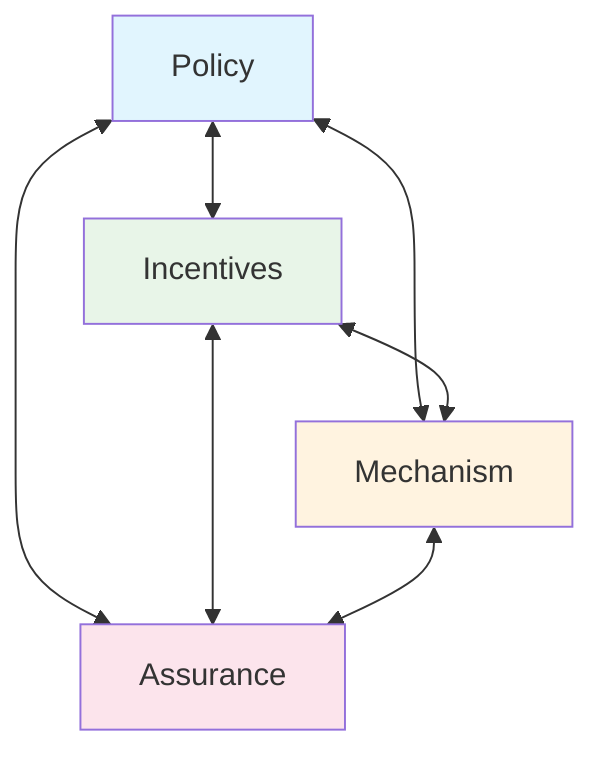

# Security Engineering. A Guide to Building Dependable Distributed Systems. Third Edition. Ross Anderson

https://www.cl.cam.ac.uk/archive/rja14/Papers/SEv3.pdf

**Що таке інженерія безпеки?**

*З кривого дерева людства ніколи не було створено нічого прямого.* – ІММАНУЇЛ КАНТ

*Світ ніколи не буде досконалим, ні онлайн, ні офлайн; тому не варто встановлювати неможливо високі стандарти для онлайн-світу.* – ЕСТЕР ДАЙСОН

## 1.1 Вступ

Інженерія безпеки - це створення систем, які залишаються надійними перед обличчям злого умислу, помилок або випадковостей. Як дисципліна, вона зосереджується на інструментах, процесах та методах, необхідних для проектування, впровадження та тестування повних систем, а також для адаптації існуючих систем у міру розвитку їх середовища.

Інженерія безпеки вимагає міждисциплінарної експертизи, починаючи від криптографії та комп'ютерної безпеки через апаратну стійкість до втручання до знання економіки, прикладної психології, організацій та права. Навички системної інженерії, від аналізу бізнес-процесів через розробку програмного забезпечення до оцінювання та тестування, також важливі; але вони недостатні, оскільки вони стосуються лише помилок та випадковостей, а не злого умислу.

Інженер безпеки також потребує деяких навичок змагального мислення, так само як шахіст; вам потрібно вивчити багато атак, які спрацьовували в минулому, від їх початку через розвиток до результатів.

Багато систем мають критичні вимоги до забезпечення. Їх відмова може загрожувати людському життю та навколишньому середовищу (як у випадку з ядерними системами безпеки та управління), завдати серйозної шкоди основній економічній інфраструктурі (банкомати та системи онлайн-платежів), загрожувати особистій приватності (системи медичних записів), підірвати життєздатність цілих бізнес-секторів (лічильники комунальних послуг з передоплатою) та сприяти злочинності (охоронна та автомобільна сигналізація).

Безпека та захищеність стають все більш переплетеними, оскільки ми отримуємо програмне забезпечення в усьому.

Навіть сприйняття того, що система є більш вразливою або менш надійною, ніж вона є насправді, може мати реальні соціальні витрати. Традиційний погляд полягає в тому, що якщо розробка програмного забезпечення стосується забезпечення того, щоб певні речі відбувалися ("Джон може прочитати цей файл"), то безпека стосується забезпечення того, щоб вони не відбувалися ("Китайський уряд не може прочитати цей файл"). Реальність набагато складніша.

Вимоги безпеки значно відрізняються від однієї системи до іншої. Зазвичай вам потрібна певна комбінація аутентифікації користувачів, цілісності транзакцій та підзвітності, відмовостійкості, секретності повідомлень та прихованості. Але багато систем зазнають невдачі, оскільки їх розробники захищають не ті речі, або захищають правильні речі, але неправильним способом.

Правильний захист таким чином залежить від кількох різних типів процесів. Вам потрібно з'ясувати, що потребує захисту, і як це робити. Вам також потрібно забезпечити, щоб люди, які охоронятимуть систему та підтримуватимуть її, були належним чином мотивовані. У наступному розділі я викладу концептуальну основу для роздумів про це.

Потім, щоб проілюструвати спектр різних речей, які повинні робити системи безпеки та захищеності, я коротко розгляну чотири сфери застосування: банк, військову базу, лікарню та дім. Коли ми надамо конкретні приклади речей, які інженери безпеки повинні розуміти та будувати, ми будемо в позиції, щоб спробувати дати деякі визначення.

## 1.2 Концептуальна основа

Щоб побудувати справді надійні системи, потрібно, щоб чотири речі з'єдналися разом. Є **політика**: те, чого ви повинні досягти. Є **механізм**: шифри, контроль доступу, апаратна стійкість до втручання та інші машинерії, які ви використовуєте для впровадження політики. Є **забезпечення**: ступінь довіри, яку ви можете покласти на кожен конкретний механізм, і наскільки добре вони працюють разом. Нарешті, є **стимул**: мотив, який люди, що охороняють та підтримують систему, мають для належного виконання своєї роботи, а також мотив, який мають зловмисники, щоб спробувати перемогти вашу політику.

Усі ці елементи взаємодіють (див. Рисунок 1.1). Як приклад, давайте подумаємо про терористичні атаки 11 вересня. Успіх викрадачів у пронесенні ножів через безпеку аеропорту був не збоєм механізму, а збоєм політики; оператори скринінгу виконали свою роботу з утримання зброї та вибухівки, але в той час ножі з лезами до трьох дюймів були дозволені.

Політика швидко змінилася: спочатку заборонити всі ножі, потім більшість зброї (бейсбольні біти тепер заборонені, але пляшки віскі дозволені); вона змінювалася туди-сюди щодо багатьох деталей (запальнички на бутані спочатку заборонили, потім знову дозволили).

Механізм слабкий через такі речі, як композитні ножі та вибухівка, яка не містить азоту. Забезпечення завжди погане; багато тонн нешкідливих речей пасажирів щомісяця потрапляють до сміття, тоді як менше половини всієї справжньої зброї, пронесеної через скринінг (чи то випадково, чи з метою тестування), помічається та конфіскується.

-----------------------------------------------------------------------------

# Security Engineering Analysis Framework

**Figure 1.1:** Security Engineering Analysis Framework

## Компоненти Framework:

**Policy (Політика)**
- Що ви повинні досягти
- Цілі та вимоги безпеки

**Incentives (Стимули)**
- Мотивація охоронців системи
- Мотивація зловмисників

**Mechanism (Механізм)**
- Шифри та криптографія
- Контроль доступу
- Апаратна захищеність
- Технічні засоби реалізації

**Assurance (Забезпечення)**
- Ступінь довіри до механізмів
- Взаємодія між компонентами
- Надійність системи в цілому

**Взаємозв'язки:**
- Всі чотири компоненти взаємопов'язані
- Зміна в одному компоненті впливає на інші
- Успішна безпека потребує балансу всіх елементів

-------------------------------------------------------------------------------

Більшість урядів надавали пріоритет видимим заходам над ефективними. Наприклад, TSA витратила мільярди на скринінг пасажирів, який є досить неефективним, тоді як 100 мільйонів доларів, витрачені на зміцнення дверей кабіни пілотів, усунули більшу частину ризику [1526]. Президент Альянсу безпеки пілотів авіакомпаній зазначив, що більшість наземного персоналу не перевіряється, і майже не приділяється уваги охороні літаків, припаркованих на землі вночі. Оскільки більшість авіалайнерів не мають замків на дверях, немає багато чого, що могло б зупинити лиходія від підкочування трапів до літака та розміщення бомби на борту; якби він мав навички пілотування та трохи нахабства, він міг би подати план польоту та втекти з літаком [1204]. Проте скринінг персоналу та охорона літаків просто не є пріоритетом.

Чому приймаються такі політичні рішення? Досить просто, стимули осіб, які приймають рішення, сприяють видимому контролю над ефективним. Результатом є те, що Брюс Шнайєр називає "театром безпеки" – заходи, призначені для створення відчуття безпеки, а не реальності.

Більшість гравців також мають стимул перебільшувати загрозу тероризму: політики для "залякування виборців" (як висловився президент Обама), журналісти для продажу більшої кількості газет, компанії для продажу більшої кількості обладнання, урядові чиновники для розбудови своїх імперій, та академіки з безпеки для отримання грантів. Результатом є те, що більшість шкоди, завданої терористами демократичним країнам, походить від надмірної реакції.

На щастя, електорат з часом це розуміє, і тепер – дев'ятнадцять років після 11 вересня – витрачається менше грошей. Звичайно, тепер ми знаємо, що набагато більше бюджету стійкості нашого суспільства повинно було бути витрачено на підготовку до пандемічної хвороби. Це було на вершині реєстру ризиків Британії, але тероризм був політично більш привабливим. Країни, які більш раціонально керували своїми пріоритетами, отримали набагато кращі результати.

Інженери безпеки повинні розуміти все це; ми повинні мати можливість ставити ризики та загрози в контекст, робити реалістичні оцінки того, що може піти не так, і давати нашим клієнтам хороші поради. Це залежить від широкого розуміння того, що йшло не так з часом з різними системами; які види атак спрацьовували, які були їх наслідки, і як їх зупинили (якщо це було зроблено).

варто було це робити). Історія також має значення, оскільки вона призводить до складності, а складність спричиняє багато невдач. Знання історії сучасної інформаційної безпеки дозволяє нам зрозуміти її складність та краще орієнтуватися в ній. Тому ця книга сповнена історій випадків. Щоб встановити сцену, я наведу тут кілька коротких прикладів цікавих систем безпеки та того, від чого вони призначені захищати.

## 1.3 Приклад 1 – банк

Банки експлуатують багато критично важливих для безпеки комп'ютерних систем.

1. **Операції банку базуються на основній системі бухгалтерського обліку.** Це зберігає головні файли рахунків клієнтів плюс ряд журналів, які записують вхідні та вихідні транзакції. Основною загрозою тут є власний персонал банку; близько одного відсотка персоналу банківських відділень звільняються щороку, переважно за дрібну нечесність (середня крадіжка становить лише кілька тисяч доларів). Традиційний захист походить від процедур бухгалтерського обліку, які розвивалися протягом століть. Наприклад, кожне списання з одного рахунку повинно відповідати зарахуванню на інший; таким чином гроші можуть лише переміщуватися всередині банку, ніколи не створюватися або знищуватися. Крім того, великі перекази зазвичай потребують авторизації двох осіб. Також є сигналізація, яка шукає незвичайні обсяги або шаблони транзакцій, і персонал зобов'язаний брати регулярні відпустки без доступу до банківських систем.

2. **Одним з публічних облич є банкомати банку.** Аутентифікація транзакцій на основі картки клієнта та персонального ідентифікаційного номера – щоб захиститися як від зовнішніх, так і від внутрішніх атак – складніша, ніж здається! Було багато епідемій "фантомних зняттів" у різних країнах, коли місцеві лиходії (або банківський персонал) знаходили та експлуатували лазівки в системі. Банкомати також цікаві тим, що вони були першим великомасштабним комерційним використанням криптографії, і вони допомогли встановити ряд криптографічних стандартів. Механізми, розроблені для банкоматів, були розширені до терміналів точок продажу в магазинах, де карткові платежі значною мірою витіснили готівку; і вони були адаптовані для інших застосувань, таких як лічильники комунальних послуг з передоплатою.

3. **Іншим публічним обличчям є веб-сайт банку та мобільний додаток.** Більшість клієнтів тепер ведуть свої рутинні справи, такі як оплата рахунків та перекази між ощадними та поточними рахунками, онлайн, а не у відділенні. Банківські веб-сайти зазнають важких атак з 2005 року від фішингу – коли клієнтів запрошують ввести свої паролі

на підроблених веб-сайтах. Стандартні механізми безпеки, розроблені в 1990-х роках, виявилися менш ефективними, коли злочинці почали атакувати клієнтів, а не банк, тому багато банків тепер надсилають вам текстове повідомлення з кодом аутентифікації. Реакція шахраїв полягає в тому, щоб піти до телефонного магазину, видати себе за вас і купити новий телефон, який перебирає ваш номер телефону. Ця гонка озброєнь створює багато захоплюючих проблем інженерії безпеки, змішуючи елементи аутентифікації, зручності використання, психології, операцій та економіки.

4. **За лаштунками знаходяться системи обміну повідомленнями високої вартості**, які використовуються для переміщення великих сум між банками; для торгівлі цінними паперами; для видачі акредитивів та гарантій; і так далі. Атака на таку систему - це мрія високотехнологічного злочинця - і ми чуємо, що уряд Північної Кореї вкрав багато мільйонів через атаки на банки. Захист є сумішшю контролю бухгалтерського обліку, контролю доступу та криптографії.

5. **Відділення банку можуть здаватися великими, міцними та процвітаючими**, заспокоюючи клієнтів, що їхні гроші в безпеці. Але кам'яний фасад - це театр, а не реальність. Якщо ви зайдете з пістолетом, касири дадуть вам всю готівку, яку ви можете побачити; і якщо ви вломитеся вночі, ви можете прорізати сейф за хвилини абразивним кругом. Ефективні засоби контролю зосереджені на системах сигналізації, які підключені до центру управління охоронної компанії, персонал якої перевіряє речі за допомогою відео та викликає поліцію, якщо необхідно. Криптографія використовується для запобігання маніпулюванню грабіжником комунікацій та створення видимості того, що сигналізація каже "все добре", коли це не так.

Я розгляну ці застосування в наступних розділах. Комп'ютерна безпека банківської справи важлива: до початку 2000-х років банки були основним цивільним ринком для багатьох продуктів комп'ютерної безпеки, тому вони мали величезний вплив на стандарти безпеки.

## 1.4 Приклад 2 – військова база

Військові системи були іншим технологічним рушієм у XX столітті, оскільки вони мотивували більшу частину академічних досліджень, які уряди фінансували в галузі комп'ютерної безпеки з початку 1980-х років. Як і в банківській справі, це не одне застосування, а багато.

1. **Військові комунікації стимулювали розвиток криптографії**, сягаючи корінням до стародавнього Єгипту та Месопотамії. Але часто недостатньо просто зашифрувати повідомлення: ворог, який бачить трафік, зашифрований чужими ключами, може просто знайти та атакувати передавач. Радіозв'язки з низькою ймовірністю перехоплення (LPI) є одним з рішень; вони використовують трюки, які тепер прийняті в щоденних комунікаціях, таких як Bluetooth.

2. **Починаючи з 1940-х років, уряди витратили багато грошей на системи радіоелектронної боротьби.** Гонка озброєнь, спрямована на глушення ворожих радарів, запобігаючи при цьому ворогу глушити ваші, привела до багатьох складних трюків обману, контрзаходів та контр-контрзаходів – з глибиною, тонкістю та діапазоном стратегій, які досі не зустрічаються в інших місцях. Атаки підміни та відмови в обслуговуванні були там реальністю задовго до того, як шантажисти почали атакувати веб-сайти банкірів, букмекерів та геймерів.

3. **Військові організації повинні тримати деяку інформацію в секреті**, такою як джерела розвідки та плани майбутніх операцій. Вони зазвичай позначаються як "Цілком секретно" та обробляються на окремих системах; вони можуть бути додатково обмежені в відсіках, щоб найбільш чутлива інформація була відома лише жменьці людей. Роками робилися спроби впровадити правила потоку інформації, щоб ви могли скопіювати файл з секретної системи зберігання до командної системи "Цілком секретно", але не навпаки. Управління множинними системами з обмеженнями потоку інформації є складною проблемою, і мільярди, які були витрачені на спроби автоматизації військової безпеки, допомогли розробити технологію контролю доступу, яку ви тепер маєте у своєму мобільному телефоні та ноутбуці.

4. **Проблеми захисту ядерної зброї призвели до винаходу багатьох крутих технологій безпеки**, починаючи від доказово безпечних систем аутентифікації, через оптоволоконні датчики сигналізації, до методів ідентифікації людей за допомогою біометрії – включаючи патерни райдужки, які тепер використовуються для ідентифікації всіх громадян Індії.

Інженер безпеки досі може багато чому навчитися з цього. Наприклад, військові були до недавнього часу одними з небагатьох клієнтів для програмних систем, які повинні були підтримуватися десятиліттями. Тепер, коли програмне забезпечення та підключення до Інтернету знаходять свій шлях до критично важливих для безпеки споживчих товарів, таких як автомобілі, стійкість програмного забезпечення стає набагато ширшою проблемою.

У 2019 році Європейський Союз прийняв закон, який вимагає, щоб якщо ви продаєте товари з цифровими компонентами, ви повинні підтримувати ці компоненти протягом двох років, або довше, якщо це розумне очікування клієнта – що означатиме десять років для автомобілів та побутової техніки. Якщо ви пишете програмне забезпечення для автомобіля або холодильника, який буде продаватися сім років, вам доведеться підтримувати його майже двадцять років. Які інструменти ви повинні використовувати?

## 1.5 Приклад 3 – лікарня

Від банкірів та солдатів ми переходимо до охорони здоров'я. Лікарні мають ряд цікавих вимог до захисту – переважно пов'язаних з безпекою та конфіденційністю пацієнтів.

1. **Безпека використання важлива для медичного обладнання і жодним чином не є вирішеною проблемою.** Оцінюється, що збої безпеки використання вбивають приблизно стільки ж людей, скільки дорожньо-транспортні пригоди – кілька десятків тисяч на рік у США, наприклад, і кілька тисяч у Великобританії. Найбільша проблема – з інфузійними насосами, які використовуються для крапельного введення ліків пацієнтам; типова лікарня може мати півдюжини різних марок, всі з дещо різними елементами управління, що робить фатальні помилки більш імовірними. Безпека використання взаємодіє з безпекою: небезпечні пристрої, які також виявляються хакерськими, набагато частіше мають накази про відкликання продукції, оскільки регулятори знають, що апетит громадськості до ризику нижчий, коли вороже втручання стає можливістю. Тому, оскільки все більше і більше медичних пристроїв отримують не лише програмне забезпечення, але й радіозв'язок, чутливість до безпеки може призвести до кращої безпеки.

2. **Системи записів пацієнтів не повинні дозволяти всьому персоналу бачити запис кожного пацієнта, інакше можна очікувати порушень конфіденційності.** Фактично, з часу другого видання цієї книги, Європейський суд постановив, що пацієнти мають право обмежити свою особисту медичну інформацію клінічним персоналом, залученим до їх догляду. Це означає, що системи повинні впроваджувати такі правила, як "медсестри можуть бачити записи будь-якого пацієнта, за яким доглядали в їхньому відділенні в будь-який час протягом попередніх 90 днів". Це може бути складніше, ніж здається. (Американське законодавство HIPAA встановлює легші стандарти для відповідності, але все ще є рушієм інвестицій в інформаційну безпеку.)

3. **Записи пацієнтів часто анонімізуються для використання в дослідженнях, але це важко зробити добре.** Простого шифрування імен пацієнтів недостатньо: запит типу "покажіть мені всіх чоловіків, народжених у 1953 році, які лікувалися від фібриляції передсердь 19 жовтня 2003 року" повинен бути достатнім для ідентифікації колишнього прем'єр-міністра Тоні Блера, якого того дня терміново доставили до лікарні для лікування нерегулярного серцебиття. З'ясувати, які дані можна ефективно анонімізувати, важко, і це також рухома ціль, оскільки ми отримуємо все більше і більше соціальних та контекстних даних – не кажучи вже про генетичні дані близьких і далеких родичів.

4. **Нові технології можуть вводити погано зрозумілі ризики.** Адміністратори лікарень розуміють необхідність резервних процедур для боротьби з відключеннями електроенергії; лікарні повинні мати можливість боротися з травмами, навіть якщо їх основне електропостачання та водопостачання відмовляють. Але після того, як кілька лікарень у Британії мали машини, заражені шкідливим ПЗ Wannacry у травні 2017 року, вони закрили свої мережі, щоб обмежити подальше зараження, а потім виявили, що їм довелося закрити свої відділення нещасних випадків та невідкладної допомоги – оскільки рентгенівські знімки більше не подорожують від рентгенівського апарата до операційної в конверті, а через сервер у далекому місті. Тому збій мережі може зупинити операції лікарів, коли збій електроенергії цього не зробив би. Були резервні генератори, але не було резервного

мережі. Хмарні сервіси можуть зробити речі в середньому більш надійними, але збої можуть бути більшими, складнішими та корельованими.

Проблема, яка виникла під час пандемії коронавірусу, - це контроль аксесуарів: деякі медичні пристрої аутентифікують свої запчастини, так само як принтери аутентифікують картриджі з чорнилом. Хоча постачальники стверджують, що це для безпеки, насправді це для того, щоб вони могли брати більше грошей за запчастини. Але це вводить крихкість: коли ланцюг постачання переривається, речі набагато важче виправити.

Ми розглянемо безпеку медичних систем (а також безпеку) більш детально пізніше. Це молодша галузь, ніж банківські ІТ або військові системи, але оскільки охорона здоров'я становить більшу частку ВНП, ніж будь-яка з них у всіх розвинених країнах, її важливість зростає. Це також постійно найбільше джерело порушень конфіденційності в країнах з обов'язковою звітністю.

## 1.6 Приклад 4 – дім

Ви можете не думати, що типова сім'я експлуатує будь-які безпечні системи. Але просто зупиніться і подумайте.

1. **Ви, ймовірно, використовуєте деякі з систем, які я вже описав.** Ви можете використовувати веб-систему електронного банкінгу для оплати рахунків, і ви можете мати онлайн-доступ до кабінету свого лікаря, щоб замовляти повторні рецепти. Якщо ви діабетик, то ваша інсулінова помпа може спілкуватися з док-станцією біля вашого ліжка. Ваша домашня сигналізація від крадіжок може надсилати зашифрований сигнал "все добре" охоронній компанії кожні кілька хвилин, а не будити район, коли щось трапляється.

2. **Ваш автомобіль, ймовірно, має електронний іммобілайзер.** Якщо він був виготовлений до близько 2015 року, автомобіль розблокується, коли ви натискаєте кнопку на ключі, який надсилає зашифровану команду розблокування. Якщо це більш нова модель, де вам не потрібно натискати жодних кнопок, а просто мати ключ у кишені, автомобіль надсилає зашифрований виклик ключу і чекає правильної відповіді. Але усунення натискання кнопки означало, що якщо ви залишите свій ключ біля передніх дверей, злодій може використати радіорелейний зв'язок, щоб вкрасти ваш автомобіль. Крадіжки автомобілів різко зросли з моменту впровадження цієї технології.

3. **Ваш мобільний телефон аутентифікує себе в мережі за допомогою криптографічного протоколу виклику-відповіді**, подібного до тих, що використовуються в замках автомобільних дверей та іммобілайзерах, але поліція може використовувати фальшиву базову станцію (відому в Європі як IMSI-catcher, а в Америці як Stingray) для прослуховування. І, як я згадував вище, багато телефонних компаній спокійно ставляться до продажу нових SIM-карт людям, які стверджують, що їхні телефони були вкрадені; тому шахрай може вкрасти ваш номер телефону і використати це для пограбування вашого банківського рахунку.

4. **У понад 100 країнах домогосподарства можуть отримати лічильники з передоплатою для електрики та газу**, які вони поповнюють, використовуючи 20-значний код, який купують в банкоматі або онлайн-сервісі. Це навіть працює поза мережею; у кенійських селах люди, які не можуть дозволити собі $200 за сонячну панель, можуть отримати її за $2 на тиждень і розблокувати електрику, яку вона виробляє, використовуючи коди, які вони купують своїми мобільними телефонами.

5. **Понад усе, дім забезпечує притулок фізичної безпеки та усамітнення.** Це змінюється кількома способами. Грабіжників турбують не стільки замки, скільки мешканці, тому сигналізація та системи моніторингу можуть допомогти; але моніторинг також стає всепроникним, з багатьма домогосподарствами, що купують системи як Alexa та Google Home, які слухають, що говорять люди. Всілякі інші пристрої тепер мають мікрофони та камери, оскільки голосові та жестові інтерфейси стають звичайними, і обробка мовлення зазвичай виконується в хмарі для збереження заряду батареї. До 2015 року рада радників президента Обами з науки та технологій передбачала, що дуже скоро кожен населений простір на землі матиме мікрофони, які будуть підключені до невеликої кількості хмарних провайдерів послуг. (США та Європа мають досить різні погляди на те, як закон про конфіденційність повинен боротися з цим.)

Так чи інакше, безпека вашого дому може залежати від віддалених систем, над якими ви маєте мало контролю. Протягом наступних кількох років кількість таких систем швидко зростатиме. За попереднім досвідом, багато з них будуть погано спроектовані. Наприклад, у 2019 році Європа заборонила дитячий годинник, який використовував незашифровані комунікації до хмарного сервісу постачальника; прослуховувач міг завантажити історію місцезнаходження будь-якої дитини та змусити її годинник телефонувати на будь-який номер у світі. Коли це було виявлено, ЄС наказав негайно відкликати всі годинники з міркувань безпеки [903].

Ця книга має на меті допомогти вам уникнути таких результатів. Щоб проектувати системи, які є безпечними та захищеними, інженер повинен знати про те, які системи існують, як вони працюють, і – принаймні так само важливо – як вони зазнавали невдач у минулому. Інженери-будівельники вчаться набагато більше з одного моста, який падає, ніж зі ста, які стоять; точно те ж саме стосується інженерії безпеки.

## 1.7 Визначення

Багато термінів, що використовуються в інженерії безпеки, є зрозумілими, але деякі вводять в оману або навіть є спірними. Є більш детальні визначення технічних термінів у відповідних розділах, які ви можете знайти, використовуючи індекс. У цьому розділі я спробую вказати, де лежать основні проблеми.
