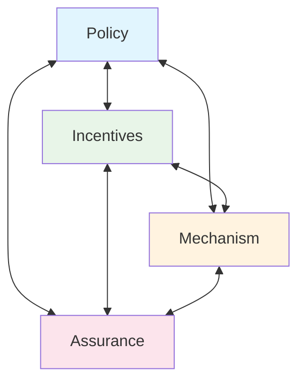

Комплексна Mind Map для Security Engineering, яка охоплює всі ключові аспекти цієї галузі. 

Ось основні характеристики:

## 🎯 **Структура Mind Map:**

### **6 основних гілок:**
1. **Fundamentals** - принципи, threat modeling, risk management
2. **Core Technologies** - криптографія, access control, network security  
3. **Application Security** - SAST/DAST/IAST, secure development
4. **Infrastructure Security** - cloud, containers, IaC
5. **DevSecOps** - CI/CD security, automation, monitoring
6. **Specialized Domains** - IoT, mobile, AI/ML security

### **Додаткові розділи:**
- **Compliance & Governance** - стандарти, аудит, GRC
- **Human Factors** - awareness, social engineering, usable security

## 🔗 **Ключові особливості:**

✅ **Всеохоплюючість** - від базових принципів до emerging technologies  
✅ **Практичність** - конкретні інструменти та технології  
✅ **Career guidance** - шляхи розвитку кар'єри  
✅ **Integration points** - зв'язки між різними доменами  
✅ **Learning progression** - від початківця до експерта  

## 🎓 **Практичне застосування:**

- **Навчальний план** для security engineers
- **Skill assessment** для HR та менеджерів
- **Career roadmap** для професійного розвитку
- **Project planning** для security initiatives
- **Interview preparation** для security позицій

Mind Map можна використовувати як:
- Довідковий матеріал для вивчення Security Engineering
- Основу для створення навчальних програм
- Чекліст для security assessments
- Структуру для організації security team expertise


# Security Engineering Mind Map

```mermaid
mindmap
  root((Security Engineering))
    Fundamentals
      Principles
        CIA Triad
          Confidentiality
          Integrity
          Availability
        Saltzer & Schroeder
          Least Privilege
          Fail Safe Defaults
          Complete Mediation
          Open Design
          Separation of Privilege
          Economy of Mechanism
          Psychological Acceptability
        Defense in Depth
        Zero Trust
      Threat Modeling
        STRIDE
          Spoofing
          Tampering
          Repudiation
          Information Disclosure
          Denial of Service
          Elevation of Privilege
        PASTA
        VAST
        Attack Trees
      Risk Management
        Risk Assessment
        Risk Analysis
        Risk Mitigation
        Risk Monitoring
        
    Core Technologies
      Cryptography
        Symmetric
          AES
          ChaCha20
          Block Ciphers
          Stream Ciphers
        Asymmetric
          RSA
          ECC
          Diffie-Hellman
        Hash Functions
          SHA-256
          SHA-3
          BLAKE2
        Digital Signatures
        PKI
          Certificates
          CAs
          Trust Models
        Modern Crypto
          Post-Quantum
          Homomorphic
          Zero-Knowledge
      Access Control
        Authentication
          Passwords
          MFA/2FA
          Biometrics
          Certificates
        Authorization
          RBAC
          ABAC
          DAC
          MAC
        Identity Management
          SSO
          Federation
          LDAP/AD
          OAuth/OIDC
      Network Security
        Firewalls
          Packet Filtering
          Stateful
          Application Layer
        VPN
          IPSec
          SSL/TLS VPN
          WireGuard
        IDS/IPS
        Network Monitoring
        Zero Trust Network
        
    Application Security
      SAST
        Static Analysis
        Code Review
        Security Testing
        Tools
          SonarQube
          Checkmarx
          Veracode
          Fortify
      DAST
        Dynamic Testing
        Penetration Testing
        Vulnerability Scanning
        Tools
          OWASP ZAP
          Burp Suite
          Nessus
      IAST
        Interactive Testing
        Runtime Analysis
        Hybrid Approach
      Software Composition Analysis
        Dependency Scanning
        License Compliance
        Vulnerability Database
        Tools
          Snyk
          WhiteSource
          OWASP Dependency Check
      Secure Development
        SSDLC
        Security Requirements
        Secure Coding
        Code Review
        Security Testing
        
    Infrastructure Security
      Cloud Security
        AWS Security
          IAM
          VPC
          CloudTrail
          Config
        Azure Security
          Azure AD
          Security Center
          Key Vault
        GCP Security
          Cloud IAM
          Security Command Center
          Cloud KMS
        Multi-Cloud
        Shared Responsibility
      Container Security
        Docker Security
        Kubernetes Security
        Image Scanning
        Runtime Protection
        Tools
          Aqua
          Twistlock
          Anchore
      Infrastructure as Code
        Terraform Security
        CloudFormation Security
        Policy as Code
        Compliance Scanning
        Tools
          Checkov
          Bridgecrew
          TFSec
      Operating System Security
        Windows Security
        Linux Security
        Hardening
        Patch Management
        
    DevSecOps
      CI/CD Security
        Pipeline Security
        Secret Management
        Automated Testing
        Security Gates
      Security Automation
        SOAR
        Security Orchestration
        Automated Response
        Playbooks
      Monitoring & Detection
        SIEM
        EDR
        UEBA
        Threat Intelligence
      Incident Response
        Preparation
        Detection
        Containment
        Eradication
        Recovery
        Lessons Learned
      Vulnerability Management
        Scanning
        Assessment
        Prioritization
        Remediation
        False Positive Analysis
        
    Specialized Domains
      IoT Security
        Device Security
        Communication Security
        Update Mechanisms
        Privacy
      Mobile Security
        iOS Security
        Android Security
        App Security
        Mobile Device Management
      Embedded Security
        Hardware Security
        Firmware Security
        Secure Boot
        Trusted Execution
      AI/ML Security
        Model Security
        Data Privacy
        Adversarial Attacks
        Secure ML Pipeline
        
    Compliance & Governance
      Standards & Frameworks
        ISO 27001
        NIST Framework
        SOC 2
        PCI DSS
        GDPR
        HIPAA
      Security Assessment
        Auditing
        Penetration Testing
        Red Team
        Blue Team
        Purple Team
      Risk Management
        GRC
        Risk Assessment
        Business Continuity
        Disaster Recovery
      Privacy Engineering
        Privacy by Design
        Data Protection
        Consent Management
        Data Minimization
        
    Human Factors
      Security Awareness
        Training Programs
        Phishing Simulation
        Security Culture
      Social Engineering
        Phishing
        Vishing
        Pretexting
        Baiting
      Usable Security
        User Experience
        Security Friction
        Behavioral Security
      Insider Threats
        Privileged Users
        Monitoring
        Background Checks
        Access Reviews
```



## Детальний опис основних компонентів

### 🎯 **Security Engineering Fundamentals**

#### **Security Principles**
- **CIA Triad**: Основа інформаційної безпеки - Конфіденційність, Цілісність, Доступність
- **Saltzer & Schroeder Principles**: 8 класичних принципів дизайну безпечних систем (1975)
- **Defense in Depth**: Багаторівневий захист з множинними контролями
- **Zero Trust**: "Never trust, always verify" - сучасна парадигма безпеки

#### **Threat Modeling**
- **STRIDE**: Microsoft framework для класифікації загроз
- **PASTA**: Process for Attack Simulation and Threat Analysis
- **Attack Trees**: Візуальне представлення шляхів атак

### 🔐 **Core Technologies**

#### **Cryptography**
- **Symmetric Crypto**: AES, ChaCha20 для швидкого шифрування
- **Asymmetric Crypto**: RSA, ECC для обміну ключами та цифрових підписів
- **Hash Functions**: SHA-256, BLAKE2 для забезпечення цілісності
- **Modern Developments**: Post-quantum, homomorphic, zero-knowledge криптографія

#### **Access Control**
- **Authentication**: Багатофакторна автентифікація, біометрія
- **Authorization**: RBAC (Role-Based), ABAC (Attribute-Based) контроль доступу
- **Identity Management**: Федеративна ідентичність, SSO рішення

### 🛡️ **Application Security**

#### **Testing Methodologies**
- **SAST**: Статичний аналіз коду без виконання
- **DAST**: Динамічне тестування працюючого додатка
- **IAST**: Інтерактивне тестування з runtime аналізом
- **SCA**: Аналіз безпеки сторонніх компонентів

#### **Secure Development**
- **SSDLC**: Secure Software Development Lifecycle
- **Security Requirements**: Вимоги безпеки на етапі планування
- **Code Review**: Peer review з фокусом на безпеку

### ☁️ **Infrastructure Security**

#### **Cloud Security**
- **Provider-Specific**: AWS, Azure, GCP специфічні сервіси безпеки
- **Multi-Cloud**: Уніфіковані підходи до безпеки
- **Shared Responsibility**: Розподіл відповідальності між провайдером та клієнтом

#### **Container & IaC Security**
- **Container Security**: Docker, Kubernetes, runtime захист
- **Infrastructure as Code**: Terraform, CloudFormation security scanning
- **Policy as Code**: Автоматизована перевірка compliance

### 🔄 **DevSecOps**

#### **CI/CD Security**
- **Pipeline Security**: Захист самого CI/CD пайплайну
- **Secret Management**: Безпечне управління credentials
- **Security Gates**: Автоматичні перевірки безпеки в пайплайні

#### **Monitoring & Response**
- **SIEM**: Security Information and Event Management
- **EDR**: Endpoint Detection and Response
- **Incident Response**: Структурований підхід до обробки інцидентів

### 🎓 **Specialized Domains**

#### **Emerging Technologies**
- **IoT Security**: Безпека пристроїв Інтернету речей
- **Mobile Security**: iOS/Android специфічна безпека
- **AI/ML Security**: Безпека машинного навчання та штучного інтелекту

#### **Industry-Specific**
- **Embedded Security**: Безпека вбудованих систем
- **Critical Infrastructure**: SCADA, ICS безпека
- **Financial Security**: FinTech специфічні вимоги

### 📊 **Compliance & Governance**

#### **Standards & Frameworks**
- **ISO 27001**: Міжнародний стандарт ISMS
- **NIST Framework**: Американський національний framework
- **Industry-Specific**: PCI DSS, HIPAA, GDPR compliance

#### **Assessment & Audit**
- **Penetration Testing**: Ethical hacking для виявлення вразливостей
- **Red/Blue/Purple Teams**: Різні підходи до security assessment
- **Compliance Auditing**: Перевірка відповідності стандартам

### 👥 **Human Factors**

#### **Security Awareness**
- **Training Programs**: Освітні програми для співробітників
- **Phishing Simulation**: Практичні тренування протидії фішингу
- **Security Culture**: Формування культури безпеки в організації

#### **Behavioral Security**
- **Usable Security**: Баланс між безпекою та зручністю
- **Social Engineering**: Розуміння психологічних атак
- **Insider Threats**: Захист від внутрішніх загроз

---

## Зв'язки та взаємодії

### 🔗 **Horizontal Integration**
- **DevSecOps ↔ Application Security**: Інтеграція security testing в розробку
- **Infrastructure ↔ Cloud Security**: Hybrid та multi-cloud архітектури
- **Compliance ↔ Technical Controls**: Відповідність через технічні засоби

### 📈 **Vertical Integration**
- **Principles → Technologies → Implementation**: Від теорії до практики
- **Risk Management → Controls → Monitoring**: Управління ризиками
- **Strategy → Tactics → Operations**: Стратегічне планування до щоденних операцій

### 🎯 **Career Pathways**

#### **Technical Tracks**
- **Cryptography Engineer**: Глибока експертиза в криптографії
- **Application Security**: SAST/DAST, secure coding
- **Cloud Security Architect**: Multi-cloud безпека
- **DevSecOps Engineer**: Автоматизація безпеки

#### **Management Tracks**
- **Security Manager**: Керування командами безпеки
- **CISO**: Chief Information Security Officer
- **GRC Specialist**: Governance, Risk, Compliance
- **Security Consultant**: Зовнішнє консультування

### 🛠️ **Tool Ecosystem Integration**

#### **SIEM Integration Hub**
```
SIEM ← EDR, Network Monitoring, Application Logs
SIEM → SOAR, Incident Response, Threat Intelligence
```

#### **DevSecOps Toolchain**
```
IDE → SAST → Repository → CI/CD → DAST → Deployment → Monitoring
      ↓        ↓        ↓      ↓       ↓           ↓
    SonarQube GitHub   Jenkins OWASP  Production  Splunk
```

### 📚 **Learning Progression**

#### **Beginner Path**
1. **Fundamentals** → Security principles, basic cryptography
2. **Core Technologies** → Hands-on with tools and technologies
3. **Specialization** → Choose domain (AppSec, Cloud, DevSecOps)

#### **Advanced Path**
1. **Architecture** → Designing secure systems
2. **Leadership** → Managing security programs
3. **Innovation** → Research and development

This mind map provides a comprehensive overview of the Security Engineering field, showing both the breadth and depth of knowledge required, as well as the interconnections between different domains and the career progression opportunities available.

------------------------------------------------------------------------------------------------------------------------------------------


Data Analytics відіграє ключову роль в сучасному Security Engineering, трансформуючи підхід до кібербезпеки від реактивного до проактивного. Ось основні аспекти цього взаємозв'язку:

## Основні функції Data Analytics в Security Engineering

**Виявлення аномалій та загроз**
Data Analytics дозволяє аналізувати великі обсяги логів, мережевого трафіку та поведінкових даних для виявлення нетипових патернів, які можуть сигналізувати про кіберзагрози. Машинне навчання допомагає виявляти як відомі, так і невідомі раніше атаки.

**Превентивний аналіз ризиків**
Аналіз даних дозволяє оцінювати рівень ризику різних активів та систем, прогнозувати потенційні вектори атак та пріоритизувати заходи захисту відповідно до реального рівня загрози.

**Розслідування інцидентів**
При виникненні інцидентів безпеки, аналітика допомагає швидко відстежити джерело атаки, зрозуміти її масштаб та вплив, а також визначити найефективніші заходи реагування.

## Технологічні компоненти

**SIEM (Security Information and Event Management)**
Системи SIEM збирають та корелюють дані з різних джерел, використовуючи аналітичні алгоритми для виявлення підозрілих активностей в режимі реального часу.

**User and Entity Behavior Analytics (UEBA)**
Ці рішення аналізують поведінку користувачів та сутностей в мережі, виявляючи відхилення від нормальних патернів активності.

**Threat Intelligence**
Аналітика зовнішніх даних про загрози допомагає контекстуалізувати внутрішні події та підвищити точність виявлення атак.

## Переваги інтеграції

Використання Data Analytics в Security Engineering значно підвищує швидкість виявлення загроз, зменшує кількість хибних спрацювань, дозволяє автоматизувати рутинні процеси та забезпечує більш глибоке розуміння ландшафту загроз. Це особливо критично в умовах зростаючої складності та частоти кібератак.

Сучасні організації розглядають Data Analytics не як допоміжний інструмент, а як фундаментальний компонент своєї стратегії кібербезпеки, що дозволяє створювати адаптивні та інтелектуальні системи захисту.


---------------------------------------------------


Security Engineering та кібербезпека - це взаємопов'язані, але різні поняття з власними фокусами та підходами:

## Security Engineering

**Інженерний підхід**
Security Engineering - це системна дисципліна, що застосовує інженерні принципи для розробки безпечних систем з самого початку. Це методологія "security by design", де безпека інтегрується на етапі архітектури та проектування.

**Фокус на системах**
Зосереджується на створенні надійних, стійких систем, які можуть протистояти різним типам загроз - не лише кіберзагрозам, але й фізичним, соціальним та операційним ризикам.

**Lifecycle approach**
Охоплює весь життєвий цикл системи: від планування та проектування до впровадження, експлуатації та виведення з експлуатації.

## Кібербезпека

**Операційний фокус**
Кібербезпека зосереджена переважно на захисті цифрових активів, мереж, даних та комп'ютерних систем від кіберзагроз.

**Реактивний та проактивний захист**
Включає моніторинг, виявлення, реагування на інциденти та відновлення після кібератак.

**Технологічна спрямованість**
Основну увагу приділяє технічним засобам захисту: фаєрволи, антивіруси, системи виявлення вторгнень, шифрування тощо.

## Ключові відмінності

**Масштаб застосування**
Security Engineering має ширший контекст і може застосовуватися до будь-яких систем (фізичних, цифрових, організаційних), тоді як кібербезпека зосереджена виключно на цифровому просторі.

**Хронологія втручання**
Security Engineering працює на етапі проектування систем, тоді як кібербезпека часто займається захистом вже існуючих систем.

**Методологія**
Security Engineering використовує формальні методи моделювання загроз, аналізу ризиків та верифікації, тоді як кібербезпека більше орієнтована на практичну реалізацію захисних заходів.

## Взаємодія в практиці

У реальних проектах ці дисципліни доповнюють одна одну: Security Engineering забезпечує фундаментальну архітектурну безпеку, а кібербезпека реалізує конкретні технічні рішення та процеси для захисту від цифрових загроз. Ефективна стратегія безпеки організації потребує інтеграції обох підходів.


-------------------------------------------------------------
Я створив комплексну підборку книг з Security Engineering та Cloud Security Engineering, структуровану за рівнями складності та спеціалізаціями.

## Ключові рекомендації:

### 🥇 **Must-read для всіх:**
- **Ross Anderson "Security Engineering"** - абсолютна класика, 3-є видання (2020)
- Безкоштовно доступна онлайн після комерційного періоду

### ☁️ **Для Cloud Security:**
- **"Building Secure and Reliable Systems"** (Google SRE підхід)
- **"Cloud Security Handbook"** (сучасний multi-cloud)
- **"Container Security"** (Liz Rice для контейнерів)

### 🛠️ **Для практики:**
- **"Web Application Hacker's Handbook"** - класика веб-безпеки
- **"Black Hat Python"** - автоматизація через Python
- **"Zero Trust Networks"** - сучасна архітектура

### 📈 **По рівнях досвіду:**
- **Початківець**: Ross Anderson + OWASP + Cloud документація
- **Середній**: + Google SRE book + Container Security
- **Експерт**: + Cryptography Engineering + дослідження

Підборка охоплює всі аспекти - від фундаментальної теорії до практичних навичок, від традиційної безпеки до сучасних хмарних технологій. Кожна книга має коротке пояснення, чому саме вона важлива.

---------------------------

# Підборка книг по Security Engineering та Cloud Security Engineering

## 📚 Фундаментальні книги по Security Engineering

### 🥇 **Топ-1: Класика жанру**

#### **"Security Engineering: A Guide to Building Dependable Distributed Systems"** 
**Автор**: Ross Anderson  
**Видання**: 3-є видання (2020)  
**Сторінок**: 1232  

**Чому обов'язково до прочитання:**
- 📖 **Найповніший** підручник з інженерії безпеки
- 🎯 Охоплює **всі аспекти**: від криптографії до психології
- 💼 **Реальні кейси** з банківської, військової, медичної сфер
- 🆓 **Безкоштовно доступна** онлайн (після комерційного періоду)

**Особливості 3-го видання:**
- Хмарні технології та IoT
- Сучасні загрози (від кіберзлочинців до держав)
- DevSecOps та Agile Security
- AI/ML безпека

---

### 🥈 **Топ-2: Практична криптографія**

#### **"Cryptography Engineering: Design Principles and Practical Applications"**
**Автори**: Niels Ferguson, Bruce Schneier, Tadayoshi Kohno  
**Видання**: 2010  
**Сторінок**: 384  

**Фокус:**
- 🔐 **Практична реалізація** криптографічних систем
- ⚠️ **Типові помилки** в криптографії
- 🛠️ **Інженерні аспекти** безпеки
- 📋 **Протоколи та стандарти**

---

### 🥉 **Топ-3: Архітектура безпеки**

#### **"Building Secure and Reliable Systems"**
**Автори**: Heather Adkins, Betsy Beyer, Paul Blankinship, Ana Oprea, Piotr Lewandowski, Adam Stubblefield  
**Видання**: 2020  
**Сторінок**: 558  

**Google SRE підхід до безпеки:**
- 🏗️ **Архітектурні принципи** безпечних систем
- 🔄 **SRE + Security** практики
- ☁️ **Хмарна безпека** на практиці
- 📊 **Метрики та моніторинг** безпеки

---

## ☁️ Спеціалізовані книги по Cloud Security

### 🌟 **AWS Security**

#### **"AWS Security Best Practices"**
**Автор**: Albert Anthony  
**Видання**: 2023  
**Сторінок**: 456  

**Покриває:**
- 🔑 IAM та Access Management
- 🛡️ Network Security в AWS
- 📊 CloudTrail та моніторинг
- 🏗️ Secure Architecture Patterns

#### **"Hands-On AWS Penetration Testing with Kali Linux"**
**Автор**: Karl Gilbert, Benjamin Caudill  
**Видання**: 2019  
**Сторінок**: 508  

**Практичний підхід:**
- 🎯 **Пентестинг** AWS інфраструктури
- 🔍 **Вразливості** хмарних сервісів
- 🛠️ **Інструменти** для тестування
- 📋 **Методології** оцінки безпеки

---

### 🌟 **Multi-Cloud Security**

#### **"Cloud Security and Privacy: An Enterprise Perspective on Risks and Compliance"**
**Автор**: Tim Mather, Subra Kumaraswamy, Shahed Latif  
**Видання**: 2009 (класика, але все ще актуальна)  
**Сторінок**: 384  

**Enterprise фокус:**
- 📊 **Compliance** та регулювання
- ⚖️ **Ризик-менеджмент** в хмарі
- 🏢 **Корпоративні** стратегії
- 📋 **Frameworks** та стандарти

#### **"Cloud Security Handbook"**
**Автор**: Eyal Estrin  
**Видання**: 2022  
**Сторінок**: 490  

**Сучасний підхід:**
- 🌐 **Multi-cloud** стратегії
- 🔐 **Zero Trust** архітектура
- 🤖 **AI/ML** в хмарній безпеці
- 📊 **DevSecOps** практики

---

## 🛠️ Практичні та технічні книги

### **"The Web Application Hacker's Handbook"**
**Автори**: Dafydd Stuttard, Marcus Pinto  
**Видання**: 2-е видання (2011)  
**Сторінок**: 912  

**Класика веб-безпеки:**
- 🌐 **Веб-вразливості** та їх експлуатація
- 🔍 **Методології** тестування
- 🛡️ **Захисні механізми**
- 📋 **OWASP Top 10** детально

### **"Black Hat Python: Python Programming for Hackers and Pentesters"**
**Автор**: Justin Seitz  
**Видання**: 2-е видання (2021)  
**Сторінок**: 216  

**Python для Security:**
- 🐍 **Автоматизація** безпеки
- 🔧 **Створення інструментів**
- 🎯 **Пентестинг** скрипти
- 🌐 **Мережевий** аналіз

### **"Penetration Testing: A Hands-On Introduction to Hacking"**
**Автор**: Georgia Weidman  
**Видання**: 2014  
**Сторінок**: 528  

**Практичний пентестинг:**
- 🔍 **Методології** тестування
- 🛠️ **Інструменти** та техніки
- 📱 **Mobile** пентестинг
- 🌐 **Веб-додатки** тестування

---

## 🏢 Enterprise та Management

### **"CISSP All-in-One Exam Guide"**
**Автори**: Shon Harris, Fernando Maymi  
**Видання**: 8-е видання (2018)  
**Сторінок**: 1456  

**Enterprise Security:**
- 🏛️ **Governance** та управління
- 📊 **Risk Management**
- 🔐 **Access Control** системи
- 🏗️ **Security Architecture**

### **"Security Risk Management: Building an Information Security Risk Management Program"**
**Автор**: Evan Wheeler  
**Видання**: 2011  
**Сторінок**: 416  

**Ризик-менеджмент:**
- 📊 **Оцінка ризиків**
- 📋 **Програми** безпеки
- 💼 **Бізнес-процеси**
- 📈 **Метрики** та KPI

---

## 🆕 Сучасні напрямки

### **"Container Security: Fundamental Technology Concepts that Protect Containerized Applications"**
**Автор**: Liz Rice  
**Видання**: 2020  
**Сторінок**: 216  

**Container Security:**
- 🐳 **Docker** безпека
- ☸️ **Kubernetes** захист
- 🔍 **Image** сканування
- 🛡️ **Runtime** безпека

### **"Kubernetes Security and Observability"**
**Автор**: Brendan Creane, Amit Gupta  
**Видання**: 2021  
**Сторінок**: 318  

**K8s Security:**
- ☸️ **Cluster** безпека
- 🔐 **RBAC** та політики
- 📊 **Observability** платформи
- 🛡️ **Network** політики

### **"Zero Trust Networks: Building Secure Systems in Untrusted Networks"**
**Автори**: Evan Gilman, Doug Barth  
**Видання**: 2017  
**Сторінок**: 384  

**Zero Trust:**
- 🚫 **Never Trust, Always Verify**
- 🏗️ **Архітектурні** принципи
- 🔐 **Micro-segmentation**
- 📊 **Continuous** верифікація

---

## 🧠 Психологія та Social Engineering

### **"The Art of Deception: Controlling the Human Element of Security"**
**Автор**: Kevin Mitnick  
**Видання**: 2002  
**Сторінок**: 384  

**Social Engineering:**
- 🎭 **Психологія** атак
- 📞 **Техніки** обману
- 🛡️ **Захист** від маніпуляцій
- 📋 **Кейс-стаді** реальних атак

### **"Security and Human Behavior"**
**Редактори**: Various (щорічний збірник)  

**Междисциплінарний підхід:**
- 🧠 **Поведінкова** економіка
- 👥 **Соціальна** психологія
- 📊 **Дослідження** UX безпеки
- 🎯 **Практичні** рекомендації

---

## 📖 Безкоштовні онлайн-ресурси

### **NIST Framework**
- 📋 **NIST Cybersecurity Framework**
- 🔐 **NIST SP 800 Series**
- ☁️ **Cloud Security Guidelines**

### **OWASP Resources**
- 🌐 **OWASP Top 10**
- 📚 **Testing Guide**
- 🏗️ **Architecture Guide**
- ☁️ **Cloud Security Project**

### **Cloud Provider Documentation**
- ☁️ **AWS Well-Architected Security Pillar**
- 🌐 **Azure Security Documentation**
- 🏗️ **Google Cloud Security Command Center**

---

## 🎯 Рекомендації по рівнях

### 🟢 **Початківець (0-2 роки досвіду):**
1. **Ross Anderson** - Security Engineering (частини I-II)
2. **CISSP All-in-One** (основи)
3. **OWASP Top 10** (практика)
4. **Cloud Provider** документація

### 🟡 **Середній рівень (2-5 років):**
1. **Ross Anderson** - Security Engineering (повністю)
2. **Building Secure and Reliable Systems** (Google)
3. **Container Security** (Liz Rice)
4. **Zero Trust Networks**
5. **Cloud Security Handbook**

### 🔴 **Експерт (5+ років):**
1. **Cryptography Engineering** (поглиблена криптографія)
2. **Security Risk Management** (стратегічне управління)
3. **Latest research papers** (актуальні дослідження)
4. **Specialized cloud certifications** books

---

## 💡 Поради по навчанню

### 📚 **Як ефективно читати:**
1. **Почніть з Ross Anderson** - це фундамент
2. **Поєднуйте теорію з практикою** - читайте + робіть лаби
3. **Ведіть конспекти** - створюйте власну базу знань
4. **Обговорюйте прочитане** - знайдіть спільноту

### 🎯 **Спеціалізація по напрямках:**
- **Cloud Architect**: Ross Anderson + Cloud Security Handbook + Zero Trust
- **DevSecOps**: Building Secure Systems + Container Security + K8s Security  
- **Pentester**: Web App Hacker's Handbook + Black Hat Python + практика
- **Risk Manager**: CISSP + Security Risk Management + frameworks

### 📅 **План читання (6 місяців):**
- **Місяць 1-2**: Ross Anderson (Security Engineering) - основи
- **Місяць 3**: Cloud Security Handbook
- **Місяць 4**: Container/K8s Security
- **Місяць 5**: Практичні книги (Web App, Python)
- **Місяць 6**: Спеціалізація за вибором

---

*Пам'ятайте: найкраща книга - та, яку ви дочитаєте до кінця і застосуєте на практиці!* 📖✨


----------------------------------------------------------------------------------------------------------------------------------------------------------


# Security Engineering. A Guide to Building Dependable Distributed Systems. Third Edition. Ross Anderson

https://www.cl.cam.ac.uk/archive/rja14/Papers/SEv3.pdf


**Що таке інженерія безпеки?**

*З кривого дерева людства ніколи не було створено нічого прямого.* – ІММАНУЇЛ КАНТ

*Світ ніколи не буде досконалим, ні онлайн, ні офлайн; тому не варто встановлювати неможливо високі стандарти для онлайн-світу.* – ЕСТЕР ДАЙСОН

## 1.1 Вступ

Інженерія безпеки - це створення систем, які залишаються надійними перед обличчям злого умислу, помилок або випадковостей. Як дисципліна, вона зосереджується на інструментах, процесах та методах, необхідних для проектування, впровадження та тестування повних систем, а також для адаптації існуючих систем у міру розвитку їх середовища.

Інженерія безпеки вимагає міждисциплінарної експертизи, починаючи від криптографії та комп'ютерної безпеки через апаратну стійкість до втручання до знання економіки, прикладної психології, організацій та права. Навички системної інженерії, від аналізу бізнес-процесів через розробку програмного забезпечення до оцінювання та тестування, також важливі; але вони недостатні, оскільки вони стосуються лише помилок та випадковостей, а не злого умислу.

Інженер безпеки також потребує деяких навичок змагального мислення, так само як шахіст; вам потрібно вивчити багато атак, які спрацьовували в минулому, від їх початку через розвиток до результатів.

Багато систем мають критичні вимоги до забезпечення. Їх відмова може загрожувати людському життю та навколишньому середовищу (як у випадку з ядерними системами безпеки та управління), завдати серйозної шкоди основній економічній інфраструктурі (банкомати та системи онлайн-платежів), загрожувати особистій приватності (системи медичних записів), підірвати життєздатність цілих бізнес-секторів (лічильники комунальних послуг з передоплатою) та сприяти злочинності (охоронна та автомобільна сигналізація).

Безпека та захищеність стають все більш переплетеними, оскільки ми отримуємо програмне забезпечення в усьому.

Навіть сприйняття того, що система є більш вразливою або менш надійною, ніж вона є насправді, може мати реальні соціальні витрати. Традиційний погляд полягає в тому, що якщо розробка програмного забезпечення стосується забезпечення того, щоб певні речі відбувалися ("Джон може прочитати цей файл"), то безпека стосується забезпечення того, щоб вони не відбувалися ("Китайський уряд не може прочитати цей файл"). Реальність набагато складніша.

Вимоги безпеки значно відрізняються від однієї системи до іншої. Зазвичай вам потрібна певна комбінація аутентифікації користувачів, цілісності транзакцій та підзвітності, відмовостійкості, секретності повідомлень та прихованості. Але багато систем зазнають невдачі, оскільки їх розробники захищають не ті речі, або захищають правильні речі, але неправильним способом.

Правильний захист таким чином залежить від кількох різних типів процесів. Вам потрібно з'ясувати, що потребує захисту, і як це робити. Вам також потрібно забезпечити, щоб люди, які охоронятимуть систему та підтримуватимуть її, були належним чином мотивовані. У наступному розділі я викладу концептуальну основу для роздумів про це.

Потім, щоб проілюструвати спектр різних речей, які повинні робити системи безпеки та захищеності, я коротко розгляну чотири сфери застосування: банк, військову базу, лікарню та дім. Коли ми надамо конкретні приклади речей, які інженери безпеки повинні розуміти та будувати, ми будемо в позиції, щоб спробувати дати деякі визначення.

## 1.2 Концептуальна основа

Щоб побудувати справді надійні системи, потрібно, щоб чотири речі з'єдналися разом. Є **політика**: те, чого ви повинні досягти. Є **механізм**: шифри, контроль доступу, апаратна стійкість до втручання та інші машинерії, які ви використовуєте для впровадження політики. Є **забезпечення**: ступінь довіри, яку ви можете покласти на кожен конкретний механізм, і наскільки добре вони працюють разом. Нарешті, є **стимул**: мотив, який люди, що охороняють та підтримують систему, мають для належного виконання своєї роботи, а також мотив, який мають зловмисники, щоб спробувати перемогти вашу політику.

Усі ці елементи взаємодіють (див. Рисунок 1.1). Як приклад, давайте подумаємо про терористичні атаки 11 вересня. Успіх викрадачів у пронесенні ножів через безпеку аеропорту був не збоєм механізму, а збоєм політики; оператори скринінгу виконали свою роботу з утримання зброї та вибухівки, але в той час ножі з лезами до трьох дюймів були дозволені.

Політика швидко змінилася: спочатку заборонити всі ножі, потім більшість зброї (бейсбольні біти тепер заборонені, але пляшки віскі дозволені); вона змінювалася туди-сюди щодо багатьох деталей (запальнички на бутані спочатку заборонили, потім знову дозволили).

Механізм слабкий через такі речі, як композитні ножі та вибухівка, яка не містить азоту. Забезпечення завжди погане; багато тонн нешкідливих речей пасажирів щомісяця потрапляють до сміття, тоді як менше половини всієї справжньої зброї, пронесеної через скринінг (чи то випадково, чи з метою тестування), помічається та конфіскується.


-----------------------------------------------------------------------------


# Security Engineering Analysis Framework



**Figure 1.1:** Security Engineering Analysis Framework

## Компоненти Framework:

**Policy (Політика)**
- Що ви повинні досягти
- Цілі та вимоги безпеки

**Incentives (Стимули)**
- Мотивація охоронців системи
- Мотивація зловмисників

**Mechanism (Механізм)**
- Шифри та криптографія
- Контроль доступу
- Апаратна захищеність
- Технічні засоби реалізації

**Assurance (Забезпечення)**
- Ступінь довіри до механізмів
- Взаємодія між компонентами
- Надійність системи в цілому

**Взаємозв'язки:**
- Всі чотири компоненти взаємопов'язані
- Зміна в одному компоненті впливає на інші
- Успішна безпека потребує балансу всіх елементів

-------------------------------------------------------------------------------

Більшість урядів надавали пріоритет видимим заходам над ефективними. Наприклад, TSA витратила мільярди на скринінг пасажирів, який є досить неефективним, тоді як 100 мільйонів доларів, витрачені на зміцнення дверей кабіни пілотів, усунули більшу частину ризику [1526]. Президент Альянсу безпеки пілотів авіакомпаній зазначив, що більшість наземного персоналу не перевіряється, і майже не приділяється уваги охороні літаків, припаркованих на землі вночі. Оскільки більшість авіалайнерів не мають замків на дверях, немає багато чого, що могло б зупинити лиходія від підкочування трапів до літака та розміщення бомби на борту; якби він мав навички пілотування та трохи нахабства, він міг би подати план польоту та втекти з літаком [1204]. Проте скринінг персоналу та охорона літаків просто не є пріоритетом.

Чому приймаються такі політичні рішення? Досить просто, стимули осіб, які приймають рішення, сприяють видимому контролю над ефективним. Результатом є те, що Брюс Шнайєр називає "театром безпеки" – заходи, призначені для створення відчуття безпеки, а не реальності.

Більшість гравців також мають стимул перебільшувати загрозу тероризму: політики для "залякування виборців" (як висловився президент Обама), журналісти для продажу більшої кількості газет, компанії для продажу більшої кількості обладнання, урядові чиновники для розбудови своїх імперій, та академіки з безпеки для отримання грантів. Результатом є те, що більшість шкоди, завданої терористами демократичним країнам, походить від надмірної реакції.

На щастя, електорат з часом це розуміє, і тепер – дев'ятнадцять років після 11 вересня – витрачається менше грошей. Звичайно, тепер ми знаємо, що набагато більше бюджету стійкості нашого суспільства повинно було бути витрачено на підготовку до пандемічної хвороби. Це було на вершині реєстру ризиків Британії, але тероризм був політично більш привабливим. Країни, які більш раціонально керували своїми пріоритетами, отримали набагато кращі результати.

Інженери безпеки повинні розуміти все це; ми повинні мати можливість ставити ризики та загрози в контекст, робити реалістичні оцінки того, що може піти не так, і давати нашим клієнтам хороші поради. Це залежить від широкого розуміння того, що йшло не так з часом з різними системами; які види атак спрацьовували, які були їх наслідки, і як їх зупинили (якщо це було зроблено).

варто було це робити). Історія також має значення, оскільки вона призводить до складності, а складність спричиняє багато невдач. Знання історії сучасної інформаційної безпеки дозволяє нам зрозуміти її складність та краще орієнтуватися в ній. Тому ця книга сповнена історій випадків. Щоб встановити сцену, я наведу тут кілька коротких прикладів цікавих систем безпеки та того, від чого вони призначені захищати.

## 1.3 Приклад 1 – банк

Банки експлуатують багато критично важливих для безпеки комп'ютерних систем.

1. **Операції банку базуються на основній системі бухгалтерського обліку.** Це зберігає головні файли рахунків клієнтів плюс ряд журналів, які записують вхідні та вихідні транзакції. Основною загрозою тут є власний персонал банку; близько одного відсотка персоналу банківських відділень звільняються щороку, переважно за дрібну нечесність (середня крадіжка становить лише кілька тисяч доларів). Традиційний захист походить від процедур бухгалтерського обліку, які розвивалися протягом століть. Наприклад, кожне списання з одного рахунку повинно відповідати зарахуванню на інший; таким чином гроші можуть лише переміщуватися всередині банку, ніколи не створюватися або знищуватися. Крім того, великі перекази зазвичай потребують авторизації двох осіб. Також є сигналізація, яка шукає незвичайні обсяги або шаблони транзакцій, і персонал зобов'язаний брати регулярні відпустки без доступу до банківських систем.

2. **Одним з публічних облич є банкомати банку.** Аутентифікація транзакцій на основі картки клієнта та персонального ідентифікаційного номера – щоб захиститися як від зовнішніх, так і від внутрішніх атак – складніша, ніж здається! Було багато епідемій "фантомних зняттів" у різних країнах, коли місцеві лиходії (або банківський персонал) знаходили та експлуатували лазівки в системі. Банкомати також цікаві тим, що вони були першим великомасштабним комерційним використанням криптографії, і вони допомогли встановити ряд криптографічних стандартів. Механізми, розроблені для банкоматів, були розширені до терміналів точок продажу в магазинах, де карткові платежі значною мірою витіснили готівку; і вони були адаптовані для інших застосувань, таких як лічильники комунальних послуг з передоплатою.

3. **Іншим публічним обличчям є веб-сайт банку та мобільний додаток.** Більшість клієнтів тепер ведуть свої рутинні справи, такі як оплата рахунків та перекази між ощадними та поточними рахунками, онлайн, а не у відділенні. Банківські веб-сайти зазнають важких атак з 2005 року від фішингу – коли клієнтів запрошують ввести свої паролі

на підроблених веб-сайтах. Стандартні механізми безпеки, розроблені в 1990-х роках, виявилися менш ефективними, коли злочинці почали атакувати клієнтів, а не банк, тому багато банків тепер надсилають вам текстове повідомлення з кодом аутентифікації. Реакція шахраїв полягає в тому, щоб піти до телефонного магазину, видати себе за вас і купити новий телефон, який перебирає ваш номер телефону. Ця гонка озброєнь створює багато захоплюючих проблем інженерії безпеки, змішуючи елементи аутентифікації, зручності використання, психології, операцій та економіки.

4. **За лаштунками знаходяться системи обміну повідомленнями високої вартості**, які використовуються для переміщення великих сум між банками; для торгівлі цінними паперами; для видачі акредитивів та гарантій; і так далі. Атака на таку систему - це мрія високотехнологічного злочинця - і ми чуємо, що уряд Північної Кореї вкрав багато мільйонів через атаки на банки. Захист є сумішшю контролю бухгалтерського обліку, контролю доступу та криптографії.

5. **Відділення банку можуть здаватися великими, міцними та процвітаючими**, заспокоюючи клієнтів, що їхні гроші в безпеці. Але кам'яний фасад - це театр, а не реальність. Якщо ви зайдете з пістолетом, касири дадуть вам всю готівку, яку ви можете побачити; і якщо ви вломитеся вночі, ви можете прорізати сейф за хвилини абразивним кругом. Ефективні засоби контролю зосереджені на системах сигналізації, які підключені до центру управління охоронної компанії, персонал якої перевіряє речі за допомогою відео та викликає поліцію, якщо необхідно. Криптографія використовується для запобігання маніпулюванню грабіжником комунікацій та створення видимості того, що сигналізація каже "все добре", коли це не так.

Я розгляну ці застосування в наступних розділах. Комп'ютерна безпека банківської справи важлива: до початку 2000-х років банки були основним цивільним ринком для багатьох продуктів комп'ютерної безпеки, тому вони мали величезний вплив на стандарти безпеки.

## 1.4 Приклад 2 – військова база

Військові системи були іншим технологічним рушієм у XX столітті, оскільки вони мотивували більшу частину академічних досліджень, які уряди фінансували в галузі комп'ютерної безпеки з початку 1980-х років. Як і в банківській справі, це не одне застосування, а багато.

1. **Військові комунікації стимулювали розвиток криптографії**, сягаючи корінням до стародавнього Єгипту та Месопотамії. Але часто недостатньо просто зашифрувати повідомлення: ворог, який бачить трафік, зашифрований чужими ключами, може просто знайти та атакувати передавач. Радіозв'язки з низькою ймовірністю перехоплення (LPI) є одним з рішень; вони використовують трюки, які тепер прийняті в щоденних комунікаціях, таких як Bluetooth.

2. **Починаючи з 1940-х років, уряди витратили багато грошей на системи радіоелектронної боротьби.** Гонка озброєнь, спрямована на глушення ворожих радарів, запобігаючи при цьому ворогу глушити ваші, привела до багатьох складних трюків обману, контрзаходів та контр-контрзаходів – з глибиною, тонкістю та діапазоном стратегій, які досі не зустрічаються в інших місцях. Атаки підміни та відмови в обслуговуванні були там реальністю задовго до того, як шантажисти почали атакувати веб-сайти банкірів, букмекерів та геймерів.

3. **Військові організації повинні тримати деяку інформацію в секреті**, такою як джерела розвідки та плани майбутніх операцій. Вони зазвичай позначаються як "Цілком секретно" та обробляються на окремих системах; вони можуть бути додатково обмежені в відсіках, щоб найбільш чутлива інформація була відома лише жменьці людей. Роками робилися спроби впровадити правила потоку інформації, щоб ви могли скопіювати файл з секретної системи зберігання до командної системи "Цілком секретно", але не навпаки. Управління множинними системами з обмеженнями потоку інформації є складною проблемою, і мільярди, які були витрачені на спроби автоматизації військової безпеки, допомогли розробити технологію контролю доступу, яку ви тепер маєте у своєму мобільному телефоні та ноутбуці.

4. **Проблеми захисту ядерної зброї призвели до винаходу багатьох крутих технологій безпеки**, починаючи від доказово безпечних систем аутентифікації, через оптоволоконні датчики сигналізації, до методів ідентифікації людей за допомогою біометрії – включаючи патерни райдужки, які тепер використовуються для ідентифікації всіх громадян Індії.

Інженер безпеки досі може багато чому навчитися з цього. Наприклад, військові були до недавнього часу одними з небагатьох клієнтів для програмних систем, які повинні були підтримуватися десятиліттями. Тепер, коли програмне забезпечення та підключення до Інтернету знаходять свій шлях до критично важливих для безпеки споживчих товарів, таких як автомобілі, стійкість програмного забезпечення стає набагато ширшою проблемою.

У 2019 році Європейський Союз прийняв закон, який вимагає, щоб якщо ви продаєте товари з цифровими компонентами, ви повинні підтримувати ці компоненти протягом двох років, або довше, якщо це розумне очікування клієнта – що означатиме десять років для автомобілів та побутової техніки. Якщо ви пишете програмне забезпечення для автомобіля або холодильника, який буде продаватися сім років, вам доведеться підтримувати його майже двадцять років. Які інструменти ви повинні використовувати?

## 1.5 Приклад 3 – лікарня

Від банкірів та солдатів ми переходимо до охорони здоров'я. Лікарні мають ряд цікавих вимог до захисту – переважно пов'язаних з безпекою та конфіденційністю пацієнтів.

1. **Безпека використання важлива для медичного обладнання і жодним чином не є вирішеною проблемою.** Оцінюється, що збої безпеки використання вбивають приблизно стільки ж людей, скільки дорожньо-транспортні пригоди – кілька десятків тисяч на рік у США, наприклад, і кілька тисяч у Великобританії. Найбільша проблема – з інфузійними насосами, які використовуються для крапельного введення ліків пацієнтам; типова лікарня може мати півдюжини різних марок, всі з дещо різними елементами управління, що робить фатальні помилки більш імовірними. Безпека використання взаємодіє з безпекою: небезпечні пристрої, які також виявляються хакерськими, набагато частіше мають накази про відкликання продукції, оскільки регулятори знають, що апетит громадськості до ризику нижчий, коли вороже втручання стає можливістю. Тому, оскільки все більше і більше медичних пристроїв отримують не лише програмне забезпечення, але й радіозв'язок, чутливість до безпеки може призвести до кращої безпеки.

2. **Системи записів пацієнтів не повинні дозволяти всьому персоналу бачити запис кожного пацієнта, інакше можна очікувати порушень конфіденційності.** Фактично, з часу другого видання цієї книги, Європейський суд постановив, що пацієнти мають право обмежити свою особисту медичну інформацію клінічним персоналом, залученим до їх догляду. Це означає, що системи повинні впроваджувати такі правила, як "медсестри можуть бачити записи будь-якого пацієнта, за яким доглядали в їхньому відділенні в будь-який час протягом попередніх 90 днів". Це може бути складніше, ніж здається. (Американське законодавство HIPAA встановлює легші стандарти для відповідності, але все ще є рушієм інвестицій в інформаційну безпеку.)

3. **Записи пацієнтів часто анонімізуються для використання в дослідженнях, але це важко зробити добре.** Простого шифрування імен пацієнтів недостатньо: запит типу "покажіть мені всіх чоловіків, народжених у 1953 році, які лікувалися від фібриляції передсердь 19 жовтня 2003 року" повинен бути достатнім для ідентифікації колишнього прем'єр-міністра Тоні Блера, якого того дня терміново доставили до лікарні для лікування нерегулярного серцебиття. З'ясувати, які дані можна ефективно анонімізувати, важко, і це також рухома ціль, оскільки ми отримуємо все більше і більше соціальних та контекстних даних – не кажучи вже про генетичні дані близьких і далеких родичів.

4. **Нові технології можуть вводити погано зрозумілі ризики.** Адміністратори лікарень розуміють необхідність резервних процедур для боротьби з відключеннями електроенергії; лікарні повинні мати можливість боротися з травмами, навіть якщо їх основне електропостачання та водопостачання відмовляють. Але після того, як кілька лікарень у Британії мали машини, заражені шкідливим ПЗ Wannacry у травні 2017 року, вони закрили свої мережі, щоб обмежити подальше зараження, а потім виявили, що їм довелося закрити свої відділення нещасних випадків та невідкладної допомоги – оскільки рентгенівські знімки більше не подорожують від рентгенівського апарата до операційної в конверті, а через сервер у далекому місті. Тому збій мережі може зупинити операції лікарів, коли збій електроенергії цього не зробив би. Були резервні генератори, але не було резервного

мережі. Хмарні сервіси можуть зробити речі в середньому більш надійними, але збої можуть бути більшими, складнішими та корельованими.

Проблема, яка виникла під час пандемії коронавірусу, - це контроль аксесуарів: деякі медичні пристрої аутентифікують свої запчастини, так само як принтери аутентифікують картриджі з чорнилом. Хоча постачальники стверджують, що це для безпеки, насправді це для того, щоб вони могли брати більше грошей за запчастини. Але це вводить крихкість: коли ланцюг постачання переривається, речі набагато важче виправити.

Ми розглянемо безпеку медичних систем (а також безпеку) більш детально пізніше. Це молодша галузь, ніж банківські ІТ або військові системи, але оскільки охорона здоров'я становить більшу частку ВНП, ніж будь-яка з них у всіх розвинених країнах, її важливість зростає. Це також постійно найбільше джерело порушень конфіденційності в країнах з обов'язковою звітністю.

## 1.6 Приклад 4 – дім

Ви можете не думати, що типова сім'я експлуатує будь-які безпечні системи. Але просто зупиніться і подумайте.

1. **Ви, ймовірно, використовуєте деякі з систем, які я вже описав.** Ви можете використовувати веб-систему електронного банкінгу для оплати рахунків, і ви можете мати онлайн-доступ до кабінету свого лікаря, щоб замовляти повторні рецепти. Якщо ви діабетик, то ваша інсулінова помпа може спілкуватися з док-станцією біля вашого ліжка. Ваша домашня сигналізація від крадіжок може надсилати зашифрований сигнал "все добре" охоронній компанії кожні кілька хвилин, а не будити район, коли щось трапляється.

2. **Ваш автомобіль, ймовірно, має електронний іммобілайзер.** Якщо він був виготовлений до близько 2015 року, автомобіль розблокується, коли ви натискаєте кнопку на ключі, який надсилає зашифровану команду розблокування. Якщо це більш нова модель, де вам не потрібно натискати жодних кнопок, а просто мати ключ у кишені, автомобіль надсилає зашифрований виклик ключу і чекає правильної відповіді. Але усунення натискання кнопки означало, що якщо ви залишите свій ключ біля передніх дверей, злодій може використати радіорелейний зв'язок, щоб вкрасти ваш автомобіль. Крадіжки автомобілів різко зросли з моменту впровадження цієї технології.

3. **Ваш мобільний телефон аутентифікує себе в мережі за допомогою криптографічного протоколу виклику-відповіді**, подібного до тих, що використовуються в замках автомобільних дверей та іммобілайзерах, але поліція може використовувати фальшиву базову станцію (відому в Європі як IMSI-catcher, а в Америці як Stingray) для прослуховування. І, як я згадував вище, багато телефонних компаній спокійно ставляться до продажу нових SIM-карт людям, які стверджують, що їхні телефони були вкрадені; тому шахрай може вкрасти ваш номер телефону і використати це для пограбування вашого банківського рахунку.

4. **У понад 100 країнах домогосподарства можуть отримати лічильники з передоплатою для електрики та газу**, які вони поповнюють, використовуючи 20-значний код, який купують в банкоматі або онлайн-сервісі. Це навіть працює поза мережею; у кенійських селах люди, які не можуть дозволити собі $200 за сонячну панель, можуть отримати її за $2 на тиждень і розблокувати електрику, яку вона виробляє, використовуючи коди, які вони купують своїми мобільними телефонами.

5. **Понад усе, дім забезпечує притулок фізичної безпеки та усамітнення.** Це змінюється кількома способами. Грабіжників турбують не стільки замки, скільки мешканці, тому сигналізація та системи моніторингу можуть допомогти; але моніторинг також стає всепроникним, з багатьма домогосподарствами, що купують системи як Alexa та Google Home, які слухають, що говорять люди. Всілякі інші пристрої тепер мають мікрофони та камери, оскільки голосові та жестові інтерфейси стають звичайними, і обробка мовлення зазвичай виконується в хмарі для збереження заряду батареї. До 2015 року рада радників президента Обами з науки та технологій передбачала, що дуже скоро кожен населений простір на землі матиме мікрофони, які будуть підключені до невеликої кількості хмарних провайдерів послуг. (США та Європа мають досить різні погляди на те, як закон про конфіденційність повинен боротися з цим.)

Так чи інакше, безпека вашого дому може залежати від віддалених систем, над якими ви маєте мало контролю. Протягом наступних кількох років кількість таких систем швидко зростатиме. За попереднім досвідом, багато з них будуть погано спроектовані. Наприклад, у 2019 році Європа заборонила дитячий годинник, який використовував незашифровані комунікації до хмарного сервісу постачальника; прослуховувач міг завантажити історію місцезнаходження будь-якої дитини та змусити її годинник телефонувати на будь-який номер у світі. Коли це було виявлено, ЄС наказав негайно відкликати всі годинники з міркувань безпеки [903].

Ця книга має на меті допомогти вам уникнути таких результатів. Щоб проектувати системи, які є безпечними та захищеними, інженер повинен знати про те, які системи існують, як вони працюють, і – принаймні так само важливо – як вони зазнавали невдач у минулому. Інженери-будівельники вчаться набагато більше з одного моста, який падає, ніж зі ста, які стоять; точно те ж саме стосується інженерії безпеки.

## 1.7 Визначення

Багато термінів, що використовуються в інженерії безпеки, є зрозумілими, але деякі вводять в оману або навіть є спірними. Є більш детальні визначення технічних термінів у відповідних розділах, які ви можете знайти, використовуючи індекс. У цьому розділі я спробую вказати, де лежать основні проблеми. 

Перше, що нам потрібно з'ясувати, - це що ми маємо на увазі під системою. На практиці це може означати:

1. **продукт або компонент**, такий як криптографічний протокол, смарт-картка, або апаратне забезпечення телефону, ноутбука чи сервера;

2. **одне або більше з вищезазначеного плюс операційна система**, комунікації та інша інфраструктура;

3. **вищезазначене плюс одна або більше програм** (банківський додаток, медичний додаток, медіаплеєр, браузер, пакет обліку/заробітної плати тощо – включаючи як клієнтські, так і хмарні компоненти);

4. **будь-що з вищезазначеного плюс ІТ-персонал**;

5. **будь-що з вищезазначеного плюс внутрішні користувачі та управління**;

6. **будь-що з вищезазначеного плюс клієнти та інші зовнішні користувачі**.

Плутанина між вищезазначеними визначеннями є родючим джерелом помилок та вразливостей. Загалом кажучи, спільноти постачальників та оцінювачів зосереджуються на першому і (зрідка) другому з них, тоді як бізнес буде зосереджуватися на шостому (і зрідка п'ятому). Ми зустрінемо багато прикладів систем, які рекламувалися або навіть були сертифіковані як безпечні, оскільки апаратне забезпечення було таким, але які серйозно ламалися, коли запускалася конкретна програма, або коли обладнання використовувалося способом, який проектувальники не передбачали.

Ігнорування людських компонентів, і таким чином нехтування питаннями зручності використання, є однією з найбільших причин збоїв безпеки. Тому ми загалом будемо використовувати визначення 6; коли ми братимемо більш обмежений погляд, це повинно бути зрозуміло з контексту.

Наступний набір проблем походить від відсутності ясності щодо того, хто є гравцями і що вони намагаються довести. У літературі з безпеки та криптології прийнято, що учасники протоколів безпеки ідентифікуються іменами, обраними з (зазвичай) послідовними початковими літерами – так само як урагани, за винятком того, що ми використовуємо змінні статі. Тому ми бачимо багато тверджень на кшталт "Аліса аутентифікує себе перед Бобом". Це робить речі набагато більш читабельними, але може коштувати точності.

Чи маємо ми на увазі, що Аліса доводить Бобу, що її ім'я справді Аліса, чи що вона доводить, що у неї є конкретні облікові дані? Чи маємо ми на увазі, що аутентифікація виконується Алісою-людиною, чи смарт-карткою або програмним інструментом, що діє як агент Аліси? У такому випадку, чи впевнені ми, що це Аліса, а не, можливо, Керол, якій Аліса позичила свою картку, або Девід, який вкрав її телефон, або Ева, яка зламала її ноутбук?

Під **суб'єктом** я матиму на увазі фізичну особу в будь-якій ролі, включаючи роль оператора, учасника або жертви. Під **особою** я матиму на увазі або фізичну особу, або юридичну особу, таку як компанія чи уряд¹.

---
¹Законодавство навколо компаній може стати в нагоді, коли ми почнемо розробляти правила навколо ШІ. Компанія, як і робот, може бути безсмертною і мати деякий функціональний інтелект – але без свідомості. Ви не можете посадити компанію у в'язницю, але можете оштрафувати її.

**Учасник** - це сутність, яка бере участь у системі безпеки. Цією сутністю може бути суб'єкт, особа, роль або частина обладнання, такого як ноутбук, телефон, смарт-картка або зчитувач карток. Учасником також може бути канал комунікації (який може бути номером порту або криптографічним ключем, залежно від обставин). Учасник також може бути складеним з інших учасників; прикладами є група (Аліса або Боб), з'єднання (Аліса і Боб діють разом), складена роль (Аліса діє як менеджер Боба) та делегування (Боб діє за Алісу в її відсутності).

Зверніть увагу, що групи та ролі - це не одне й те саме. Під **групою** я матиму на увазі набір учасників, тоді як **роль** - це набір функцій, які по черзі виконують різні особи (такі як "офіцер вахти на USS Nimitz" або "теперішній президент Ісландської медичної асоціації").

Учасник може розглядатися на більш ніж одному рівні абстракції: наприклад, "Боб діє за Алісу в її відсутності" може означати "смарт-картка Боба представляє Боба, який діє за Алісу в її відсутності" або навіть "Боб використовує смарт-картку Аліси в її відсутності". Коли нам доведеться розглядати більше деталей, я буду більш конкретним.

Значення слова **ідентичність** є спірним. Коли нам потрібно бути обережними, я використовуватиму його для позначення відповідності між іменами двох учасників, що означає, що вони відносяться до тієї самої особи або обладнання. Наприклад, може бути важливо знати, що Боб у "Аліса діє як менеджер Боба" - це той самий Боб, що і в "Боб діє як менеджер Чарлі" та в "Боб як менеджер відділення підписує банківський переказ спільно з Девідом". Часто ідентичність неправильно використовується для позначення просто "ім'я", зловживання, закріплене такими фразами, як "ідентичність користувача" та "посвідчення особи громадянина".

Визначення **довіри** та **надійності** часто плутають. Наступний приклад ілюструє різницю: якщо співробітник АНБ спостерігається в туалетній кабінці в аеропорту Балтимор-Вашингтон, де продає ключові матеріали китайському дипломату, то (припускаючи, що його операція не була санкціонована) ми можемо описати його як "довіреного, але не надійного".

Я використовую визначення АНБ, що **довірена система або компонент** - це та, чия відмова може порушити політику безпеки, тоді як **надійна система або компонент** - це та, яка не відмовить. Існує багато альтернативних визначень довіри. У корпоративному світі довірена система може бути "системою, яка не призведе до мого звільнення, якщо її зламають під час моєї зміни" або навіть "системою, яку ми можемо застрахувати". Але коли я маю на увазі схвалену систему, систему, яку можна застрахувати, або застраховану систему, я скажу це прямо.

Визначення **конфіденційності** проти **приватності** проти **секретності** відкриває ще одну банку з хробаками. Ці терміни перекриваються, але не є точно однаковими. Якщо мій сусід зрізає плющ на нашому спільному паркані з результатом, що його діти можуть дивитися в мій сад і дражнити моїх собак, це не моя конфіденційність була порушена. І обов'язок мовчати про справи колишнього роботодавця - це обов'язок довіри, а не приватності.


Я буду використовувати ці слова наступним чином. **Секретність** - це інженерний термін, який відноситься до ефекту механізмів, що використовуються для обмеження кількості учасників, які можуть мати доступ до інформації, таких як криптографія або комп'ютерні засоби контролю доступу. **Конфіденційність** включає зобов'язання захищати секрети іншої особи або організації, якщо ви їх знаєте. **Приватність** - це здатність та/або право захищати вашу особисту інформацію і поширюється на здатність та/або право запобігати вторгненням у ваш особистий простір (точне визначення якого варіюється від однієї країни до іншої). Приватність може поширюватися на сім'ї, але не на юридичних осіб, таких як корпорації.

Наприклад, пацієнти лікарень мають право на приватність, і для підтримки цього права лікарі, медсестри та інший персонал мають обов'язок конфіденційності щодо своїх пацієнтів. Лікарня не має права на приватність щодо своїх ділових справ, але ті співробітники, які обізнані з ними, можуть мати обов'язок конфіденційності (якщо вони не скористаються правом викривача для розкриття правопорушень). Зазвичай приватність - це секретність на користь індивіда, тоді як конфіденційність - це секретність на користь організації.

Є додаткова складність у тому, що часто недостатньо захищати дані, такі як зміст повідомлень; ми також повинні захищати метадані, такі як журнали того, хто з ким розмовляв. Наприклад, багато країн мають закони, що роблять лікування хвороб, що передаються статевим шляхом, секретним, і все ж, якщо приватний детектив міг би спостерігати, як ви обмінюєтеся зашифрованими повідомленнями з клінікою венеричних захворювань, він міг би зробити висновок, що вас там лікують. Фактично, ключовий випадок приватності у Великобританії обертався навколо такого факту: модель у Британії виграла судовий процес про приватність проти таблоїдної газети, яка надрукувала фотографію її виходу із зустрічі Анонімних Наркоманів.

Тому **анонімність** може бути настільки ж важливим фактором у приватності (або конфіденційності), як і секретність. Але анонімність складна. Важко бути анонімним самому; зазвичай вам потрібен натовп, щоб сховатися. Також наші правові кодекси не призначені для підтримки анонімності: поліції набагато легше отримати детальну інформацію про виставлення рахунків від телефонної компанії, яка повідомляє їм, хто кому дзвонив, ніж отримати фактичне прослуховування. (І це часто більш корисно.)

Значення **автентичності** та **цілісності** також можуть тонко варіюватися. В академічній літературі з протоколів безпеки автентичність означає цілісність плюс свіжість: ви встановили, що ви розмовляєте з справжнім учасником, а не з повтором попередніх повідомлень. У нас є подібна ідея в банківських протоколах. Якщо місцеві банківські закони стверджують, що чеки більше не дійсні після шести місяців, семимісячний неоплачений чек має цілісність (припускаючи, що він не був змінений), але більше не є дійсним.

Однак є деякі дивні крайні випадки. Наприклад, поліцейський слідчий місця злочину збереже цілісність підробленого чека - шляхом

розміщення його в пакет з доказами. (Значення цілісності змінилося в новому контексті, включаючи не лише підпис, але й будь-які відбитки пальців.)

Речі, які ми не хочемо, часто описуються як **хакінг**. Я буду слідувати Брюсу Шнайєру і визначу хак як те, що правила системи дозволяють, але що було непередбачуваним і небажаним її проектувальниками [1682]. Наприклад, податкові адвокати вивчають податковий кодекс, щоб знайти лазівки, які вони розвивають у стратегії ухилення від податків; точно так само, зловмисники вивчають програмний код, щоб знайти лазівки, які вони розвивають в експлойти.

Хаки можуть націлюватися не лише на податкову систему та комп'ютерні системи, але й на ринкову економіку, наші системи обрання лідерів і навіть наші когнітивні системи. Вони можуть відбуватися на кількох рівнях: юристи можуть хакнути податковий кодекс, або піднятися по стеку і хакнути законодавчий орган, або навіть ЗМІ. Таким же чином ви можете спробувати зламати криптосистему, знайшовши математичну слабкість в алгоритмі шифрування, або ви можете спуститися на рівень нижче і виміряти потужність, споживану пристроєм, який її реалізує, щоб з'ясувати ключ, або піднятися на рівень вище і обманути опікуна пристрою, щоб він використав його, коли не повинен. Ця книга містить багато прикладів.

У ширшому контексті хакінг іноді є джерелом значної інновації. Якщо хак стає популярним, правила можуть бути змінені, щоб його зупинити; але він також може стати нормалізованим (приклади варіюються від бібліотек через філібастер до пошукових систем і соціальних мереж).

Останнє питання, яке я з'ясую тут, - це термінологія, що описує те, чого ми намагаємося досягти. **Вразливість** - це властивість системи або її середовища, яка, у поєднанні з внутрішньою або зовнішньою загрозою, може призвести до збою безпеки, який є порушенням політики безпеки системи.

Під **політикою безпеки** я матиму на увазі стислу заяву про стратегію захисту системи (наприклад, "у кожній транзакції суми кредитів і дебетів рівні, і всі транзакції понад $1,000,000 повинні бути авторизовані двома менеджерами").

**Ціль безпеки** - це більш детальна специфікація, яка викладає засоби, якими політика безпеки буде впроваджена в конкретному продукті - механізми шифрування та цифрового підпису, контроль доступу, журнали аудиту тощо - і яка буде використана як мірило для оцінки того, чи інженери виконали належну роботу.

Між цими двома рівнями ви можете знайти **профіль захисту**, який схожий на ціль безпеки, за винятком того, що написаний достатньо незалежно від пристрою, щоб дозволити порівняльні оцінки між різними продуктами та різними версіями того самого продукту. Я детальніше розгляну політики безпеки, цілі безпеки та профілі захисту в Частині 3.

Загалом, слово **захист** означатиме властивість, таку як конфіденційність або цілісність, визначену достатньо абстрактним способом, щоб ми могли міркувати про неї в контексті загальних систем, а не конкретних реалізацій. Це певною мірою відображає термінологію, яку ми використовуємо для критичних з точки зору безпеки систем, і оскільки нам доведеться інженерувати безпеку та захищеність разом у все більшій кількості застосувань, корисно продовжувати думати про них пліч-о-пліч.

У світі безпеки, **критична система або компонент** - це та, чия відмова може призвести до аварії, за наявності **небезпеки** - набору внутрішніх умов або зовнішніх обставин. **Небезпечність** - це ймовірність того, що небезпека призведе до аварії, а **ризик** - це загальна ймовірність аварії. Таким чином, ризик - це рівень небезпеки в поєднанні з небезпечністю та латентністю - впливом небезпеки та тривалістю. **Невизначеність** - це там, де ризик не можна кількісно оцінити, тоді як **безпека** - це свобода від аварій.

Потім у нас є **політика безпеки**, яка дає нам стислу заяву про те, як ризики будуть утримуватися нижче прийнятного порогу (і це може варіюватися від стислих, таких як "не ставте вибухівку та детонатори в одну вантажівку", до набагато складніших політик, що використовуються в медицині та авіації); на наступному рівні нижче ми можемо знайти **обґрунтування безпеки**, яке повинно бути зроблено для конкретного компонента, такого як літак, авіаційний двигун або навіть програмне забезпечення управління для авіаційного двигуна.

## 1.8 Підсумок

"Безпека" - це жахливо перевантажене слово, яке часто означає зовсім несумісні речі для різних людей. Для корпорації це може означати здатність моніторити електронну пошту та веб-перегляд всіх співробітників; для співробітників це може означати можливість використовувати електронну пошту та веб без моніторингу.

З плином часу, і оскільки механізми безпеки все частіше використовуються людьми, які контролюють дизайн системи, для отримання певної комерційної переваги над іншими людьми, які її використовують, ми можемо очікувати, що конфлікти, плутанина та обманливе використання мови зростатимуть.

Це нагадує уривок з Льюїса Керролла:

*"Коли я використовую слово," сказав Шалтай-Болтай досить зневажливим тоном, "воно означає саме те, що я вибираю, щоб воно означало - ні більше, ні менше."*

*"Питання в тому," сказала Аліса, "чи можете ви змусити слова означати так багато різних речей."*

*"Питання в тому," сказав Шалтай-Болтай, "хто буде господарем - ось і все."*

Інженер безпеки повинен бути чутливим до різних відтінків значення, які слова набувають у різних застосуваннях, і мати можливість формалізувати те, чим насправді є політика безпеки та ціль. Це може іноді бути незручним для клієнтів, які хочуть щось приховати, але, загалом, надійний дизайн безпеки вимагає, щоб цілі захисту були зроблені явними.
