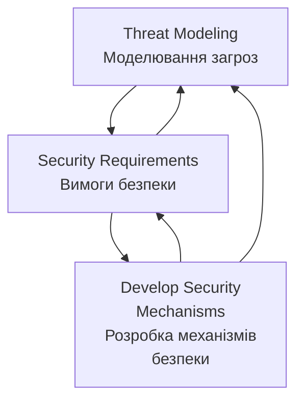

# Threat Modeling as a Basis for Security Requirements
- https://www.researchgate.net/publication/228634178_Threat_Modeling_as_a_Basis_for_Security_Requirements

**Моделювання загроз як основа для вимог безпеки**

**Анотація**

Ми регулярно чуємо заяви постачальників про те, що їхні системи є "безпечними". Однак, не знаючи, які припущення робить постачальник, важко обґрунтувати таке твердження. Перш ніж заявляти про безпеку системи, важливо ідентифікувати загрози для відповідної системи. Перелік загроз для системи допомагає архітекторам систем розробити реалістичні та значущі вимоги безпеки. У цій роботі ми досліджуємо, як моделювання загроз може бути використане як основа для специфікації вимог безпеки. Хоча численні праці були опубліковані з моделювання загроз, існує брак інтегрованого, систематичного підходу до моделювання загроз для складних систем. Ми розглядаємо відмінності між моделюванням програмних продуктів та складних систем, і викладаємо наш підхід для ідентифікації загроз мережевих систем. Ми також представляємо три тематичні дослідження моделювання загроз: Програмно-визначене радіо (Software-Defined Radio), інструмент моніторингу мережевого трафіку (VisFlowConnect) та інструмент моніторингу безпеки кластера (NVisionCC).

# 1. Вступ

Загальновизнано, що проектування безпечних комп'ютерних систем є складною проблемою. Зловмисники регулярно зламують системи, і у відповідь постачальники програмного забезпечення почали надавати безпеку як необхідну функцію для своїх продуктів та мережевих систем. В результаті багаторічних досліджень було розроблено багато потужних технік для вирішення широкого спектра проблем безпеки. Хоча заяви про те, що система використовує "інфраструктуру відкритих ключів" або застосовує "128-бітні ключі", звучать вражаюче, ці твердження означають дуже мало, коли їх вириваютьз контексту. Важливе питання, яке слід поставити: "Чи є функції безпеки системи необхідними, і чи відповідають вони потребам безпеки системи?"

При виборі заходів безпеки проектувальник системи безпеки повинен розглядати дизайн всієї системи, а не впроваджувати технології безпеки навмання. У [8] Брюс Шнайєр стверджує, що "Безпека - це ланцюг; вона настільки безпечна, наскільки безпечна її найслабша ланка. Безпека - це процес, а не продукт." Проектування безпеки системи найкраще здійснювати, використовуючи систематичний інженерний підхід. Інженерія безпеки систем займається ідентифікацією ризиків безпеки, вимог та стратегій відновлення [5]. Вона включає чітко визначені процеси, через які проектувальники розробляють механізми безпеки. В ідеалі, інженерія безпеки повинна бути включена в процес проектування системи якомога раніше, від початкової специфікації архітектури, якщо це можливо. Чим раніше вирішуються проблеми безпеки, тим менше часу та коштів потрібно для виправлення майбутніх проблем безпеки. Незважаючи на цей добре відомий факт, часто трапляється так, що інженери-програмісти опиняються в ситуації, коли їм потрібно модернізувати безпеку в існуючій системі. У будь-якому випадку процес інженерії безпеки може застосовуватися подібним чином.

Один з поглядів на процес інженерії безпеки представлений на Рисунку 1. Моделювання загроз включає розуміння складності системи та ідентифікацію всіх можливих загроз для системи, незалежно від того, чи можуть вони бути використані чи ні. Під час формування вимог безпеки ці загрози аналізуються на основі їх критичності та ймовірності, і приймається рішення про те, чи пом'якшувати загрозу, чи прийняти ризик, пов'язаний з нею. Після того, як проектувальники систем визначають, які механізми безпеки повинні бути доступні для системи, розробка цих механізмів слідує загальному циклу інженерії програмного забезпечення: проектування, впровадження, тестування та підтримка. Кожен етап інженерії безпеки подає зворотний зв'язок до попереднього етапу, і через цей етап до всіх попередніх етапів. Зворотний зв'язок дозволяє проектувальникам виявляти помилки, зроблені на ранніх етапах, не дозволяючи їх наслідкам каскадно поширюватися. Моделювання загроз та вимоги безпеки забезпечують основи, на яких будується решта системи безпеки.

Ідентифікація загроз допомагає розробити реалістичні та значущі вимоги безпеки. Це особливо важливо, оскільки якщо вимоги безпеки є помилковими, то визначення безпеки для цієї системи є помилковим, і таким чином система не може бути безпечною. Правильна ідентифікація загроз та відповідний вибір контрзаходів зменшує здатність зловмисників зловживати системою. У цьому відношенні моделювання загроз

--------------------------------------------------------------------------------------------------

#### Діаграма процесу інженерії безпеки систем

## Опис процесу:

**1. Threat Modeling (Моделювання загроз)**
- Ідентифікація всіх можливих загроз для системи
- Розуміння складності системи
- Аналіз з перспективи зловмисника

**2. Security Requirements (Вимоги безпеки)**
- Аналіз загроз за критичністю та ймовірністю
- Прийняття рішень про мітигацію або прийняття ризику
- Формування конкретних вимог безпеки

**3. Develop Security Mechanisms (Розробка механізмів безпеки)**
- Проектування
- Впровадження
- Тестування
- Підтримка

**Зворотний зв'язок:**
- Кожен етап подає зворотний зв'язок до попередніх етапів
- Дозволяє виявляти та виправляти помилки на ранніх стадіях
- Забезпечує ітеративне покращення процесу
-----------------------------------------------------------------------------------------------

**Рисунок 1. Інженерія безпеки систем**

розглядає систему з перспективи супротивника, щоб допомогти проектувальникам передбачити цілі атак та визначити відповіді на питання про те, що система призначена захищати, і від кого. Будь-який тип системи може отримати користь від моделювання загроз. Деякі системи є досить простими, а інші - більш складними, деякі з них уже розгорнуті, а інші існують лише на папері. Незалежно від того, що являє собою система або на якому етапі процесу розробки вона знаходиться, переваги від добре продуманої моделі загроз можуть виявитися надзвичайно корисними. Ми детально розглядаємо різні підходи до моделювання загроз стосовно цих різних типів систем пізніше в статті.

Існує кілька наявних робіт з моделювання загроз та багато більше з інженерії вимог. У цій статті ми будуємо на цих масивах роботи, досліджуючи, як моделювання загроз може бути використане як основа для специфікації вимог безпеки. Ми виступаємо за використання моделювання загроз як важливого кроку до вирішення питання повноти системних вимог в цілому, і вимог безпеки зокрема. Моделювання загроз може бути використане для обґрунтування контрзаходів безпеки та валідації припущень, зроблених архітекторами систем. Ми обговорюємо взаємодію між моделюванням загроз та визначенням вимог і розглядаємо відмінності між моделюванням програмних продуктів та складних систем. Ми також представляємо три тематичні дослідження моделювання загроз: Програмно-визначене радіо, інструмент моніторингу мережевого трафіку та інструмент моніторингу безпеки кластера.

Решта цієї статті організована наступним чином. У Розділі 2 ми обговорюємо процес моделювання загроз та те, як він відрізняється для програмних продуктів та складних систем. Потім ми пояснюємо, як специфікуються вимоги безпеки на основі моделі загроз у Розділі 3. Ми представляємо наші тематичні дослідження в Розділі 4 та завершуємо підсумком у Розділі 5.

# 2. Процес моделювання загроз

Гарна модель загроз дозволяє проектувальникам безпеки точно оцінити можливості зловмисника. Може бути спокусливо пропустити моделювання загроз і просто витягнути вимоги безпеки системи з "найкращих практик індустрії" або стандартів, таких як Common Criteria [2]. Однак ці стандарти лише надають загальні рекомендації з безпеки і не можуть врахувати всі нюанси конкретної системи. Загальні стандарти майже завжди потребують деякої кастомізації для цільової системи, і додаткові вимоги повинні бути визначені. Жанетт Вінг та ін. [9,10] підкреслюють використання графів атак для визначення того, які заходи безпеки слід розгорнути в системі. Однак дерева атак моделюють вибраний набір атак через кінцевий автомат і здійсненні лише в невеликих сценаріях. Більше того, список потенційних загроз все ще потрібно скласти перед генерацією дерев атак. Таким чином, моделювання загроз необхідне для:

- Складних програмних систем, які інтегрують множинні інфраструктури та технології
- Кастомізованих прикладних рішень
- Всіх інших випадків, де неприйнятно впроваджувати попередньо складені "списки справ", надані постачальником програмного забезпечення або комітетом зі стандартів

Модель загроз не може бути створена простим "мозковим штурмом" можливих намірів супротивника. Цей підхід не є систематичним і, ймовірно, залишить великі частини простору атак недослідженими. Зловмиснику потрібно знайти лише одну вразливість безпеки, щоб скомпрометувати всю систему [7]. Таким чином, важливо бути систематичним під час процесу моделювання загроз, щоб забезпечити виявлення якомога більшої кількості можливих загроз та вразливостей розробниками, а не зловмисниками. Аналіз загроз слід використовувати на найбільш ранніх можливих етапах проектування системи. Хоча зусилля, необхідні для моделювання загроз існуючої системи, такі ж, як і для моделювання загроз системи на ранніх етапах її проектування, складніше та дорожче пом'якшувати загрози, виявлені в існуючій системі, через архітектурні обмеження.

Наш процес моделювання загроз складається з наступних трьох високорівневих кроків: характеризація системи, ідентифікація активів та точок доступу, та ідентифікація загроз. Хоча цей процес може здаватися схожим на той, що представлений Свідерскі та Снайдер [11], послідовність та опис кроків відрізняються, а виконання кроків розширено для відповідності складним, мережевим системам. Їх процес моделювання загроз орієнтований на програмні додатки.

Характеризація системи включає розуміння компонентів системи та їх взаємозв'язків, і створення моделі системи, яка підкреслює її основні характеристики. Потім ідентифікуються активи та точки доступу системи. Ідентифікація загроз створює профіль загроз системи, описуючи всі потенційні атаки, які потрібно пом'якшити або прийняти як низький ризик.

Хоча ці три кроки процесу моделювання загроз є спільними для всіх типів систем, фактичне виконання цих кроків відрізняється залежно від типу системи. Додаток та мережева система представлені абсолютно різними моделями систем на етапі характеризації. Додаток моделюється діаграмою потоку даних, а мережева система - мережевою моделлю. Наступні кроки моделювання загроз застосовуються до цих різних моделей систем. Далі ми детально розглянемо кожен з цих кроків моделювання загроз.

## 2.1. Характеризація системи

На початку процесу моделювання загроз проектувальник безпеки повинен повністю зрозуміти систему, яка розглядається. Це включає розуміння кожного компонента та його взаємозв'язків, визначення сценаріїв використання, та ідентифікацію припущень та залежностей. Нам потрібна модель системи, яка розкриває основні характеристики системи.

Залежно від типу системи, вона може бути змодельована за допомогою одного з кількох різних підходів. Якщо система, яка розглядається, є програмним додатком, ми можемо намалювати її діаграму потоку даних (DFD), яка розсікає додаток на його функціональні компоненти та показує потік даних в різні частини компонентів системи та з них. Підхід DFD робить ідентифікацію загроз легшою, ніж інші види систем, оскільки можна слідкувати за даними та командами супротивника, коли вони обробляються системою, аналізуючи, як вони парсяться та на них діють, а також відзначаючи, з якими активами вони взаємодіють [11]. Один приклад DFD показаний у нашому першому тематичному дослідженні: Програмно-визначене радіо (див. Рисунок 2).

На жаль, не всі системи можуть бути легко змодельовані за допомогою DFD. Деякі системи настільки складні, що неможливо знати всі програмні компоненти, які можуть бути присутніми, і таким чином не можна робити припущення про шляхи потоку даних. Це особливо справедливо для мережевих систем, таких як великомасштабні товарні кластери. Мережеві системи можуть розглядатися через мережеву модель, яка дозволяє аналітикам вивчати комунікацію між комп'ютерами з різними ролями. При моделюванні загроз мережевої системи першим кроком є ідентифікація ролей та функцій кожного класу комп'ютерів у мережі. Потім відображаються шаблони комунікації між сутностями в різних ролях. Наприклад, сервери додатків повинні спілкуватися з контролерами домену та з робочими станціями користувачів. Це відображення повинно точно визначити протоколи, порти та шаблони трафіку, що використовуються для цих комунікацій. Приклад мережевої моделі можна знайти в нашому другому тематичному дослідженні: VisFlowConnect (див. Рисунок 3).

## 2.2. Ідентифікація активів та точок доступу

Щоб правильно використовувати моделювання загроз, аналітики повинні навчитися думати як зловмисник. Це легше зробити, коли система повністю зрозуміла, звідси попередній крок у процесі моделювання загроз - характеризація системи. Супротивники можуть характеризуватися в термінах їх ресурсів, доступу, толерантності до ризику та цілей. Аналітик повинен спробувати відповісти на питання типу:

- Хто мої потенційні супротивники?
- Яка їх мотивація, і які їх цілі?
- Скільки внутрішньої інформації вони мають?

Ідентифікація активів та точок доступу є критичним кроком у процесі моделювання загроз. Актив - це абстрактний або конкретний ресурс, який система повинна захищати від неправильного використання супротивником. Активи можуть бути матеріальними, такими як процеси та дані, або більш абстрактними концепціями, такими як консистентність даних. Неможливо мати загрозу без відповідного активу, оскільки активи по суті є цілями загроз.

Точки доступу - це те, що зловмисник збирається використовувати для отримання доступу до активів. Прикладами точок доступу є відкриті сокети, RPC інтерфейси, файли конфігурації, апаратні порти та читання/запис файлової системи. Пов'язано з точками доступу, також важливо визначити межі довіри в системі. Межа довіри - це межа, через яку існує різний рівень довіри. Наприклад, мережа може формувати межу довіри, оскільки будь-хто може отримати доступ до Інтернету, але не всі повинні мати доступ до корпоративної системи. Пов'язані з межами довіри є рівні довіри. Рівні довіри показують, скільки довіри потрібно для доступу до частини системи. Наприклад, якщо користувач є адміністратором, йому довіряють робити більше, ніж звичайним користувачам.

## 2.3. Ідентифікація загроз

Після завершення попередніх кроків настає час подумати про конкретні загрози для системи. Загрози можуть надходити як зсередини, так і ззовні системи - від авторизованих користувачів або від неавторизованих користувачів, які маскуються під дійсних користувачів або знаходять способи обійти механізми безпеки. Загрози також можуть надходити від людських помилок.

Мета цього кроку - ідентифікувати загрози для системи, використовуючи інформацію, зібрану досі. Загроза - це мета супротивника, або те, що супротивник може спробувати зробити з системою [11]. Іноді загроза також описується як здатність супротивника атакувати систему. У контексті моделювання загроз перше визначення є більш підходящим. Часто корисно починати моделювання загроз зі списку відомих загроз та вразливостей, знайдених у подібних системах. Хоча робота назад від відомих вразливостей зазвичай дає загальні загрози, системно-специфічні загрози вимагають глибшого аналізу унікальних якостей системи, що моделюється.

Найкращим методом для перерахування загроз є пройти через кожен з активів системи, переглядаючи список цілей атак для кожного активу. Активи та загрози тісно корелюють. Загроза не може існувати без цільового активу. Загрози зазвичай запобігаються шляхом застосування якогось виду захисту до активів. Процес кореляції загроз з активом включає створення гіпотез супротивника. У моделюванні загроз модель системи показує всі критичні для безпеки сутності, такі як активи, точки доступу та канали комунікації. Загрози можуть бути ідентифіковані шляхом проходження через кожну з цих критичних для безпеки сутностей та створення гіпотез загроз, які порушують конфіденційність, цілісність або доступність сутності.

Результатом процесу ідентифікації загроз є профіль загроз для системи, що описує всі потенційні атаки, кожна з яких потребує пом'якшення або прийняття. В загальному, загрози можуть бути класифіковані на шість класів на основі їх ефекту [11]:

- **Підробка (Spoofing)** - Використання чужих облікових даних для отримання доступу до інакше недоступних активів.
- **Підміна (Tampering)** - Зміна даних для здійснення атаки.
- **Відмова від дій (Repudiation)** - Виникає, коли користувач заперечує виконання дії, але ціль дії не має способу довести інакше.
- **Розкриття інформації (Information disclosure)** - Розкриття інформації користувачу, який не має дозволу її бачити.
- **Відмова в обслуговуванні (Denial of service)** - Зменшення здатності дійсних користувачів отримувати доступ до ресурсів.
- **Підвищення привілеїв (Elevation of privilege)** - Виникає, коли непривілейований користувач отримує привілейований статус.

При ідентифікації загрози корисно думати про різні атаки в термінах наведеної вище класифікації. З іншого боку, загрози безпеки є порушеннями конфіденційності, цілісності або доступності. Таким чином, загрози також можуть бути класифіковані за цими властивостями. Ця класифікація корисна у вимогах безпеки при прийнятті рішення про механізм пом'якшення конкретної загрози. Наприклад, неавторизована модифікація даних на шляху до компонента B від компонента A становить загрозу підміни, яка порушує властивість цілісності. Щоб пом'якшити цю загрозу, може мати сенс застосувати механізм цілісності, такий як Secure Hashing Algorithm-1 (SHA-1) до даних, що передаються.

Ідентифікація загроз - лише частина створення профілю загроз системи. Загрози також повинні бути проаналізовані для визначення того, чи є система сприйнятливою до них. Використання дерев атак - один зі способів досягти цього. Щоб проілюструвати цей процес, розглянемо випадок, коли зловмисник бажає розшифрувати повідомлення, що подорожує від машини A до машини B. У цій точці аналітик повинен провести мозковий штурм, щоб з'ясувати всі шляхи, якими зловмисник може скористатися для досягнення цієї мети. Ці шляхи стають вузлами під оригінальною метою і стають цілями самі по собі, які можуть бути оцінені таким же способом. Зауважте, дерева атак не можуть замінити процес моделювання загроз. Шейнер та ін. [9] демонструють генерацію дерев атак для обмежених і дещо штучних сценаріїв.

При визначенні моделі загроз проектувальники повинні турбуватися не лише про визначення того, з якими атаками вони стурбовані, але також тих, які не є високим пріоритетом. Оцінка ризику виконується для відображення кожної загрози або в механізм пом'якшення, або в припущення, що про неї не варто турбуватися. У цій точці можуть бути визначені вимоги безпеки для системи.

# 3. Специфікація вимог безпеки

Вимоги безпеки надають основи, на яких будується безпека комп'ютерної системи. Системи не розробляються без вимог; для невеликого, простого проекту, можливо, вимоги не специфікуються та не документуються формально, але все ж розробник матиме якісь вимоги у своїй голові. Вимоги специфікують те, що система буде робити, тоді як наступні етапи в інженерії програмного забезпечення та проектуванні визначають, як вона буде працювати.

Вимоги безпеки керуються загрозами безпеки, тоді як більшість вимог базуються на цілях вищого рівня. Хоча більшість вимог формулюються в термінах того, що повинно відбуватися, вимоги безпеки часто специфікуються в термінах того, що не повинно бути дозволено. Наприклад, "Додаток не повинен дозволяти жодному клієнту отримувати доступ до інформації про рахунок будь-якого іншого клієнта." Під час цього процесу важливо виявити, які загрози є реалістичними і з якими треба боротися.

Часто неможливо пом'якшити кожну загрозу, і навіть якби це можна було зробити, це майже напевно відбувалося б за рахунок зниженої зручності використання. Забезпечення безпеки систем - це питання компромісів; часто знаходження ідеального балансу є досить складним завданням. Управління ризиками вирішує це питання і обговорюється в наступному підрозділі. Навіть якщо процес вимог безпеки починається з набору загальних вимог, витягнутих зі стандартів, все ще важливо провести ретельну сесію управління ризиками для аналізу придатності загальних вимог до системи. Як згадувалося раніше, може статися так, що ці загальні вимоги є неповними, і проектувальники безпеки повинні будуть специфікувати додаткові вимоги.

Після того, як всі потенційні загрози були проаналізовані і визначені загрози, які повинні бути пом'якшені, наступним завданням є специфікація вимог безпеки. Вимога - це твердження цілей, які повинні бути задоволені. Політика безпеки може розглядатися як набір вимог безпеки. Відображення загроз безпеки в набір вимог та припущень частково вирішує питання повноти безпеки системи. Це відображення використовується для обґрунтування придатності запропонованих механізмів безпеки. В загальному, процес інженерії вимог включає наступні активності [5]: 1) Елісітація вимог; 2) Аналіз та переговори щодо вимог; 3) Валідація вимог. Модель загроз надає більшість інформації, необхідної для елісітації вимог. Шляхом перетворення твердження про загрозу в твердження вимоги "не повинен", можна скласти початковий набір вимог безпеки. Деталі інженерії вимог виходять за межі цієї статті; існує багато відмінних публікацій на цю тему. Далі ми демонструємо відображення загрози у вимогу.

**Приклад.** Скажімо, що модель загроз для системи електронного голосування була визначена. Ми розглянемо, як одна конкретна загроза може бути відображена у вимогу безпеки. Загроза, яка розглядається, - "Зловмисник використовує DoS атаки для зменшення доступності системи". Дерево атак розкриває, що ця загроза може бути реалізована або шляхом флудингу мережевого інтерфейсу, або заповнення доступного дискового простору шляхом запису помилкових даних у файли журналу аудиту [6].

Під час оцінки ризику ми обчислюємо ризик загрози в кількох категоріях. Для кожної категорії призначаємо значення ризику від 1 до 10, обчислене як добуток критичності на ймовірність.

- Кількість постраждалих користувачів: **10**
- Потенціал збитків: **6**
- Рівень необхідних навичок: **6**
- Вартість атаки: **8**
- Відтворюваність: **8**
- Виявляємість: **10**
- **Загальний ризик: 8**

Ми вирішуємо пом'якшити цю загрозу, оскільки загальний фактор ризику досить високий. Вимога для пом'якшення цієї загрози може бути: "Система не повинна дозволяти жодному користувачу успішно використовувати DoS атаку для зменшення доступності системи". Для задоволення цієї вимоги пропонуються наступні заходи пом'якшення: а) Використання брандмауера для відкидання певних IP пакетів; б) Обмеження ресурсів, що використовуються анонімними користувачами.

## 3.1. Управління ризиками

Незважаючи на найкращі зусилля дослідників безпеки, неможливо гарантувати 100% безпеку. Однак ми можемо працювати над 100% прийняттям ризику. Гарна система безпеки досягає балансу між тим, що можливо, і тим, що прийнятно через процес управління ризиками. Управління ризиками складається з оцінки ризику, зменшення ризику та прийняття ризику.

Для оцінки ризику ідентифікованих загроз, загрози повинні бути пріоритизовані. Найпростіший спосіб пріоритизації загроз - це використання двох факторів: збитків та ймовірності. Спочатку обчисліть загальний фактор ризику для кожної загрози, а потім відсортуйте список загроз у порядку зменшення ризику. З загрозами можна боротися, починаючи з вершини списку. Існує чотири можливі способи управління ризиком:

- **Прийняти ризик** - Ризик настільки низький і настільки дорогий для пом'якшення, що його варто прийняти.
- **Передати ризик** - Передати ризик комусь іншому через страхування, попередження тощо.
- **Усунути ризик** - Видалити компонент системи або функцію, пов'язану з ризиком, якщо функція не варта ризику.
- **Пом'якшити ризик** - Зменшити ризик за допомогою контрзаходів.

Загрози, вибрані для пом'якшення, повинні бути вирішені якимось контрзаходом. Проектувальники повинні забезпечити, щоб безпека не стала дорожчою, ніж вона варта. Заходи безпеки слід застосовувати лише до точки, де витрати на їх впровадження не перевищують очікуваний ризик. Неспроможність правильно зробити це судження може легко призвести до ситуації, коли жоден ризик не вважається прийнятним, і таким чином неможливо спроектувати прийнятну систему.

# 4. Тематичні дослідження

У цьому розділі ми демонструємо, як процес моделювання загроз може бути застосований до різних типів систем через конкретні приклади. Першим прикладом є програмний додаток на основі хоста під назвою GNU Software Defined Radio, другим є система моніторингу мережевого трафіку на основі мережі під назвою VisFlowConnect, а останнім є інструмент моніторингу безпеки кластера під назвою NVisionCC. У кожному тематичному дослідженні ми характеризуємо систему відповідною моделлю системи, ідентифікуємо основні активи та точки доступу, і нарешті ідентифікуємо загрози. Ми не надаємо вимоги безпеки для цих систем на цей час, це робота в процесі.

## 4.1. Програмно-визначене радіо

Програмно-визначене радіо (SDR) реалізує функціональність радіо в програмному забезпеченні, яка раніше надавалася в апаратному забезпеченні, дозволяючи радіо функціонувати як будь-який тип радіопристрою, такий як стільниковий телефон, GPS приймач або пакетне радіо. Деякі з переваг SDR: реконфігуровані трубки та інфраструктурне обладнання, апаратне забезпечення загального призначення, безпровідні оновлення програмного забезпечення, легка міграція мереж від одного покоління до іншого, та безшовний доступ до мережі через різні географічні регіони. Ми були залучені до аналізу загроз SDR [3]. Підхід потоку даних був використаний для розуміння компонентів та взаємозв'язків програмного забезпечення перед ідентифікацією його загроз безпеки.

GNU SDR [1] є платформою програмного забезпечення з відкритим кодом, яка надає радіо операційне середовище та бібліотеку цифрової обробки сигналів. Вона організована навколо принципу конструювання графу, який описує потік даних радіосистеми. Вершини графу є блоками обробки сигналів, які виконують різні математичні маніпуляції з вхідним потоком сигналу, наприклад модуляція, фільтрація, змішування тощо. Ребра, що з'єднують сусідні блоки обробки сигналів, містять спільні буфери, які використовуються для тимчасового зберігання сигналу. Радіосистема починає свою роботу, коли граф потоку передається системі виконання для виконання. Рисунок 2 показує граф потоку FM приймача.

**Рисунок 2. Граф потоку даних FM приймача.**

Основні активи GNU SDR, на які можуть націлюватися зловмисники:
- Граф потоку
- Планувальник
- Бібліотека обробки сигналів
- Спільні буфери
- Потік сигналу

На основі цих активів та точок входу ми ідентифікували загрози GNU SDR. Для кожної загрози ми називаємо загрозу, надаємо її класифікацію та описуємо її ефекти та наслідки.

- **Будь-яка сутність може конструювати граф потоку** в поточній реалізації системи (Підміна). Це дозволяє супротивнику створити пристрій для підслуховування або глушіння.

- **Несумісні програмні модулі можуть бути зібрані** в граф потоку без дотримання регіональних регулювань та специфікацій апаратного забезпечення (DoS). Це може зробити пристрій неопераційним.

- **Небезпечне безпровідне завантаження програмного забезпечення** (Підміна, Розкриття). Програмне забезпечення може бути незаконно модифіковане або супротивник може надати своє власне програмне забезпечення.

- **Завантажене програмне забезпечення може містити проблему переповнення буфера** (Підміна). Навіть якщо програмне забезпечення було надане сертифікованим постачальником через безпечний канал комунікації, воно може мати помилкову функціональність. Це дозволяє супротивнику модифікувати потік сигналу в спільних буферах за бажанням або виконати зловмисний код.

- **Блоки обробки сигналів можуть отримувати доступ до даних інших модулів** (Підміна, Розкриття). Планувальник виконує блоки обробки сигналів у графі потоку послідовно, один за одним, як єдиний процес. Це знову дозволяє супротивнику безперешкодний доступ до всіх спільних буферів у графі потоку.

Існують інші загрози, такі як неавторизоване використання мережевих сервісів та неавторизований вхід у радіопристрій, які стосуються SDR в цілому, але виходять за межі GNU SDR програмного забезпечення. На основі нашого управління ризиками профілю загроз ми рекомендуємо наступні заходи безпеки для GNU SDR:

- Шифрування та перевірка цілісності для безпровідного завантаження програмного забезпечення.
- Перевірка того, що завантажене програмне забезпечення надане сертифікованим постачальником.
- Проектування довіреного модуля конфігурації, відповідального за конструювання графу потоку.
- Проектування керованого політикою фреймворку конфігурації для автоматизації відображення запиту користувача у функціональний граф потоку. Наприклад, коли користувач запитує FM приймач, система достатньо обізнана, щоб сконструювати граф, показаний на Рисунку 2.
- Надання ізоляції домену несправності для блоків обробки сигналів, щоб кожен мав доступ лише до своєї власної області пам'яті.
- Надання механізму запобігання переповненню буфера, можливо, як розширення компілятора або розширення ядра.

## 4.2. Інструмент моніторингу мережевого трафіку - VisFlowConnect

VisFlowConnect [14] є інструментом візуалізації, призначеним для підвищення здатності мережевого адміністратора виявляти та досліджувати аномальний трафік. Також названий пасивним інструментом моніторингу, VisFlowConnect візуалізує мережевий трафік між корпоративною мережею та Інтернетом. Він здатний фільтрувати трафік для відображення лише трафіку з певними атрибутами та показувати динаміку трафіку в часі шляхом анімації потоків з користувацьким вікном часу, що регулюється. VisFlowConnect покладається на дані NetFlow [12] як джерело вхідних даних. Кожен запис у файлах журналу NetFlow містить різноманітну інформацію про мережевий потік, таку як IP адреса джерела/призначення та номер порту, кількість переданих байтів та пакетів, використаний протокол та час початку/кінця передачі.

Рисунок 3 показує архітектуру розгортання NetFlows в NCSA. Колектори NetFlow споживають потоки з множинних джерел, виконують редукцію даних через фільтрацію та агрегацію, та зберігають інформацію про потоки у плоских файлах, готових для подальшої обробки. Потім датаграми потоків перетворюються у уніформний формат NCSA, обробляються процесорами потоків та подаються як джерело даних до інструменту VisFlowConnect.

**Рисунок 3. Архітектура розгортання NetFlows в NCSA.**

Хоча VisFlowConnect сам по собі є інструментом моніторингу безпеки, важливо ідентифікувати його загрози. Моделювання загроз VisFlowConnect допомагає зрозуміти його обмеження у виявленні DoS атак проти моніторованої мережі та забезпечити, що інструмент не вводить нові вразливості в систему або ненавмисно не робить атаки на систему легшими. Ми використовуємо мережеву модель для моделювання загроз VisFlowConnect. На основі нашого розуміння архітектури системи ми ідентифікуємо наступні критичні для безпеки активи:

- Колектори NetFlow
- Процесор потоків
- Конвертер формату
- Датаграми NetFlow
- Кошики даних на процесорі потоків
- Цикли CPU на колекторах
- Канали комунікації між маршрутизаторами, колекторами та процесором потоків
- Бібліотека програмного забезпечення, що використовується VisFlowConnect

Наступні загрози виникають стосовно цих критичних для безпеки активів:

- **Маршрутизатори можуть не логувати мережеві потоки точно.** Це може статися, якщо маршрутизатори, що розміщують VisFlowConnect, скомпрометовані.

- **Журнали NetFlow на маршрутизаторах можуть бути підмінені.** Файли журналів модифіковані перед досягненням колекторів.

- **Конфіденційність та цілісність датаграм потоків скомпрометована** в дорозі між маршрутизаторами, колекторами та процесором потоків.

- **Датаграми потоків затримані, повторені або відсутні.**

- **Будь-який з програмних компонентів, що обробляють датаграми NetFlow, може бути несправним** (переповнення буфера) або зловмисним.

- **Супротивник може адаптувати свій шаблон атаки** для імітації нормального мережевого трафіку.

## 4.3. Інструмент моніторингу безпеки кластера - NVisionCC

Кластери вразливі до нових типів атак, які неможливі з індивідуальними хостами. Наприклад, спроба грубої сили відгадати паролі може бути розподілена по кластеру, щоб дозволити атаці успішно відбутися без активації механізмів безпеки на основі хоста, що перевіряють часті невдалі спроби входу. Розглядаючи кластер як єдину неподільну сутність замість колекції індивідуальних вузлів, можливо ефективно моніторити безпеку кластера та виловити цей тип атаки. NVisionCC є активним інструментом моніторингу для безпеки кластера, який моніторить процеси через вузли кластера та підіймає сповіщення, коли відзначаються відхилення від попередньо визначеного профілю очікуваних процесів [4,13].

Архітектура моніторингу процесів складається з трьох окремих компонентів. Колектор інформації збирає дані процесів з вузлів кластера та зберігає їх у центральній базі даних, як показано на Рисунку 4. Аналізатор даних отримує дані з цієї бази даних та шукає відхилення від визначених користувачем профілів для кожного типу вузла, такого як головний вузол, обчислювальний вузол, вузол зберігання тощо. Клієнт візуалізації комбінує дані з бази даних з результатами від аналізатора даних, щоб надати користувачу візуальне представлення стану кластера. NVisionCC реалізований як плагін до інструменту моніторингу кластера Clumon. Колектор інформації використовує інфраструктуру моніторингу процесів Clumon.

Кластери зазвичай є найбільш цінним активом у середовищі організації і як такі повинні отримувати пріоритетний захист безпеки. Хоча NVisionCC є механізмом безпеки для кластерів, він може мати свої власні вразливості безпеки, або навіть гірше, він може піддавати кластер новим загрозам. Як і з будь-якою системою, аналіз безпеки NVisionCC повинен починатися з моделі загроз. Ми ідентифікуємо наступні критичні для безпеки активи для NVisionCC:

- PCP демон
- Колектор інформації
- Аналізатор даних
- Клієнт візуалізації

**Рисунок 4. Архітектура NVisionCC.**

- Дані процесів
- Сповіщення про атаки
- Профілі нормального стану
- Канали комунікації між колектором, аналізатором та візуалізатором
- Бібліотека програмного забезпечення, що використовується NVisionCC

Наступні загрози виникають стосовно цих критичних для безпеки активів:

- **Зловмисний процес може маскуватися** як легітимний процес на вузлі кластера.

- **PCP демон може стати зміненим, скомпрометованим.**

- **Дані процесів на вузлах кластера можуть бути підмінені.**

- **Конфіденційність та цілісність даних процесів скомпрометована** в дорозі до колектора інформації або центральної бази даних.

- **Дані процесів затримані, повторені або відсутні.**

- **Цілісність сповіщень про атаки, відправлених від аналізатора, може бути скомпрометована.**

- **Якщо атака завершена достатньо швидко між опитуваннями PCP**, вона може уникнути виявлення.

- **Зловмисник може вивчити шаблон опитування PCP** та спробувати підірвати виявлення, розподіливши свою активність у часі.

# 5. Висновки

У цій статті ми пропонуємо моделювання загроз як важливу основу для визначення вимог безпеки комп'ютерних систем. Без ідентифікації загроз неможливо надати гарантії для системи та обґрунтувати вжиті заходи безпеки. Ми представили наш погляд на найкращі практики для моделювання загроз як для програмних додатків, так і для складних систем.

У майбутньому ми плануємо визначити вимоги безпеки на основі моделювання загроз для кількох інструментів безпеки, розроблених в NCSA, включаючи VisFlowConnect, NVisionCC та NVisionIP. Зрештою, ми проектуватимемо та впроваджуватимемо механізми безпеки, необхідні для цих систем. Ці проекти допоможуть нам краще зрозуміти та дослідити взаємодію між моделюванням загроз та визначенням вимог для систем, які вже були розгорнуті.

# References

[1] GNU Software Radio project. http://www.gnu.org/software/gnuradio/.

[2] (CCEB) Common Criteria Editorial Board. Common Criteria for Information Technology Security Evaluations. Report, 1998.

[3] R. Hill, S. Myagmar, and R. Campbell. Threat Analysis of GNU Software Radio. In Proc. of World Wireless Congress (WWC'05), Palo Alto, CA, May 2005.

[4] G.A. Koenig, X. Meng, A.J. Lee, M. Treaster, N. Kiyanclar, and W. Yurcik. Cluster Security with NVisionCC: Process Monitoring by Leveraging Emergent Properties. In Proc. of IEEE Cluster Computing and Grid (CCGrid'05), May 2005.

[5] G. Kotonya and I. Sommerville. Requirements Engineering: Processes and Techniques. John Wiley & Sons, 1998.

[6] G. Obradovic. Threat Modeling and Data Sensitivity Classification for Information Security Risk Analysis. Presentation at Data Protection '03, 2003.

[7] B. Schneier. Why Cryptography is Harder than it Looks. Electronic Article, 1997.

[8] B. Schneier. Secrets & Lies. John Wiley & Sons, Inc., 2000.

[9] O. Sheyner, J. Haines, S. Jha, R. Lippmann, and J. Wing. Automated Generation and Analysis of Attack Graphs. In Proc. of IEEE Symposium on Security and Privacy, April 2002.

[10] O. Sheyner and J. Wing. Tools for Generating and Analyzing attack Graphs. In Proc. of Formal Methods for Components and Objects, pages 344–371, 2004.

[11] F. Swiderski and W. Snyder. Threat Modeling. Microsoft Press, 2004.

[12] C. Systems. NetFlow Services and Applications. Technical Report, 1999.

[13] M. Treaster, G. A. Koenig, X. Meng, and W. Yurcik. Detection of Privilege Escalation for Linux Cluster Security. In Proc. of 6th LCI International Conference on Linux Clusters, April 2005.

[14] X. Yin, W. Yurcik, M. Treaster, Y. Li, and K. Lakkaraju. VisFlowConnect: NetFlow Visualizations of Link Relationships for Security Situational Awareness. In Proc. of ACM Workshop on Visualization and Data Mining for Computer Security (VizSEC '04), Washington DC, 2004.
