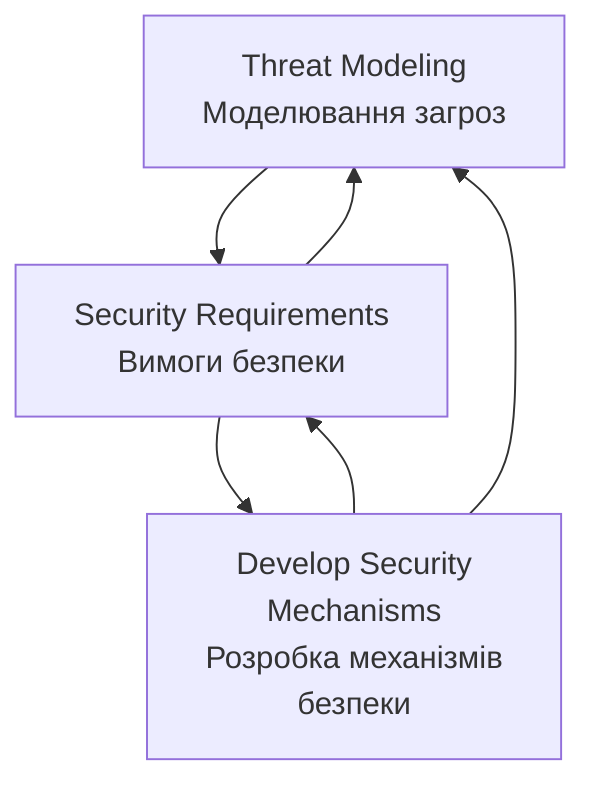

# Threat Modeling as a Basis for Security Requirements
- https://www.researchgate.net/publication/228634178_Threat_Modeling_as_a_Basis_for_Security_Requirements

**Анотація**

Ми регулярно чуємо заяви постачальників про те, що їхні системи є "безпечними". Однак, не знаючи, які припущення робить постачальник, важко обґрунтувати таке твердження. Перш ніж заявляти про безпеку системи, важливо ідентифікувати загрози для відповідної системи. Перелік загроз для системи допомагає архітекторам систем розробити реалістичні та значущі вимоги безпеки. У цій роботі ми досліджуємо, як моделювання загроз може бути використане як основа для специфікації вимог безпеки. Хоча численні праці були опубліковані з моделювання загроз, існує брак інтегрованого, систематичного підходу до моделювання загроз для складних систем. Ми розглядаємо відмінності між моделюванням програмних продуктів та складних систем, і викладаємо наш підхід для ідентифікації загроз мережевих систем. Ми також представляємо три тематичні дослідження моделювання загроз: Програмно-визначене радіо (Software-Defined Radio), інструмент моніторингу мережевого трафіку (VisFlowConnect) та інструмент моніторингу безпеки кластера (NVisionCC).

# 1. Вступ

Загальновизнано, що проектування безпечних комп'ютерних систем є складною проблемою. Зловмисники регулярно зламують системи, і у відповідь постачальники програмного забезпечення почали надавати безпеку як необхідну функцію для своїх продуктів та мережевих систем. В результаті багаторічних досліджень було розроблено багато потужних технік для вирішення широкого спектра проблем безпеки. Хоча заяви про те, що система використовує "інфраструктуру відкритих ключів" або застосовує "128-бітні ключі", звучать вражаюче, ці твердження означають дуже мало, коли їх вириваютьз контексту. Важливе питання, яке слід поставити: "Чи є функції безпеки системи необхідними, і чи відповідають вони потребам безпеки системи?"

При виборі заходів безпеки проектувальник системи безпеки повинен розглядати дизайн всієї системи, а не впроваджувати технології безпеки навмання. У [8] Брюс Шнайєр стверджує, що "Безпека - це ланцюг; вона настільки безпечна, наскільки безпечна її найслабша ланка. Безпека - це процес, а не продукт." Проектування безпеки системи найкраще здійснювати, використовуючи систематичний інженерний підхід. Інженерія безпеки систем займається ідентифікацією ризиків безпеки, вимог та стратегій відновлення [5]. Вона включає чітко визначені процеси, через які проектувальники розробляють механізми безпеки. В ідеалі, інженерія безпеки повинна бути включена в процес проектування системи якомога раніше, від початкової специфікації архітектури, якщо це можливо. Чим раніше вирішуються проблеми безпеки, тим менше часу та коштів потрібно для виправлення майбутніх проблем безпеки. Незважаючи на цей добре відомий факт, часто трапляється так, що інженери-програмісти опиняються в ситуації, коли їм потрібно модернізувати безпеку в існуючій системі. У будь-якому випадку процес інженерії безпеки може застосовуватися подібним чином.

Один з поглядів на процес інженерії безпеки представлений на Рисунку 1. Моделювання загроз включає розуміння складності системи та ідентифікацію всіх можливих загроз для системи, незалежно від того, чи можуть вони бути використані чи ні. Під час формування вимог безпеки ці загрози аналізуються на основі їх критичності та ймовірності, і приймається рішення про те, чи пом'якшувати загрозу, чи прийняти ризик, пов'язаний з нею. Після того, як проектувальники систем визначають, які механізми безпеки повинні бути доступні для системи, розробка цих механізмів слідує загальному циклу інженерії програмного забезпечення: проектування, впровадження, тестування та підтримка. Кожен етап інженерії безпеки подає зворотний зв'язок до попереднього етапу, і через цей етап до всіх попередніх етапів. Зворотний зв'язок дозволяє проектувальникам виявляти помилки, зроблені на ранніх етапах, не дозволяючи їх наслідкам каскадно поширюватися. Моделювання загроз та вимоги безпеки забезпечують основи, на яких будується решта системи безпеки.

Ідентифікація загроз допомагає розробити реалістичні та значущі вимоги безпеки. Це особливо важливо, оскільки якщо вимоги безпеки є помилковими, то визначення безпеки для цієї системи є помилковим, і таким чином система не може бути безпечною. Правильна ідентифікація загроз та відповідний вибір контрзаходів зменшує здатність зловмисників зловживати системою. У цьому відношенні моделювання загроз

--------------------------------------------------------------------------------------------------

#### Діаграма процесу інженерії безпеки систем

## Опис процесу:

**1. Threat Modeling (Моделювання загроз)**
- Ідентифікація всіх можливих загроз для системи
- Розуміння складності системи
- Аналіз з перспективи зловмисника

**2. Security Requirements (Вимоги безпеки)**
- Аналіз загроз за критичністю та ймовірністю
- Прийняття рішень про мітигацію або прийняття ризику
- Формування конкретних вимог безпеки

**3. Develop Security Mechanisms (Розробка механізмів безпеки)**
- Проектування
- Впровадження
- Тестування
- Підтримка

**Зворотний зв'язок:**
- Кожен етап подає зворотний зв'язок до попередніх етапів
- Дозволяє виявляти та виправляти помилки на ранніх стадіях
- Забезпечує ітеративне покращення процесу
-----------------------------------------------------------------------------------------------

**Рисунок 1. Інженерія безпеки систем**

розглядає систему з перспективи супротивника, щоб допомогти проектувальникам передбачити цілі атак та визначити відповіді на питання про те, що система призначена захищати, і від кого. Будь-який тип системи може отримати користь від моделювання загроз. Деякі системи є досить простими, а інші - більш складними, деякі з них уже розгорнуті, а інші існують лише на папері. Незалежно від того, що являє собою система або на якому етапі процесу розробки вона знаходиться, переваги від добре продуманої моделі загроз можуть виявитися надзвичайно корисними. Ми детально розглядаємо різні підходи до моделювання загроз стосовно цих різних типів систем пізніше в статті.

Існує кілька наявних робіт з моделювання загроз та багато більше з інженерії вимог. У цій статті ми будуємо на цих масивах роботи, досліджуючи, як моделювання загроз може бути використане як основа для специфікації вимог безпеки. Ми виступаємо за використання моделювання загроз як важливого кроку до вирішення питання повноти системних вимог в цілому, і вимог безпеки зокрема. Моделювання загроз може бути використане для обґрунтування контрзаходів безпеки та валідації припущень, зроблених архітекторами систем. Ми обговорюємо взаємодію між моделюванням загроз та визначенням вимог і розглядаємо відмінності між моделюванням програмних продуктів та складних систем. Ми також представляємо три тематичні дослідження моделювання загроз: Програмно-визначене радіо, інструмент моніторингу мережевого трафіку та інструмент моніторингу безпеки кластера.

Решта цієї статті організована наступним чином. У Розділі 2 ми обговорюємо процес моделювання загроз та те, як він відрізняється для програмних продуктів та складних систем. Потім ми пояснюємо, як специфікуються вимоги безпеки на основі моделі загроз у Розділі 3. Ми представляємо наші тематичні дослідження в Розділі 4 та завершуємо підсумком у Розділі 5.

# 2. Процес моделювання загроз

Гарна модель загроз дозволяє проектувальникам безпеки точно оцінити можливості зловмисника. Може бути спокусливо пропустити моделювання загроз і просто витягнути вимоги безпеки системи з "найкращих практик індустрії" або стандартів, таких як Common Criteria [2]. Однак ці стандарти лише надають загальні рекомендації з безпеки і не можуть врахувати всі нюанси конкретної системи. Загальні стандарти майже завжди потребують деякої кастомізації для цільової системи, і додаткові вимоги повинні бути визначені. Жанетт Вінг та ін. [9,10] підкреслюють використання графів атак для визначення того, які заходи безпеки слід розгорнути в системі. Однак дерева атак моделюють вибраний набір атак через кінцевий автомат і здійсненні лише в невеликих сценаріях. Більше того, список потенційних загроз все ще потрібно скласти перед генерацією дерев атак. Таким чином, моделювання загроз необхідне для:

- Складних програмних систем, які інтегрують множинні інфраструктури та технології
- Кастомізованих прикладних рішень
- Всіх інших випадків, де неприйнятно впроваджувати попередньо складені "списки справ", надані постачальником програмного забезпечення або комітетом зі стандартів

Модель загроз не може бути створена простим "мозковим штурмом" можливих намірів супротивника. Цей підхід не є систематичним і, ймовірно, залишить великі частини простору атак недослідженими. Зловмиснику потрібно знайти лише одну вразливість безпеки, щоб скомпрометувати всю систему [7]. Таким чином, важливо бути систематичним під час процесу моделювання загроз, щоб забезпечити виявлення якомога більшої кількості можливих загроз та вразливостей розробниками, а не зловмисниками. Аналіз загроз слід використовувати на найбільш ранніх можливих етапах проектування системи. Хоча зусилля, необхідні для моделювання загроз існуючої системи, такі ж, як і для моделювання загроз системи на ранніх етапах її проектування, складніше та дорожче пом'якшувати загрози, виявлені в існуючій системі, через архітектурні обмеження.

Наш процес моделювання загроз складається з наступних трьох високорівневих кроків: характеризація системи, ідентифікація активів та точок доступу, та ідентифікація загроз. Хоча цей процес може здаватися схожим на той, що представлений Свідерскі та Снайдер [11], послідовність та опис кроків відрізняються, а виконання кроків розширено для відповідності складним, мережевим системам. Їх процес моделювання загроз орієнтований на програмні додатки.

Характеризація системи включає розуміння компонентів системи та їх взаємозв'язків, і створення моделі системи, яка підкреслює її основні характеристики. Потім ідентифікуються активи та точки доступу системи. Ідентифікація загроз створює профіль загроз системи, описуючи всі потенційні атаки, які потрібно пом'якшити або прийняти як низький ризик.

Хоча ці три кроки процесу моделювання загроз є спільними для всіх типів систем, фактичне виконання цих кроків відрізняється залежно від типу системи. Додаток та мережева система представлені абсолютно різними моделями систем на етапі характеризації. Додаток моделюється діаграмою потоку даних, а мережева система - мережевою моделлю. Наступні кроки моделювання загроз застосовуються до цих різних моделей систем. Далі ми детально розглянемо кожен з цих кроків моделювання загроз.

## 2.1. Характеризація системи

На початку процесу моделювання загроз проектувальник безпеки повинен повністю зрозуміти систему, яка розглядається. Це включає розуміння кожного компонента та його взаємозв'язків, визначення сценаріїв використання, та ідентифікацію припущень та залежностей. Нам потрібна модель системи, яка розкриває основні характеристики системи.

Залежно від типу системи, вона може бути змодельована за допомогою одного з кількох різних підходів. Якщо система, яка розглядається, є програмним додатком, ми можемо намалювати її діаграму потоку даних (DFD), яка розсікає додаток на його функціональні компоненти та показує потік даних в різні частини компонентів системи та з них. Підхід DFD робить ідентифікацію загроз легшою, ніж інші види систем, оскільки можна слідкувати за даними та командами супротивника, коли вони обробляються системою, аналізуючи, як вони парсяться та на них діють, а також відзначаючи, з якими активами вони взаємодіють [11]. Один приклад DFD показаний у нашому першому тематичному дослідженні: Програмно-визначене радіо (див. Рисунок 2).

На жаль, не всі системи можуть бути легко змодельовані за допомогою DFD. Деякі системи настільки складні, що неможливо знати всі програмні компоненти, які можуть бути присутніми, і таким чином не можна робити припущення про шляхи потоку даних. Це особливо справедливо для мережевих систем, таких як великомасштабні товарні кластери. Мережеві системи можуть розглядатися через мережеву модель, яка дозволяє аналітикам вивчати комунікацію між комп'ютерами з різними ролями. При моделюванні загроз мережевої системи першим кроком є ідентифікація ролей та функцій кожного класу комп'ютерів у мережі. Потім відображаються шаблони комунікації між сутностями в різних ролях. Наприклад, сервери додатків повинні спілкуватися з контролерами домену та з робочими станціями користувачів. Це відображення повинно точно визначити протоколи, порти та шаблони трафіку, що використовуються для цих комунікацій. Приклад мережевої моделі можна знайти в нашому другому тематичному дослідженні: VisFlowConnect (див. Рисунок 3).

## 2.2. Ідентифікація активів та точок доступу

Щоб правильно використовувати моделювання загроз, аналітики повинні навчитися думати як зловмисник. Це легше зробити, коли система повністю зрозуміла, звідси попередній крок у процесі моделювання загроз - характеризація системи. Супротивники можуть характеризуватися в термінах їх ресурсів, доступу, толерантності до ризику та цілей. Аналітик повинен спробувати відповісти на питання типу:

- Хто мої потенційні супротивники?
- Яка їх мотивація, і які їх цілі?
- Скільки внутрішньої інформації вони мають?

Ідентифікація активів та точок доступу є критичним кроком у процесі моделювання загроз. Актив - це абстрактний або конкретний ресурс, який система повинна захищати від неправильного використання супротивником. Активи можуть бути матеріальними, такими як процеси та дані, або більш абстрактними концепціями, такими як консистентність даних. Неможливо мати загрозу без відповідного активу, оскільки активи по суті є цілями загроз.

Точки доступу - це те, що зловмисник збирається використовувати для отримання доступу до активів. Прикладами точок доступу є відкриті сокети, RPC інтерфейси, файли конфігурації, апаратні порти та читання/запис файлової системи. Пов'язано з точками доступу, також важливо визначити межі довіри в системі. Межа довіри - це межа, через яку існує різний рівень довіри. Наприклад, мережа може формувати межу довіри, оскільки будь-хто може отримати доступ до Інтернету, але не всі повинні мати доступ до корпоративної системи. Пов'язані з межами довіри є рівні довіри. Рівні довіри показують, скільки довіри потрібно для доступу до частини системи. Наприклад, якщо користувач є адміністратором, йому довіряють робити більше, ніж звичайним користувачам.

## 2.3. Ідентифікація загроз

Після завершення попередніх кроків настає час подумати про конкретні загрози для системи. Загрози можуть надходити як зсередини, так і ззовні системи - від авторизованих користувачів або від неавторизованих користувачів, які маскуються під дійсних користувачів або знаходять способи обійти механізми безпеки. Загрози також можуть надходити від людських помилок.

Мета цього кроку - ідентифікувати загрози для системи, використовуючи інформацію, зібрану досі. Загроза - це мета супротивника, або те, що супротивник може спробувати зробити з системою [11]. Іноді загроза також описується як здатність супротивника атакувати систему. У контексті моделювання загроз перше визначення є більш підходящим. Часто корисно починати моделювання загроз зі списку відомих загроз та вразливостей, знайдених у подібних системах. Хоча робота назад від відомих вразливостей зазвичай дає загальні загрози, системно-специфічні загрози вимагають глибшого аналізу унікальних якостей системи, що моделюється.

Найкращим методом для перерахування загроз є пройти через кожен з активів системи, переглядаючи список цілей атак для кожного активу. Активи та загрози тісно корелюють. Загроза не може існувати без цільового активу. Загрози зазвичай запобігаються шляхом застосування якогось виду захисту до активів. Процес кореляції загроз з активом включає створення гіпотез супротивника. У моделюванні загроз модель системи показує всі критичні для безпеки сутності, такі як активи, точки доступу та канали комунікації. Загрози можуть бути ідентифіковані шляхом проходження через кожну з цих критичних для безпеки сутностей та створення гіпотез загроз, які порушують конфіденційність, цілісність або доступність сутності.

Результатом процесу ідентифікації загроз є профіль загроз для системи, що описує всі потенційні атаки, кожна з яких потребує пом'якшення або прийняття. В загальному, загрози можуть бути класифіковані на шість класів на основі їх ефекту [11]:

- **Підробка (Spoofing)** - Використання чужих облікових даних для отримання доступу до інакше недоступних активів.
- **Підміна (Tampering)** - Зміна даних для здійснення атаки.
- **Відмова від дій (Repudiation)** - Виникає, коли користувач заперечує виконання дії, але ціль дії не має способу довести інакше.
- **Розкриття інформації (Information disclosure)** - Розкриття інформації користувачу, який не має дозволу її бачити.
- **Відмова в обслуговуванні (Denial of service)** - Зменшення здатності дійсних користувачів отримувати доступ до ресурсів.
- **Підвищення привілеїв (Elevation of privilege)** - Виникає, коли непривілейований користувач отримує привілейований статус.

При ідентифікації загрози корисно думати про різні атаки в термінах наведеної вище класифікації. З іншого боку, загрози безпеки є порушеннями конфіденційності, цілісності або доступності. Таким чином, загрози також можуть бути класифіковані за цими властивостями. Ця класифікація корисна у вимогах безпеки при прийнятті рішення про механізм пом'якшення конкретної загрози. Наприклад, неавторизована модифікація даних на шляху до компонента B від компонента A становить загрозу підміни, яка порушує властивість цілісності. Щоб пом'якшити цю загрозу, може мати сенс застосувати механізм цілісності, такий як Secure Hashing Algorithm-1 (SHA-1) до даних, що передаються.

Ідентифікація загроз - лише частина створення профілю загроз системи. Загрози також повинні бути проаналізовані для визначення того, чи є система сприйнятливою до них. Використання дерев атак - один зі способів досягти цього. Щоб проілюструвати цей процес, розглянемо випадок, коли зловмисник бажає розшифрувати повідомлення, що подорожує від машини A до машини B. У цій точці аналітик повинен провести мозковий штурм, щоб з'ясувати всі шляхи, якими зловмисник може скористатися для досягнення цієї мети. Ці шляхи стають вузлами під оригінальною метою і стають цілями самі по собі, які можуть бути оцінені таким же способом. Зауважте, дерева атак не можуть замінити процес моделювання загроз. Шейнер та ін. [9] демонструють генерацію дерев атак для обмежених і дещо штучних сценаріїв.

При визначенні моделі загроз проектувальники повинні турбуватися не лише про визначення того, з якими атаками вони стурбовані, але також тих, які не є високим пріоритетом. Оцінка ризику виконується для відображення кожної загрози або в механізм пом'якшення, або в припущення, що про неї не варто турбуватися. У цій точці можуть бути визначені вимоги безпеки для системи.

