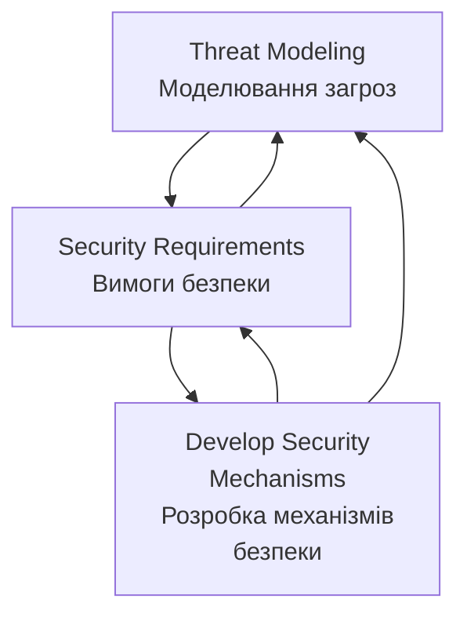

# Threat Modeling as a Basis for Security Requirements
- https://www.researchgate.net/publication/228634178_Threat_Modeling_as_a_Basis_for_Security_Requirements


**Анотація**

Ми регулярно чуємо заяви постачальників про те, що їхні системи є "безпечними". Однак, не знаючи, які припущення робить постачальник, важко обґрунтувати таке твердження. Перш ніж заявляти про безпеку системи, важливо ідентифікувати загрози для відповідної системи. Перелік загроз для системи допомагає архітекторам систем розробити реалістичні та значущі вимоги безпеки. У цій роботі ми досліджуємо, як моделювання загроз може бути використане як основа для специфікації вимог безпеки. Хоча численні праці були опубліковані з моделювання загроз, існує брак інтегрованого, систематичного підходу до моделювання загроз для складних систем. Ми розглядаємо відмінності між моделюванням програмних продуктів та складних систем, і викладаємо наш підхід для ідентифікації загроз мережевих систем. Ми також представляємо три тематичні дослідження моделювання загроз: Програмно-визначене радіо (Software-Defined Radio), інструмент моніторингу мережевого трафіку (VisFlowConnect) та інструмент моніторингу безпеки кластера (NVisionCC).

# 1. Вступ

Загальновизнано, що проектування безпечних комп'ютерних систем є складною проблемою. Зловмисники регулярно зламують системи, і у відповідь постачальники програмного забезпечення почали надавати безпеку як необхідну функцію для своїх продуктів та мережевих систем. В результаті багаторічних досліджень було розроблено багато потужних технік для вирішення широкого спектра проблем безпеки. Хоча заяви про те, що система використовує "інфраструктуру відкритих ключів" або застосовує "128-бітні ключі", звучать вражаюче, ці твердження означають дуже мало, коли їх вириваютьз контексту. Важливе питання, яке слід поставити: "Чи є функції безпеки системи необхідними, і чи відповідають вони потребам безпеки системи?"

При виборі заходів безпеки проектувальник системи безпеки повинен розглядати дизайн всієї системи, а не впроваджувати технології безпеки навмання. У [8] Брюс Шнайєр стверджує, що "Безпека - це ланцюг; вона настільки безпечна, наскільки безпечна її найслабша ланка. Безпека - це процес, а не продукт." Проектування безпеки системи найкраще здійснювати, використовуючи систематичний інженерний підхід. Інженерія безпеки систем займається ідентифікацією ризиків безпеки, вимог та стратегій відновлення [5]. Вона включає чітко визначені процеси, через які проектувальники розробляють механізми безпеки. В ідеалі, інженерія безпеки повинна бути включена в процес проектування системи якомога раніше, від початкової специфікації архітектури, якщо це можливо. Чим раніше вирішуються проблеми безпеки, тим менше часу та коштів потрібно для виправлення майбутніх проблем безпеки. Незважаючи на цей добре відомий факт, часто трапляється так, що інженери-програмісти опиняються в ситуації, коли їм потрібно модернізувати безпеку в існуючій системі. У будь-якому випадку процес інженерії безпеки може застосовуватися подібним чином.

Один з поглядів на процес інженерії безпеки представлений на Рисунку 1. Моделювання загроз включає розуміння складності системи та ідентифікацію всіх можливих загроз для системи, незалежно від того, чи можуть вони бути використані чи ні. Під час формування вимог безпеки ці загрози аналізуються на основі їх критичності та ймовірності, і приймається рішення про те, чи пом'якшувати загрозу, чи прийняти ризик, пов'язаний з нею. Після того, як проектувальники систем визначають, які механізми безпеки повинні бути доступні для системи, розробка цих механізмів слідує загальному циклу інженерії програмного забезпечення: проектування, впровадження, тестування та підтримка. Кожен етап інженерії безпеки подає зворотний зв'язок до попереднього етапу, і через цей етап до всіх попередніх етапів. Зворотний зв'язок дозволяє проектувальникам виявляти помилки, зроблені на ранніх етапах, не дозволяючи їх наслідкам каскадно поширюватися. Моделювання загроз та вимоги безпеки забезпечують основи, на яких будується решта системи безпеки.

Ідентифікація загроз допомагає розробити реалістичні та значущі вимоги безпеки. Це особливо важливо, оскільки якщо вимоги безпеки є помилковими, то визначення безпеки для цієї системи є помилковим, і таким чином система не може бути безпечною. Правильна ідентифікація загроз та відповідний вибір контрзаходів зменшує здатність зловмисників зловживати системою. У цьому відношенні моделювання загроз


```markdown
# Діаграма процесу інженерії безпеки систем



## Опис процесу:

**1. Threat Modeling (Моделювання загроз)**
- Ідентифікація всіх можливих загроз для системи
- Розуміння складності системи
- Аналіз з перспективи зловмисника

**2. Security Requirements (Вимоги безпеки)**
- Аналіз загроз за критичністю та ймовірністю
- Прийняття рішень про мітигацію або прийняття ризику
- Формування конкретних вимог безпеки

**3. Develop Security Mechanisms (Розробка механізмів безпеки)**
- Проектування
- Впровадження
- Тестування
- Підтримка

**Зворотний зв'язок:**
- Кожен етап подає зворотний зв'язок до попередніх етапів
- Дозволяє виявляти та виправляти помилки на ранніх стадіях
- Забезпечує ітеративне покращення процесу
```


**Рисунок 1. Інженерія безпеки систем**

розглядає систему з перспективи супротивника, щоб допомогти проектувальникам передбачити цілі атак та визначити відповіді на питання про те, що система призначена захищати, і від кого. Будь-який тип системи може отримати користь від моделювання загроз. Деякі системи є досить простими, а інші - більш складними, деякі з них уже розгорнуті, а інші існують лише на папері. Незалежно від того, що являє собою система або на якому етапі процесу розробки вона знаходиться, переваги від добре продуманої моделі загроз можуть виявитися надзвичайно корисними. Ми детально розглядаємо різні підходи до моделювання загроз стосовно цих різних типів систем пізніше в статті.

Існує кілька наявних робіт з моделювання загроз та багато більше з інженерії вимог. У цій статті ми будуємо на цих масивах роботи, досліджуючи, як моделювання загроз може бути використане як основа для специфікації вимог безпеки. Ми виступаємо за використання моделювання загроз як важливого кроку до вирішення питання повноти системних вимог в цілому, і вимог безпеки зокрема. Моделювання загроз може бути використане для обґрунтування контрзаходів безпеки та валідації припущень, зроблених архітекторами систем. Ми обговорюємо взаємодію між моделюванням загроз та визначенням вимог і розглядаємо відмінності між моделюванням програмних продуктів та складних систем. Ми також представляємо три тематичні дослідження моделювання загроз: Програмно-визначене радіо, інструмент моніторингу мережевого трафіку та інструмент моніторингу безпеки кластера.

Решта цієї статті організована наступним чином. У Розділі 2 ми обговорюємо процес моделювання загроз та те, як він відрізняється для програмних продуктів та складних систем. Потім ми пояснюємо, як специфікуються вимоги безпеки на основі моделі загроз у Розділі 3. Ми представляємо наші тематичні дослідження в Розділі 4 та завершуємо підсумком у Розділі 5.
