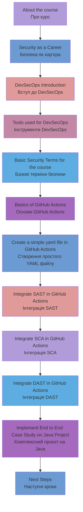

# DevSecOps using GitHub Actions: Secure CICD with GitHub

- https://ua.udemy.com/course/devsecops-crash-course-integrate-security-in-pipelines-2022/?referralCode=CFCD5C83BF3B2308D45C


# 1 Лекція: Вступ до курсу DevSecOps з GitHub Actions

## Привітання

Вітаємо на інтенсивному курсі з DevSecOps та GitHub Actions! Цей курс розроблено для фахівців, які прагнуть оволодіти сучасними практиками інтеграції безпеки в процеси розробки та розгортання програмного забезпечення.

## Структура курсу

### 📚 Модуль 1: Основи та вступ
**Тема:** Знайомство з курсом та цільовою аудиторією
- Хто може отримати користь від цього курсу
- Як курс допоможе стати DevSecOps або Security інженером
- Огляд навичок, які ви отримаєте

### 💼 Модуль 2: Кар'єрні можливості в безпеці
**Тема:** Огляд професійних шляхів у сфері кібербезпеки
- Security Engineer - інженер з безпеки
- DevSecOps Engineer - інженер DevSecOps
- Security Architect - архітектор безпеки
- Penetration Tester - тестувальник на проникнення
- Security Analyst - аналітик безпеки
- Compliance Specialist - спеціаліст з відповідності

### 🔐 Модуль 3: Основи DevSecOps
**Тема:** Розуміння концепції DevSecOps
- **Історія виникнення терміну:** від DevOps до DevSecOps
- **Філософія "Security as Code":** безпека як невід'ємна частина коду
- **Shift-Left підхід:** інтеграція безпеки на ранніх етапах розробки
- **Автоматизація безпеки:** зменшення людського фактора

### 🛠️ Модуль 4: Інструменти DevSecOps
**Тема:** Огляд інструментів безпеки на різних етапах

#### Етап розробки (Development):
- **SAST (Static Application Security Testing):**
  - SonarQube/SonarCloud
  - Checkmarx
  - Veracode
  - CodeQL

#### Етап збірки (Build Pipeline):
- **SCA (Software Composition Analysis):**
  - Snyk
  - OWASP Dependency-Check
  - WhiteSource (Mend)
  - Black Duck

#### Етап розгортання (Deployment):
- **DAST (Dynamic Application Security Testing):**
  - OWASP ZAP
  - Burp Suite Enterprise
  - Rapid7 AppSpider
  - Qualys WAS

- **IAST (Interactive Application Security Testing):**
  - Contrast Security
  - Hdiv Security

### 📖 Модуль 5: Термінологія безпеки
**Тема:** Ключові поняття, які використовуватимемо в курсі

**Основні терміни:**
- **CVE (Common Vulnerabilities and Exposures)** - база даних відомих вразливостей
- **CVSS (Common Vulnerability Scoring System)** - система оцінки критичності вразливостей
- **OWASP Top 10** - десятка найпоширеніших веб-вразливостей
- **False Positive** - помилково виявлена вразливість
- **False Negative** - пропущена реальна вразливість
- **Security Gates** - контрольні точки безпеки в pipeline
- **Compliance** - відповідність стандартам безпеки

### ⚙️ Модуль 6: GitHub Actions - основи
**Тема:** Фундаментальні знання GitHub Actions

**Ключові концепції:**
- **Workflows** - робочі процеси
- **Jobs** - завдання
- **Steps** - кроки
- **Actions** - дії
- **Runners** - виконавці
- **Secrets** - секрети
- **Artifacts** - артефакти

**Структура YAML файлу:**
```yaml
name: CI/CD Pipeline
on: [push, pull_request]
jobs:
  build:
    runs-on: ubuntu-latest
    steps:
      - uses: actions/checkout@v3
      - name: Setup
        run: echo "Hello DevSecOps"
```

### 🎯 Модуль 7: Перший YAML файл
**Тема:** Практичне створення простого workflow

**Мета модуля:**
- Створити базовий YAML файл
- Зрозуміти синтаксис GitHub Actions
- Запустити перший успішний workflow
- Налагодити проблеми, що можуть виникнути

### 🔍 Модуль 8: Інтеграція SAST
**Тема:** Static Application Security Testing з GitHub Actions

**Практичні завдання:**
- Налаштування SonarCloud
- Інтеграція з GitHub repository
- Аналіз результатів сканування
- Налаштування quality gates
- Обробка виявлених вразливостей

### 📦 Модуль 9: Software Composition Analysis (SCA)
**Тема:** Аналіз залежностей з використанням Snyk

**Що вивчимо:**
- Інтеграція Snyk з GitHub Actions
- Сканування package.json, pom.xml, requirements.txt
- Аналіз ліцензій третіх сторін
- Автоматичне створення pull requests для оновлень
- Моніторинг нових вразливостей

### 🌐 Модуль 10: Dynamic Application Security Testing (DAST)
**Тема:** Тестування веб-додатків з OWASP ZAP

**Практична реалізація:**
- Розгортання тестового додатку
- Налаштування OWASP ZAP
- Baseline та Full scan режими
- Аналіз HTTP трафіку
- Генерація звітів безпеки

### 🏗️ Модуль 11: Enterprise DevSecOps Pipeline
**Тема:** Комплексна реалізація на Java проєкті

**Компоненти pipeline:**
```
📋 План pipeline:
1. Code Checkout
2. Dependency Scanning (Snyk)
3. Static Code Analysis (SonarCloud)  
4. Build Application
5. Security Testing (OWASP ZAP)
6. Deploy to Staging
7. Generate Security Reports
8. Security Gate Decision
```

**Інструменти в дії:**
- **SonarCloud:** якість коду та security hotspots
- **Snyk:** аналіз вразливостей у залежностях
- **OWASP ZAP:** динамічне тестування безпеки
- **GitHub:** централізоване управління звітами

### 📈 Модуль 12: Наступні кроки та розвиток
**Тема:** Планування кар'єрного росту в DevSecOps

**Рекомендації для поглиблення знань:**
- **Сертифікації:**
  - Certified DevSecOps Professional (CDP)
  - AWS Certified Security - Specialty
  - CISSP (Certified Information Systems Security Professional)
  - CEH (Certified Ethical Hacker)

- **Додаткові інструменти для вивчення:**
  - Terraform для Infrastructure as Code
  - Ansible для автоматизації
  - Docker Security
  - Kubernetes Security
  - Cloud Security (AWS/Azure/GCP)

### 🔧 Модуль 13: Альтернативні інструменти та платформи
**Тема:** Огляд екосистеми DevSecOps

**CI/CD платформи:**
- Jenkins з Security плагінами
- GitLab CI/CD з вбудованою безпекою
- Azure DevOps Security
- CircleCI Security
- AWS CodePipeline

**Альтернативні інструменти безпеки:**
- Aqua Security для контейнерів
- Prisma Cloud для мультихмарної безпеки
- Checkmarx для enterprise SAST
- Rapid7 InsightAppSec для DAST

### 📄 Модуль 14: Створення професійного CV
**Тема:** Оформлення резюме DevSecOps інженера

**Ключові секції CV:**
- **Technical Skills:** інструменти та технології
- **Security Experience:** проєкти та досягнення
- **Certifications:** отримані сертифікати
- **Projects:** портфоліо DevSecOps проєктів

**Приклад опису досвіду:**
```
DevSecOps Engineer | Company Name | 2023-Present
• Implemented automated security scanning in CI/CD pipelines using GitHub Actions
• Reduced security vulnerabilities by 75% through SAST/DAST integration
• Established security gates that prevented 50+ vulnerable deployments
• Mentored development teams on secure coding practices
```

## Цільова аудиторія курсу

### 👨‍💻 Розробники (Developers)
- Хочуть інтегрувати безпеку в процес розробки
- Прагнуть розуміти security implications свого коду
- Мають базовий досвід з Git та CI/CD

### 🔧 DevOps інженери
- Бажають додати Security до своїх навичок
- Працюють з pipeline автоматизацією
- Знайомі з концепціями Infrastructure as Code

### 🛡️ Security спеціалісти
- Хочуть автоматизувати безпеку
- Прагнуть інтегруватися в DevOps процеси
- Мають знання в галузі кібербезпеки

### 🎓 Студенти та початківці
- Вивчають кібербезпеку або DevOps
- Хочуть отримати практичні навички
- Планують кар'єру в IT безпеці

## Переваги курсу

### 🎯 Практичний підхід
- **Hands-on лабораторії:** реальні проєкти та завдання
- **Real-world scenarios:** ситуації з практики
- **Step-by-step інструкції:** детальні покрокові посібники

### 🔄 Актуальність
- **Сучасні інструменти:** GitHub Actions, Snyk, SonarCloud
- **Industry best practices:** кращі практики індустрії
- **Enterprise готовність:** рішення для великих компаній

### 💼 Кар'єрні перспективи
- **Portfolio projects:** проєкти для портфоліо
- **Industry connections:** знайомство з інструментами ринку
- **Certification preparation:** підготовка до сертифікацій

## Рекомендації для успішного проходження

### 💪 Активна участь
- **Виконуйте всі лабораторні роботи**
- **Експериментуйте з налаштуваннями**
- **Створюйте власні модифікації**

### 📚 Додаткове навчання
- **Читайте документацію інструментів**
- **Слідкуйте за Security блогами**
- **Приєднуйтесь до DevSecOps спільнот**

### 🎓 Практичне застосування
- **Застосовуйте знання в робочих проєктах**
- **Діліться досвідом з колегами**
- **Будуйте власне портфоліо**

## Висновки

Цей курс розроблено як комплексний вступ до світу DevSecOps з практичним фокусом на GitHub Actions. Ви отримаєте:

✅ **Теоретичні знання** про DevSecOps концепції  
✅ **Практичні навички** роботи з інструментами безпеки  
✅ **Real-world досвід** створення enterprise pipeline  
✅ **Кар'єрні поради** для розвитку в галузі  

Готуйтеся до захоплюючої подорожі у світ автоматизованої безпеки!


# Agenda курсу DevSecOps з GitHub Actions



## Альтернативний вигляд (блок-схема)

```
┌─────────────────┐    ┌─────────────────┐    ┌─────────────────┐    ┌─────────────────┐
│   About the     │───▶│  Security as a  │───▶│   DevSecOps     │───▶│  Tools used for │
│     course      │    │     Career      │    │  Introduction   │    │    DevSecOps    │
└─────────────────┘    └─────────────────┘    └─────────────────┘    └─────────────────┘
                                                                              │
                                                                              ▼
┌─────────────────┐    ┌─────────────────┐    ┌─────────────────┐    ┌─────────────────┐
│  Integrate SAST │◀───│   Create simple │◀───│  Basics of      │◀───│ Basic Security  │
│ in GitHub Actions│    │   YAML file     │    │ GitHub Actions  │    │ Terms for course│
└─────────────────┘    └─────────────────┘    └─────────────────┘    └─────────────────┘
          │
          ▼
┌─────────────────┐    ┌─────────────────┐    ┌─────────────────┐    ┌─────────────────┐
│  Integrate SCA  │───▶│  Integrate DAST │───▶│ Implement End   │───▶│   Next Steps    │
│ in GitHub Actions│    │ in GitHub Actions│    │ to End Case     │    │                 │
└─────────────────┘    └─────────────────┘    │ Study on Java   │    └─────────────────┘
                                              │    Project      │
                                              └─────────────────┘
```

## Структурований план курсу

### 🎯 Блок 1: Основи та теорія
1. **About the course** - Про курс
2. **Security as a Career** - Безпека як кар'єра  
3. **DevSecOps Introduction** - Вступ до DevSecOps
4. **Tools used for DevSecOps** - Інструменти DevSecOps

### 📚 Блок 2: Підготовка та основи
5. **Basic Security Terms for the course** - Базові терміни безпеки
6. **Basics of GitHub Actions** - Основи GitHub Actions
7. **Create a simple yaml file in GitHub Actions** - Створення простого YAML файлу

### 🔧 Блок 3: Практична інтеграція інструментів
8. **Integrate SAST in GitHub Actions** - Інтеграція SAST (Static Application Security Testing)
9. **Integrate SCA in GitHub Actions** - Інтеграція SCA (Software Composition Analysis)
10. **Integrate DAST in GitHub Actions** - Інтеграція DAST (Dynamic Application Security Testing)

### 🏗️ Блок 4: Комплексна реалізація та розвиток
11. **Implement End to End Case Study on Java Project** - Комплексний проєкт на Java
12. **Next Steps** - Наступні кроки та розвиток

---

**Загальна тривалість:** 12 модулів  
**Фокус:** Практичне впровадження DevSecOps з GitHub Actions  
**Кінцевий результат:** Повноцінний DevSecOps pipeline на реальному проєкті


-----------------------------------------------------------------------


# 2 Лекція: Цільова аудиторія та переваги курсу DevSecOps

## Привітання

Вітаємо, експерти з безпеки! Ласкаво просимо на нову лекцію нашого курсу. У цій лекції ми з'ясуємо, чому саме ви повинні вивчити цей курс і хто є цільовою аудиторією для навчання DevSecOps.

## 🎯 Цільова аудиторія курсу

Цей курс спеціально розроблений для наступних категорій фахівців:

### 👨‍🎓 Новачки в IT-безпеці (Freshers)
**Характеристики:**
- Студенти або випускники IT-спеціальностей
- Особи без досвіду роботи в кібербезпеці
- Бажання розпочати кар'єру в галузі безпеки

**Що отримують від курсу:**
- Фундаментальні знання DevSecOps
- Практичні навички роботи з інструментами
- Готовність до entry-level позицій

### 🔒 Security Engineers (Інженери з безпеки)
**Поточний досвід:**
- Робота з традиційними інструментами безпеки
- Знання принципів кібербезпеки
- Досвід проведення security assessments

**Мета навчання:**
- Інтеграція безпеки в DevOps процеси
- Автоматизація security тестування
- Перехід від reactive до proactive підходу

### 🧪 QA Engineers (Інженери з тестування)
**Наявні компетенції:**
- Досвід автоматизації тестування
- Знання CI/CD pipeline
- Розуміння процесів якості ПЗ

**Розширення навичок:**
- Додавання security тестування до QA процесів
- Вивчення SAST, DAST, SCA інструментів
- Створення comprehensive testing strategy

### 💼 IT-професіонали (Загальна категорія)
**Включає:**
- DevOps інженерів
- Software розробників
- System адміністраторів
- Project менеджерів у IT

**Причини навчання:**
- Розширення професійного кругозору
- Підвищення ринкової вартості
- Відповідність сучасним industry trends

## 📈 Чому варто вивчати DevSecOps?

### 🌟 Нішевий домен з високим попитом

**Статистика ринку:**
- DevSecOps вважається одним з найперспективніших напрямків в IT
- Ріст вакансій на 150% за останні 3 роки
- Shortage кваліфікованих спеціалістів у всьому світі

**Тенденції галузі:**
```
2020: DevOps + Security = окремі команди
2021: Початок інтеграції безпеки в DevOps
2022: DevSecOps стає industry standard
2023: Масове впровадження DevSecOps практик
2024: Критичний shortage DevSecOps талантів
```

### 💰 Високооплачувані вакансії

**Діапазон зарплат DevSecOps інженерів:**

| Рівень досвіду | Зарплата (США) | Зарплата (Європа) | Зарплата (Україна) |
|----------------|----------------|-------------------|-------------------|
| Junior (0-2 роки) | $80,000-120,000 | €45,000-65,000 | $18,000-30,000 |
| Middle (2-5 років) | $120,000-160,000 | €65,000-85,000 | $30,000-50,000 |
| Senior (5+ років) | $160,000-220,000 | €85,000-120,000 | $50,000-80,000 |

### 🚀 Недостатність правильного таланту

**Проблеми ринку:**
- **Skills Gap:** розрив між потребами роботодавців та навичками кандидатів
- **Technology Evolution:** швидка еволюція інструментів та практик
- **Cross-functional Requirements:** потреба в знаннях Dev, Ops та Security одночасно

**Наше рішення:**
- Практичний курс з реальними інструментами
- Hands-on досвід з enterprise технологіями
- Підготовка готових до роботи спеціалістів

## 🎯 Цілі курсу

### 🏗️ Створення правильного таланту для ринку

**Що ми робимо:**
1. **Ідентифікуємо gap** на ринку DevSecOps спеціалістів
2. **Аналізуємо потреби** роботодавців та industry
3. **Розробляємо curriculum** відповідно до ринкових вимог
4. **Забезпечуємо практичний досвід** з реальними проєктами

**Результат:**
- Підготовлені спеціалісти готові до роботи з першого дня
- Закриття gap між попитом та пропозицією
- Підвищення загального рівня DevSecOps в індустрії

### 💼 Допомога інженерам у кар'єрному зростанні

**Переваги для учасників:**

#### 📊 Підвищення зарплати
- **Immediate impact:** негайне підвищення ринкової вартості
- **Career progression:** швидші промоції та кар'єрний ріст
- **Job security:** стабільність через високий попит

#### 🎓 Upskilling в найновіших технологіях
- **Modern tools:** GitHub Actions, SonarCloud, Snyk, OWASP ZAP
- **Industry practices:** real-world підходи від провідних компаній
- **Future-ready skills:** підготовка до майбутніх технологій

#### 🌐 Розширення професійних можливостей
- **Remote opportunities:** можливість роботи з global командами
- **Consulting potential:** можливості для freelance та консалтингу
- **Leadership roles:** підготовка до lead та architect позицій

## 🔥 Чому не можна пропустити цю можливість?

### ⏰ Timing є критичним

**Ринкові фактори:**
- DevSecOps знаходиться на піку adoption curve
- Early adopters отримують найбільші переваги
- Competition за таланти буде тільки зростати

### 📚 Унікальність курсу

**Що робить наш курс особливим:**
- **Практичний підхід:** реальні проєкти замість теорії
- **Industry tools:** робота з enterprise інструментами
- **End-to-end experience:** повний цикл DevSecOps pipeline
- **Real-world scenarios:** кейси з практики великих компаній

### 🎯 Гарантований результат

**Що ви отримаєте після курсу:**
- ✅ Портфоліо з реальними DevSecOps проєктами
- ✅ Досвід роботи з топовими інструментами ринку
- ✅ Розуміння enterprise DevSecOps процесів
- ✅ Готовність до співбесід на DevSecOps позиції
- ✅ Network з однодумцями та експертами

## 💡 Перспективи після курсу

### 🚀 Кар'єрні шляхи

**Можливі позиції:**
1. **DevSecOps Engineer** - основна спеціалізація
2. **Security Automation Engineer** - фокус на автоматизації
3. **Application Security Engineer** - безпека додатків
4. **Cloud Security Engineer** - хмарна безпека
5. **Security Architect** - архітектурні рішення

### 📈 Траєкторія зростання

```
Junior DevSecOps Engineer (0-2 роки)
          ↓
Middle DevSecOps Engineer (2-5 років)
          ↓
Senior DevSecOps Engineer (5+ років)
          ↓
Lead DevSecOps Engineer / Security Architect
          ↓
Principal Engineer / Director of Security
```

## 🎊 Заключення

DevSecOps представляє унікальну можливість для IT-професіоналів:

### 🌟 Ключові переваги:
- **Високий попит** на ринку праці
- **Привабливі зарплати** у всіх регіонах
- **Перспективний напрямок** з постійним розвитком
- **Можливість впливу** на безпеку продуктів

### 🎯 Наша місія:
Підготувати нове покоління DevSecOps інженерів, які зможуть закрити gap на ринку та допомогти компаніям створювати більш безпечні продукти.

**Не втрачайте цю можливість стати частиною майбутнього IT-безпеки!**

---

*Дякуємо за увагу! До зустрічі на наступній лекції, де ми розглянемо кар'єрні можливості в сфері безпеки.*


----------------------------------------------------


