# DevSecOps using GitHub Actions: Secure CICD with GitHub

- https://ua.udemy.com/course/devsecops-crash-course-integrate-security-in-pipelines-2022/?referralCode=CFCD5C83BF3B2308D45C


# 1 Лекція: Вступ до курсу DevSecOps з GitHub Actions

## Привітання

Вітаємо на інтенсивному курсі з DevSecOps та GitHub Actions! Цей курс розроблено для фахівців, які прагнуть оволодіти сучасними практиками інтеграції безпеки в процеси розробки та розгортання програмного забезпечення.

## Структура курсу

### 📚 Модуль 1: Основи та вступ
**Тема:** Знайомство з курсом та цільовою аудиторією
- Хто може отримати користь від цього курсу
- Як курс допоможе стати DevSecOps або Security інженером
- Огляд навичок, які ви отримаєте

### 💼 Модуль 2: Кар'єрні можливості в безпеці
**Тема:** Огляд професійних шляхів у сфері кібербезпеки
- Security Engineer - інженер з безпеки
- DevSecOps Engineer - інженер DevSecOps
- Security Architect - архітектор безпеки
- Penetration Tester - тестувальник на проникнення
- Security Analyst - аналітик безпеки
- Compliance Specialist - спеціаліст з відповідності

### 🔐 Модуль 3: Основи DevSecOps
**Тема:** Розуміння концепції DevSecOps
- **Історія виникнення терміну:** від DevOps до DevSecOps
- **Філософія "Security as Code":** безпека як невід'ємна частина коду
- **Shift-Left підхід:** інтеграція безпеки на ранніх етапах розробки
- **Автоматизація безпеки:** зменшення людського фактора

### 🛠️ Модуль 4: Інструменти DevSecOps
**Тема:** Огляд інструментів безпеки на різних етапах

#### Етап розробки (Development):
- **SAST (Static Application Security Testing):**
  - SonarQube/SonarCloud
  - Checkmarx
  - Veracode
  - CodeQL

#### Етап збірки (Build Pipeline):
- **SCA (Software Composition Analysis):**
  - Snyk
  - OWASP Dependency-Check
  - WhiteSource (Mend)
  - Black Duck

#### Етап розгортання (Deployment):
- **DAST (Dynamic Application Security Testing):**
  - OWASP ZAP
  - Burp Suite Enterprise
  - Rapid7 AppSpider
  - Qualys WAS

- **IAST (Interactive Application Security Testing):**
  - Contrast Security
  - Hdiv Security

### 📖 Модуль 5: Термінологія безпеки
**Тема:** Ключові поняття, які використовуватимемо в курсі

**Основні терміни:**
- **CVE (Common Vulnerabilities and Exposures)** - база даних відомих вразливостей
- **CVSS (Common Vulnerability Scoring System)** - система оцінки критичності вразливостей
- **OWASP Top 10** - десятка найпоширеніших веб-вразливостей
- **False Positive** - помилково виявлена вразливість
- **False Negative** - пропущена реальна вразливість
- **Security Gates** - контрольні точки безпеки в pipeline
- **Compliance** - відповідність стандартам безпеки

### ⚙️ Модуль 6: GitHub Actions - основи
**Тема:** Фундаментальні знання GitHub Actions

**Ключові концепції:**
- **Workflows** - робочі процеси
- **Jobs** - завдання
- **Steps** - кроки
- **Actions** - дії
- **Runners** - виконавці
- **Secrets** - секрети
- **Artifacts** - артефакти

**Структура YAML файлу:**
```yaml
name: CI/CD Pipeline
on: [push, pull_request]
jobs:
  build:
    runs-on: ubuntu-latest
    steps:
      - uses: actions/checkout@v3
      - name: Setup
        run: echo "Hello DevSecOps"
```

### 🎯 Модуль 7: Перший YAML файл
**Тема:** Практичне створення простого workflow

**Мета модуля:**
- Створити базовий YAML файл
- Зрозуміти синтаксис GitHub Actions
- Запустити перший успішний workflow
- Налагодити проблеми, що можуть виникнути

### 🔍 Модуль 8: Інтеграція SAST
**Тема:** Static Application Security Testing з GitHub Actions

**Практичні завдання:**
- Налаштування SonarCloud
- Інтеграція з GitHub repository
- Аналіз результатів сканування
- Налаштування quality gates
- Обробка виявлених вразливостей

### 📦 Модуль 9: Software Composition Analysis (SCA)
**Тема:** Аналіз залежностей з використанням Snyk

**Що вивчимо:**
- Інтеграція Snyk з GitHub Actions
- Сканування package.json, pom.xml, requirements.txt
- Аналіз ліцензій третіх сторін
- Автоматичне створення pull requests для оновлень
- Моніторинг нових вразливостей

### 🌐 Модуль 10: Dynamic Application Security Testing (DAST)
**Тема:** Тестування веб-додатків з OWASP ZAP

**Практична реалізація:**
- Розгортання тестового додатку
- Налаштування OWASP ZAP
- Baseline та Full scan режими
- Аналіз HTTP трафіку
- Генерація звітів безпеки

### 🏗️ Модуль 11: Enterprise DevSecOps Pipeline
**Тема:** Комплексна реалізація на Java проєкті

**Компоненти pipeline:**
```
📋 План pipeline:
1. Code Checkout
2. Dependency Scanning (Snyk)
3. Static Code Analysis (SonarCloud)  
4. Build Application
5. Security Testing (OWASP ZAP)
6. Deploy to Staging
7. Generate Security Reports
8. Security Gate Decision
```

**Інструменти в дії:**
- **SonarCloud:** якість коду та security hotspots
- **Snyk:** аналіз вразливостей у залежностях
- **OWASP ZAP:** динамічне тестування безпеки
- **GitHub:** централізоване управління звітами

### 📈 Модуль 12: Наступні кроки та розвиток
**Тема:** Планування кар'єрного росту в DevSecOps

**Рекомендації для поглиблення знань:**
- **Сертифікації:**
  - Certified DevSecOps Professional (CDP)
  - AWS Certified Security - Specialty
  - CISSP (Certified Information Systems Security Professional)
  - CEH (Certified Ethical Hacker)

- **Додаткові інструменти для вивчення:**
  - Terraform для Infrastructure as Code
  - Ansible для автоматизації
  - Docker Security
  - Kubernetes Security
  - Cloud Security (AWS/Azure/GCP)

### 🔧 Модуль 13: Альтернативні інструменти та платформи
**Тема:** Огляд екосистеми DevSecOps

**CI/CD платформи:**
- Jenkins з Security плагінами
- GitLab CI/CD з вбудованою безпекою
- Azure DevOps Security
- CircleCI Security
- AWS CodePipeline

**Альтернативні інструменти безпеки:**
- Aqua Security для контейнерів
- Prisma Cloud для мультихмарної безпеки
- Checkmarx для enterprise SAST
- Rapid7 InsightAppSec для DAST

### 📄 Модуль 14: Створення професійного CV
**Тема:** Оформлення резюме DevSecOps інженера

**Ключові секції CV:**
- **Technical Skills:** інструменти та технології
- **Security Experience:** проєкти та досягнення
- **Certifications:** отримані сертифікати
- **Projects:** портфоліо DevSecOps проєктів

**Приклад опису досвіду:**
```
DevSecOps Engineer | Company Name | 2023-Present
• Implemented automated security scanning in CI/CD pipelines using GitHub Actions
• Reduced security vulnerabilities by 75% through SAST/DAST integration
• Established security gates that prevented 50+ vulnerable deployments
• Mentored development teams on secure coding practices
```

## Цільова аудиторія курсу

### 👨‍💻 Розробники (Developers)
- Хочуть інтегрувати безпеку в процес розробки
- Прагнуть розуміти security implications свого коду
- Мають базовий досвід з Git та CI/CD

### 🔧 DevOps інженери
- Бажають додати Security до своїх навичок
- Працюють з pipeline автоматизацією
- Знайомі з концепціями Infrastructure as Code

### 🛡️ Security спеціалісти
- Хочуть автоматизувати безпеку
- Прагнуть інтегруватися в DevOps процеси
- Мають знання в галузі кібербезпеки

### 🎓 Студенти та початківці
- Вивчають кібербезпеку або DevOps
- Хочуть отримати практичні навички
- Планують кар'єру в IT безпеці

## Переваги курсу

### 🎯 Практичний підхід
- **Hands-on лабораторії:** реальні проєкти та завдання
- **Real-world scenarios:** ситуації з практики
- **Step-by-step інструкції:** детальні покрокові посібники

### 🔄 Актуальність
- **Сучасні інструменти:** GitHub Actions, Snyk, SonarCloud
- **Industry best practices:** кращі практики індустрії
- **Enterprise готовність:** рішення для великих компаній

### 💼 Кар'єрні перспективи
- **Portfolio projects:** проєкти для портфоліо
- **Industry connections:** знайомство з інструментами ринку
- **Certification preparation:** підготовка до сертифікацій

## Рекомендації для успішного проходження

### 💪 Активна участь
- **Виконуйте всі лабораторні роботи**
- **Експериментуйте з налаштуваннями**
- **Створюйте власні модифікації**

### 📚 Додаткове навчання
- **Читайте документацію інструментів**
- **Слідкуйте за Security блогами**
- **Приєднуйтесь до DevSecOps спільнот**

### 🎓 Практичне застосування
- **Застосовуйте знання в робочих проєктах**
- **Діліться досвідом з колегами**
- **Будуйте власне портфоліо**

## Висновки

Цей курс розроблено як комплексний вступ до світу DevSecOps з практичним фокусом на GitHub Actions. Ви отримаєте:

✅ **Теоретичні знання** про DevSecOps концепції  
✅ **Практичні навички** роботи з інструментами безпеки  
✅ **Real-world досвід** створення enterprise pipeline  
✅ **Кар'єрні поради** для розвитку в галузі  

Готуйтеся до захоплюючої подорожі у світ автоматизованої безпеки!


# Agenda курсу DevSecOps з GitHub Actions

```mermaid
flowchart TD
    A[About the course<br/>Про курс] --> B[Security as a Career<br/>Безпека як кар'єра]
    B --> C[DevSecOps Introduction<br/>Вступ до DevSecOps]
    C --> D[Tools used for DevSecOps<br/>Інструменти DevSecOps]
    
    D --> E[Basic Security Terms for the course<br/>Базові терміни безпеки]
    E --> F[Basics of GitHub Actions<br/>Основи GitHub Actions]
    F --> G[Create a simple yaml file in GitHub Actions<br/>Створення простого YAML файлу]
    G --> H[Integrate SAST in GitHub Actions<br/>Інтеграція SAST]
    
    H --> I[Integrate SCA in GitHub Actions<br/>Інтеграція SCA]
    I --> J[Integrate DAST in GitHub Actions<br/>Інтеграція DAST]
    J --> K[Implement End to End Case Study on Java Project<br/>Комплексний проєкт на Java]
    K --> L[Next Steps<br/>Наступні кроки]
    
    style A fill:#b19cd9
    style B fill:#6b9bd2
    style C fill:#e19a9a
    style D fill:#c488a7
    style E fill:#5dade2
    style F fill:#a569bd
    style G fill:#6b9bd2
    style H fill:#e19a9a
    style I fill:#b19cd9
    style J fill:#5dade2
    style K fill:#a569bd
    style L fill:#6b9bd2
```



## Альтернативний вигляд (блок-схема)

```
┌─────────────────┐    ┌─────────────────┐    ┌─────────────────┐    ┌─────────────────┐
│   About the     │───▶│  Security as a  │───▶│   DevSecOps     │───▶│  Tools used for │
│     course      │    │     Career      │    │  Introduction   │    │    DevSecOps    │
└─────────────────┘    └─────────────────┘    └─────────────────┘    └─────────────────┘
                                                                              │
                                                                              ▼
┌─────────────────┐    ┌─────────────────┐    ┌─────────────────┐    ┌─────────────────┐
│  Integrate SAST │◀───│   Create simple │◀───│  Basics of      │◀───│ Basic Security  │
│ in GitHub Actions│    │   YAML file     │    │ GitHub Actions  │    │ Terms for course│
└─────────────────┘    └─────────────────┘    └─────────────────┘    └─────────────────┘
          │
          ▼
┌─────────────────┐    ┌─────────────────┐    ┌─────────────────┐    ┌─────────────────┐
│  Integrate SCA  │───▶│  Integrate DAST │───▶│ Implement End   │───▶│   Next Steps    │
│ in GitHub Actions│    │ in GitHub Actions│    │ to End Case     │    │                 │
└─────────────────┘    └─────────────────┘    │ Study on Java   │    └─────────────────┘
                                              │    Project      │
                                              └─────────────────┘
```

## Структурований план курсу

### 🎯 Блок 1: Основи та теорія
1. **About the course** - Про курс
2. **Security as a Career** - Безпека як кар'єра  
3. **DevSecOps Introduction** - Вступ до DevSecOps
4. **Tools used for DevSecOps** - Інструменти DevSecOps

### 📚 Блок 2: Підготовка та основи
5. **Basic Security Terms for the course** - Базові терміни безпеки
6. **Basics of GitHub Actions** - Основи GitHub Actions
7. **Create a simple yaml file in GitHub Actions** - Створення простого YAML файлу

### 🔧 Блок 3: Практична інтеграція інструментів
8. **Integrate SAST in GitHub Actions** - Інтеграція SAST (Static Application Security Testing)
9. **Integrate SCA in GitHub Actions** - Інтеграція SCA (Software Composition Analysis)
10. **Integrate DAST in GitHub Actions** - Інтеграція DAST (Dynamic Application Security Testing)

### 🏗️ Блок 4: Комплексна реалізація та розвиток
11. **Implement End to End Case Study on Java Project** - Комплексний проєкт на Java
12. **Next Steps** - Наступні кроки та розвиток

---

**Загальна тривалість:** 12 модулів  
**Фокус:** Практичне впровадження DevSecOps з GitHub Actions  
**Кінцевий результат:** Повноцінний DevSecOps pipeline на реальному проєкті


-----------------------------------------------------------------------
